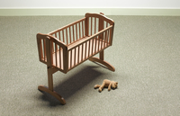

#### cradle
noun

1. a small bed for a baby, especially one that moves from side to side:
   
   
   
   1. The nurse **rocked** the cradle.

#### pregnancy
noun

1. the state of being pregnant:
   
   1. Most woman feel sick in the mornings during their first months of pregnancy.
   2. My first pregnancy was very straightforward - there were no complications.

#### conception
noun

1. an idea of what something or someone is like, or a basic understanding of a situation or a principle:
   
   1. People from different cultures have different conceptions **of** the world.
   2. She has a conception **of** people as being basically good.

2. the process of a male and a female sex cell joining and causing a baby to start to form:
   
   1. at/from the moment of conception.

#### fertilised
verb

1. to spread a natural or chemical substance on land or plants, in order to make the plants grow well:

2. to cause an egg or seed to start to develop into a new young animal or plant by joining it with a male cell:
   
   1. Bees fertilize the flowers by bringing pollen.
   2. Once an egg is fertilized by the sperm, it becomes an embryo.

#### embryo
noun

1. an animal that is developing either in its mother's womb or in an egg, or a plant that is developing in a seed:
   
   1. Between the eighth week of development and birth a human embryo is called a foetus.
   

#### implant
verb

1. to put an organ, group of cells, or device into the body in a medical operation:
   
   1. The owner's name and address is stored on a micochip and implanted in the dog's body.

#### womb
noun

1. the organ in the body of a woman or other female mammal in which a baby develops before birth:
   
   1. Researchers are looking at how a mother's health can affect the baby in the womb.

#### uterus
noun

1. the organ in the body of woman or other female mammal in which a baby develops before birth:
   
   1. Conception is the moment when a fertilized egg implants itself in a woman's uterus.

#### conceive

1. to become pregnant, or to cause a baby to begin to form:
   
   1. Do you know exactly when you conceived?
   2. The baby was conceived in March, so will be born in December.

#### fertility
noun

1. (of animals and plants) the quality of being able to produce young or fruit:
   
   1. a fertility symbol
   2. declining fertility rates

#### foetus
noun, also fetus

1. a young human being or animal before birth, after the organs have started to develop

#### placenta
noun

1. the temporary organ that feeds a foetus(= developing baby) inside its mother's womb

#### labour
noun

1. the last stage of pregnancy from the time when the muscles of the womb start to push the baby out of the body until the baby appears:
   
   1. lobour pains
   2. I was in labour for twelve hours with my first baby.
   3. She went into(started) labour at twelve o'clock last night.

#### induced

to use a drug to make a pregnant woman start giving birth:

1. In this hospital, twins are often induced.

#### caesarean section
noun

1. an operation on a woman to allow the birth of her child through a cut made in her abdomen

#### ripe old age

the condition of being very old; used especially to talk about someone who has a long healthy life:

1. I'm sure he'll live to a ripe old age.
2. My grandmother died at the ripe old age of 92.

#### pensioner
noun

a person who receives a pension, especially the government pension given to old people:

1. Students and pensioners are entitled to a discount.

#### sheltered accommodation
noun

houses for old and ill people in a place where help can be given if it is needed:

1. She's just moved into sheltered accmmodation.
   

#### doddery
adjective

1. weak and unable to walk in a normal way, usually because you are old:
   
   1. a doddery old man

#### gaga
adjective

1. unable to think clearly and make decisions because of old age:
   
   1. My granny's 94 and she's a bit gaga.

#### dementia
noun

1. a medical condition that affects especially old people, causing the memory and other mental abilities to gradually become worse, and leading to confused behaviour:
   
   1. The most common form of dementia is Alzheimer's disease.

#### coffin
noun

1. a long box in which the body of a dead person is buried or burned:
   

#### mourning
noun

1. a loud crying that people in some countries make when someone dies:
   
   1. The mourning could be heard all day and all night.

#### cremation
noun

1. the act of burning a dead body, or a part of a funeral ceremony in which this is done:
   
   1. My dad's cremation was a sad affair.
   2. Many people choose cremation rather than burial.

#### scatter
verb

1. to move apart in many directions, or to throw something in different directions:
   
   1. We grew up in a small town, but now we're scattered all over the country.

#### condolence
noun

1. sympathy and sadness for the family or close friends of a person who has recently died, or an expression of this, especially in written form:
   
   1. a letter of condolence.
   

#### fatality
noun

1. a death caused by an accident or by violence, or someone who has died in either of these ways:
   
   1. There are thousands of traffic fatalities every year.
   2. The first fatalities of the war were civilians.

#### perish
verb

1. to die, especially in an accident or by being killed, or to be destroyed:
   
   1. Three hundred people perished in the earthquake.
   2. He believes that Europe must create closer ties or it will perish.

#### slaughter
noun

1. the killing of many people cruelly and unfairly, especially in a war:
   
   1. Hardly anyone in the town escaped the slaughter when the rebels were defeated.

#### deceased
adjective

1. dead
   
   1. the recently deceased Member of Parliament.

#### bequeath
verb

1. to arrange for money or property to be given to somebody after your death:
   
   1. Her father bequeath her the family fortune in his will.

#### inherit
verb

1. to receive money, a house, etc. from someone after they have died:
   
   1. Who will inherit the house when he dies?
   2. All her children will inherit equally.

#### intestate
adjective

1. If someone dies intestate, they have died without leaving instructions about who should receive their property:
   
   1. Many people **die** intestate because they thought they were too young to make a will.

