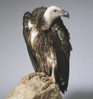

#### rewarding
adjective

1. giving a reward, especially by making you feel satisfied that you have done something important or useful, or done something well:
   
   1. Is it a rewarding job?
   2. Textbook writing can be in intellectually and financially rewarding activity.

#### fruitful
adjective

1. producing good results:
   
   1. It was a most fruitful discussion, with both sides agreeing to adopt a common policy.

#### lucrative
adjective

1. (especially of a business, job, or activity) producing a lot of money:
   
   1. The merger proved to be very lucrative for both companies.

#### therapeutic
adjective

1. relating to the curing of a disease or medical condition:
   
   1. They found his blood contained the drug at a level that you might expect in an overdose, far exceeding a therapeutic dose.

#### relaxing
adjective

1. making you feel relaxed:
   
   1. a relaxing holiday.
   2. I find swimming so relaxing.

#### vulture
noun

1. a large bird with almost no feathers on its head or neck, that eats the flesh of dead animals.
   
   

#### couch potato
noun, informal disapproving

1. a person who watches a lot of television and does not have an active life:

#### amateur
adjective

1. taking part in an activity for pleasure, not as a job:
   
   1. an amateur boxer.
   2. He was an amateur singer until the age of 40, when he turned professional.

#### dabbler
noun

1. someone who takes a slight and not very serious interest in a subject, or tries a particular activity for a short period:
   
   1. They are dabblers **in** African music rather than experts.
   2. I'm not a real painter - just a dabbler.

#### chore
noun

1. a job or piece of work that is often boring or unpleasant but needs to be done regularly:
   
   1. I'll go shopping when I've **done my** chores.
   2. I find writing reports a real chore.

#### shopaholic
noun

1. a person who enjoys shopping very much and does it a lot:
   
   1. A self-confessed shopaholic, Diane loved looking for new clothes with her two daughters.

#### hooked
adjective

1. enjoying something so much that you are unable to stop having it, watching it, doing it, etc:
   
   1. I was hooked after two episodes.

2. (informal) unable to stop taking a drug:
   
   1. to be hooked **on** cocaine.

#### hectic
adjective

1. full of activity, or very busy and fast:
   
   1. a hectic schedule
   2. The area has become a haven for people tired of the hectic **pace** of city life.

