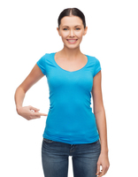
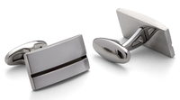
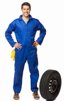
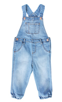
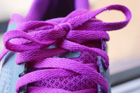
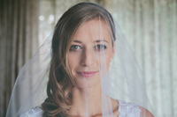

#### be (all) the rage
idiom

1. to be very popular at a particular time:
   
   1. Long hair for men was all the rage in the 70s.

#### dress code
noun

1. an accepted way of dressing for a particular occasion or in a particular social group:
   
   1. Most evenings there's a party and the dress code is strict - black tie only.

#### attire
noun

1. clothes, especially of a particular or formal type:
   
   1. I hardly think jeans are appropriate attire for a wedding.

#### cleavage
noun

1. the narrow space between a woman's breasts, that is seen when she wears a piece of clothing that does not cover the top of them:
   
   1. Clare was wearing a low-cut dress that showed off her cleavage.

#### midriff
noun

1. the part of the human body between the chest and the waist:
   
    

    She wore a short T-shirt that revealed her midriff.

#### fabric
noun

1. cloth or material for making clothes, covering furniture, etc.:
   
   1. dress fabric.
   2. cotton fabrics.

#### frumpy
adjective

1. (of a person or their clothes) old-fashioned and not attractive:
   
   1. I felt fat and frumpy.
   2. a frumpy cardigan.

#### invaluable
adjective

1. extremely useful:
   
   1. The new job will provide you with invaluable experience.
   2. Such data will prove invaluable **to/for** researchers.

#### accessory
noun

1. something added to a machine or to clothing that has a useful or decorative purpose:
   
   1. She wore a green wool suit with **matching** accesssories(= shoes, hat, bag, etc.)
   2. Sunglasses are much more than a fashion accessory.

#### cufflink
noun

1. a small decorative object used to fasten shirt cuffs.
   
   

#### overalls
noun

1. a piece of clothing that covers both the upper and lower parts of the body and is worn especially over other clothes to protect them:

   
   
   1. She put on some overalls and got out a tin of paint.
    
   

#### revealing
adjective

1. Revealing clothes show more of the body that is usual:
   
   1. a revealing dress/shirt

#### skimpy
adjective

1. not large enough:
   
   1. a skimpy meal

2. Skimpy clothing shows a lot of your body:
   
   1. a skimpy dress.

#### baggy
adjective

1. (of clothes) hanging loosely because of being too big or having been stretched:
   
   1. baggy trousers
   2. My T-shirt went all baggy in the wash.

#### clingy
adjective

1. used to describe something that sticks onto someone or something tightly:
   
   1. clingy material
   2. a clingy skirt

#### chic
adjective

1. stylish and fashionable:
   
   1. I like your haircut - it's very chic.
   2. a chic restaurant

#### dolled up
adjective

1. (of a woman) wearing make-up and special clothes in order to look attracitve for a special occasion:
   
   1. She spent two hours **getting** dolled up for the party.

#### (dressed up/done up) to the nines
idiom

1. to be wearing fashionable or formal clothes for a special occasion:
   
   1. Jackie went out dressed to the nines.

#### High Street
noun

1. a street where the most important shops and businesses in a town are:
   
   1. There's a new Italian restaurant opening **on** the high street.
   

#### made-to-measure
adjective

1. made specially to fit a particular person, room, etc.:
   
   1. made-to-measure curtains.

#### off the peg/rack
adjective

1. off-the-peg clothes are made and bought in standard sizes and not made especially to fit a particular person:
   
   1. an off-the-peg suit

#### slave 

#### shoestring
noun

1. a shoelace

#### shoelace
noun

1. a thin string or strip of leather used to fasten shoes:
   
   1. My shoelaces came **undone/untied**.
   2. **Do/Tie** up your shoelaces, Roise.

#### frills
noun

1. extra things that are added to something to make it more pleasant or more attractive, but that are not necessary:
   
   1. a cheap airline, with no frills.
   2. a basic computer with few frills.
   3. A little money spent right can do more than a lot of money spent on frills and gimmicks.

#### no-frills

#### veil
noun

1. a piece of thin material worn by woman to cover the face or head:
   
   

   1. After the ceremony, the bride **lifted** up her veil to kiss her husband.
   2. The women wore black veils that coverd all but their eyes.

