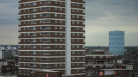

#### squat

verb

1. to position yourself close to the ground balancing on the front part of your feet with your legs bent under your body:
   
   

   1. She squatted on the ground and warmed her hands by the fire.
   2. He squatted **down** and examined the front wheel of his bike.
   
2. to live in an empty building or area of land without the permission of the owner:
   
   1. They squatted (in) an old house in King's Cross when their money ran out.

#### hovel
noun

1. a small home that is dirty and in bad condition.

#### run-down
adjective

1. Run-down buildings or areas are in very bad condition:
   
   1. a run-down building/cemetery

#### addommodate
verb

1. to provide with a place to live or to be stored in:
   
   1. New students may be accommodated **in** halls of residence.
   2. There wasn't enough space to accomodate the files.

2. to give what is needed to someone:
   
   1. The new policies fail to accommodate people with disabilities.
   2. We always try to accommodate out clients **with** financial assistance if necessary.

#### high-rise (flat)
noun

1. a tall modern building with many floors:
   
   1. She lives in a high-rise overlooking the river

Synonym: tower block

#### tower block
noun

1. a tall building divided into apartments or offices:
   
   

#### granny flat
noun

1. a set of rooms, often connected to or part of a relation's house, in which an old person lives

