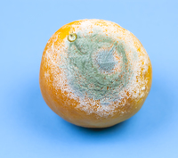

#### Impressionism

#### Cubist

#### Surrealists

#### Op-art

#### Surrealism

#### practitioner
noun

1. someone involved in a skilled job or activity:
   
   1. She was a medical practitioner before she entered politics.

#### daubers
noun, disapproving 

1. someone who paints quickly and carelessly.

#### deem
verb, formal

1. to consider or judge something in a particular way:
   
   1. The area has now been deemed safe
   2. We will provide help whenever you deem it appropriate.

#### acceptable

#### campaign
noun

1. a planned group of especially political, business, or military activities that are intended to achieve a particular aim:
   
   1. The protests were part of their campaign **against** the proposed building development in the area.

#### ubiquity
noun

1. the fact that something or someone seems to be everywhere:
   
   1. the ubiquity of fast-food outlets

#### visually literate
educated with regard to art

#### inured to
not affected by

#### hostility  
noun

1. an occasion when someone is unfriendly or shows that they do not like something:
   
   1. They showed **open**(=obvious) hostility **to/towards** their new neighbours.

### Words for commenting on art

#### original
new in a special and interesting way

Opposite:

#### predictable
disapproving

happening or behaving in a way that you expect and not unusual or interesting:

1. The ending to the film was just so predictable.

#### highbrow
adjective, mainly disapproving

1. (of books, plays, etc.) involving serious and complicated or artistic ideas, or (of people) interested in serious and complicated subjects.

Opposite:

#### lowbrow
adjective

1. (of entertainment) not complicated or demanding much intelligence to be understood:
   
   1. He regards the sort of books I read as very lowbrow.
   2. I like a lowbrow action movie once in a while.

#### middlebrow
adjective, disapproving

1. middlebrow music, literature, art, and films are of good quality, interesting, and often popular, but can be understood quite easily:

#### impenetrable
adjective

1. impossible to see through or go through:
   
   1. Outside, the fog was thick and impenetrable.
   2. an impenetrable barrier

2. impossible to understand:
   
   1. Some of the lyrics on their latest album are completely impenetrable.

Opposite:

#### transparent
adjective

1. If a subject or object is transparent, you can see through it very clearly:
   
   1. Grow the bulbs in a transparent plastic box, so the children can see the roots growing.
   2. Her blouse was practically transparent.

2. clear and easy to understand or recognize:
   
   1. I think we should try to make the instructions more transparent.

#### sophisticated
adjective

1. having a good understanding of the way people behave and/or a good knowledge of culture and fashion:
   
   1. She was slim, svelte, and sophisticated.
   2. I don't think I have any books that would suit your sophisticated tastes.

Opposite:

#### primitive
adjective

1. relating to human society at a very early stage of development, with people living in a simple way without machines or a writing system:
   
   1. Primitive races colonized these islands 2,00o years ago.
   2. Primitive man

#### challenging
adjective

1. difficult, in a way that tests your ability or determination:
   
   1. This has been a challenging time for use all.

Opposite:

#### undemanding
adjective

1. not needing a lot of time, energy, or attention:
   
   1. He is quiet and undemanding.
   2. a relatively undemanding job

#### dazzling
adjective

1. A dazzling light is so bright that you cannot see for a short time after looking at it:
   
   1. a dazzling white light

2. extremely attractive or exciting:
   
   1. dazzling good looks.
   2. a dazzling smile
   3. a dazzling performance/display

#### pedestrain
noun

1. a person who is walking, especially in an area where vehicles go:
   
   1. A few pedestrains sheltered from the rain in doorways.
   2. The death rate for pedestrians hit by cars is unacceptable high.
   
adjective, formal disapproving

1. not interesting; showing very little imagination:
   
   1. Her books, with few exceptions, are workmanlike but pedestrain.
   2. His speech was long and pedestrain.

#### evocative
adjective

1. making you remember or imagine something pleasant:
   
   1. evocative music
   2. a sound evocative **of** the sea.

#### uninspiring
adjective

1. not making you feel excited or interested:
   
   1. The menu looked fairly uninspiring.

#### thought-provoking
adjective

1. making you think a lot about a subject:
   
   1. a thought-provoking book/film.

#### unstimulating

#### exquisite
adjective

1. very beautiful and delicate:
   
   1. an exquisite piece of china
   2. Look at this exquisite painting
   3. She has exquisite taste
   4. a vase of exquisite workmanship

#### clumsy
adjective

1. 

#### intriguing
adjective

1. very interesting because of being unusual or mysterious:
   
   1. an intriguing possibility/question
   2. She has a really intriguing personality.

#### dreary
adjective

1. boring and making you feel unhappy:
   
   1. a dreary little town.
   2. She had spent another dreary day in the office.

#### peerless
adjective

1. Something that is peerless is better than any other of its type:
   
   1. peerless beauty/ability

Synonym:

1. matchless
2. unmatched
3. unrivalled

#### run-of-the-mill
adjective

1. ordinary and not special or exciting in any way:
   
   1. He gave a fairly run-of-the-mill speech.

#### tongue-in-cheek
idiom

If you say something tongue in cheek, you intend it to be understood as a joke, although you might appear to be serious:

1. He said that he was a huge fan of the president, although I suspect it was tongue in cheek.

#### earnest
adjective

1. serious and determined, especially too serious and unable to find your own actions funny:
   
   1. He was a very earnest young man.

#### priceless
adjective

1. A priceless object has such a high value, especially because it is rare, that the price of it cannot be calculated:
   
   1. A priceless collection of vases was destroyed.
   2. Her knowledge and experience would make her a priceless asset to the team.

#### worthless
adjective

1. having no value in money:
   
   1. The company's shares are now **virtually** worthless.
   2. He said the jewels were worthless fakes.

#### skilful
adjective

1. good at doing something, especially because you have priactised doing it:
   
   1. Police officers have to be skilful drivers.

2. done or made very well:
   
   1. a skilful piece of playing on the clarinet.

#### poorly done

#### shadowy
adjective

1. dark and full of shadows:
   
   1. She was startled by a sudden movement in the shadowy hallway.

2. used to refer to someone or something about which little is known:
   
   1. The English king, Arthur, is a somewhat shadowy **figure** who may not have even existed.
   2. They are members of some shadowy extremist group.

#### sketchy
adjective

1. containing few details:
   
   1. So far we only have sketchy information about what caused the explosion.

#### depict
verb

1. to represent or show something in a picture or story:
   
   1. Her paintings depict the lives of ordinary people in the last century.
   2. In the book, he depicts his father **as** a tyrant.

#### portray
verb

1. to represent or describe someone or something in a painting, film, book, or other artistic work:
   
   1. The painting portray a beautiful young woman in a blue dress.
   2. The writer protarys life in a small village at the turn of the century.

#### sensitivity
noun

1. an ability to understand what other people need, and be helpful and kind to them:
   
   1. The police showed commendable sensitivity in their handling of the case.

2. the quality of being easily upset by the things people say or do, or causing people to be upset, embarrassed, or angry:
   
   1. I should have warned you about her sensitivity to criticism.

#### heroine
noun

1. the main female character in a book or film, who is usually good:

#### colourful
adjective

1. having bright colours or a lot of different colours:
   
   1. a colourful painting
   2. colourful costumes

2. interesting and exciting
   
   1. a colourful character
   2. The town, of course, has a very colourful history/past.
   3. The old city around the cathedral is the most colourful part of the town.

#### mould
noun

1. a soft, green or grey growth that develops on old food or on objects that have been left for too long in warm, wet air:
   
   

   There was mould on the cheese.

verb

1. to try to change or influence someone:
   
   1. He kept trying to mould me into something he wanted me to be.

#### illustrate
verb

1. to draw picture for a book, magazine, etc.:
   
   1. a beautifully illustrated book/old manuscript.

2. to show the meaning or truth of somehing more clearly, especially by giving examples:
   
   1. The lecturer illustrated his point **with** a diagram on the blackboard.

#### motif
noun

1. a pattern or design:
   
   1. We chose some curtains with a flower motif.

#### illuminate
verb
 
1. to light something and make it brighter:
   
   1. The streets were illuminate with strings of coloured lights.

2. to explain and show more clearly something that is difficult to understand:
   
   1. an article which illuminates the issues at stake.

#### slavery
noun

