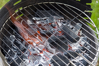

#### a recipe for something
idiom

1. an idea, situation, or method that is likely to result in something:
   
   1. Treating teenagers like six-year-olds is a recipe for disaster.

#### industrialized
adjective

1. having developed a lot of industry:
   
   1. industrialized nations/countries.

#### wholesome
adjective

1. good for you, and likely to improve your life either physically, morally, or emotionally:
   
   1. wholesome food
   2. good, wholesome family entertainment
   3. He looks like a nice, wholesome young man.

#### vague
adjective

1. not clearly expressed,known, described, or decided:
   
   1. I do have a vague memory of meeting her many years ago.
   2. The patient had complained of vague pains and backache.
   

#### additive
noun

1. a substance that is added to food in order to improve its taste or appearance or to keep it fresh and stop it from decaying:
   
   1. food additives.
   2. This margarine is **full of** additives - just look at the label.

#### incomprehensible
adjective

1. impossible or extremely difficult to understand:
   
   1. These accounts are utterly incomprehensible. Can you explain them to me?
   2. It's incomprehensible **to** me why he could want to kill himself.

#### wholefood
noun

1. food that has not had any of its natural features taken away or any artificial substances added:
   
   1. a wholefood shop.

#### free-range
adjective

1. relating to or produced by farm animals that are allowed to move around outside and are not kept in cages:
   
   1. free-range eggs/chickens

### gluten-free
adjective

1. containing no gluten(= a protein contained in wheat and some other grains):
   
   1. Gluten-free bread can be found in most large supermarkets.
   2. a gluten-free **diet**

#### preservative
noun

1. a substance used to prevent decay in wood:
   
   1. a timber/wood preservative
   2. The fence has been treated with preservative

2. a chemical used to stop food from decaying:
   
   1. This bread is completely free from **artificial** preservatives.
   2. No added preservatives.
   3. natural preservatives.

#### scientifically
adverb

#### accurate
adjective

1. correct, exact, and without any mistakes:
   
   1. an accurate machine
   2. an accurate description
   3. The figures they have used are just not accurate.

#### allergy
noun

1. a condition that makes a person become sick or develop skin or breathing problems because they have eaten certain foods or been near certain substances:
   
   1. an allergy **to** wheat
   2. a wheat allergy

adjective: allergic

I'm allergic to cats.

#### vegan

#### unprocessed

#### animal welfare

#### battery-farming

system of producing a large quantity of eggs or meat cheaply by keeping a lot of birds in rows of small cages

#### popularity
noun

1. the fact that something or someone is liked, enjoyed, or supported by many people:
   
   1. the increasing popularity of organic food.

#### convenience food
noun

1. food that is almost ready to eat when it is bought and can be prepared quickly and easily:

#### convenience store
noun

a shop that sells food, drinks, etc. and is usually open until late.

#### unambiguous
adjective

1. expressed in a way that makes it completely clear what is meant:
   
   1. The minister promised a clear and unambiguous **statement** on the future of the coal industry.

#### nutrition
noun

1. the substances that you take into your body as food and the way that they influence your health:
   
   1. **Good** nutrition is essential if patients are to make a quick recovery.
   2. improvements in nutrition.

#### fair trade
noun

1. a way of buying and selling products that makes certain that the people who produce the goods receive a fair price:
   
   1. The charity says that fair trade brings a better standard of living for poor farmers in developing countries.

#### cook up something
informal

to invent a story, plan, etc. usually dishonestly:

1. She cooked up some weird scheme that was going to earn her a future.
2. I had to cook up an excuse about my car breaking down.

#### scheme
noun

1. an organized plan for doing something, especially something dishonest or illegal that will bring a good result for you:
   
   1. He has a hare-brained/crazy scheme for getting rich before he's 20.

2. an officially organized plan or system:
   
   1. Under the current **marking/mark** scheme, you need 90 percent to get an A.
   2. a training/housing/play scheme
   3. a pension/savings scheme
   4. There's a new scheme in our town for recycling plastic bottles.

#### all the ingredients of

#### stew
verb, informal

1. to be angry or worried
   
   1. You're not still stew about what happened yesterday, are you?

#### spice up something

to add excitement or interest to a speech, story, or performance:

1. He's spice up his speech **with** a few rude jokes.

#### grill
verb

1. to ask someone a lot of questions for a long time:
   
   1. After being grilled by the police for two days, Johnson signed a confession.
   2. Her parents would grill her about where she'd been.

noun

1. a frame of metal bars over a fire on which food can be put to be cooked
   
   

#### unsavoury
adjective

1. unpleasant, or morally offensive:
   
   1. unsavoury sexual practices.
   2. an unsavoury reputation

