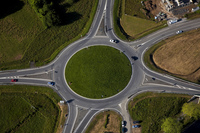
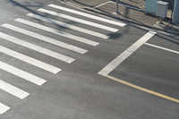
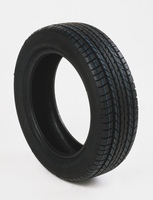
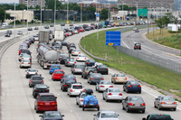
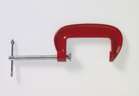

#### junction
noun, US usually intersection

1. a place where things, especially roads or railways, come together:
   
   1. You should slow down as you approache the junction.
   2. There's a service station at the next motorway junction.

#### give way
idiom

1. to allow other vehicles to go past before you move onto a road:
   
   1. You have to give way **to** traffic coming from the right.
   

#### roundabout
noun, US traffic circle

1. a place where three or more roads join and traffic must go around a circular area in the middle, rather than straight accross.
   
   

   
#### pedestrian crossing

#### zabra crossing

#### beep
verb

1. (to cause) to make a short, loud sound:
   
   1. The cab driver beeped (his horn) impatiently **at** the cyclist.
   2. I don't like those watches that keep beeping every hour.

#### jumping a red light
jumping： not stopping at

#### reckless
adjective

1. doing something dangerous and not worrying about the risks and the possibile results:
   
   1. He was found guilty of reckless **driving**.

#### drink-driving

#### drug-driving

#### breathalyse
verb

1. to test a driver's breath to see how much alcohol they have drunk

#### breathalyser
noun

1. a brand name for a device like a small bag, with a tube at one end, that the policae can ask a driver to blow into to see how much alcohol the driver has drunk.

#### hit-and-run
noun

1. a road accident in which the dricer who caused the accident drives away without helping the other people involved and without telling the police:
   
   1. The 24-year-old was the victim of a hit-and-run, killed by a speeding truck.
   2. She was charged in relation to a hit-and-run after she allegedly left the scene of an accident.

#### allege
verb

1. to say that someone has done something illegal or wrong without giving proof:
   
   1. The two men allege (**that**) the police forced them to make false confessions.

#### imprisonment
noun

1. the act of putting someone in prison or the condition of being kept in prison:
   
   1. She was sentenced to five years' imprisonment.
   

#### grave
noun

1. a place in the ground where a dead person is buried:
   
   1. a mass grave
   2. an unmaked grave
   3. a grave digger

adjective

1. seriously bad:
   
   1. a grave situation

#### breach
noun

1. an act of breaking a law, promise, agreement, or relationship:
   
   1. They felt that our discussions with other companies constituted a breach **of/in** our agreement.
   2. He was sued for breach **of contract**.

#### tyre
noun

1. a thick rubber ring, often filled with air, that is fitted around the outer edge of the wheel of a vihicle, allowing the vehicle to stick to the road surface and to travel over the ground more easily:
   
   
   
   1. I've got a flat tyre.(= the air has gone out of it).
   2. I keep a **spare** tyre in the back of the car.

#### exhaust emission
waster gases produced by the vehicle.

#### tailback
noun

1. a line of vehicles that have stopped or are moving only very slowly, because of an accident or other problem on the road in front of them:
   
   

   1. Yesterday there was a four-mile tailback on the main road into the city after a crash.

#### congestioin
noun

1. a situation in which a place is too blocked or crowded, causing difficulties:
   
   1. These facilities are designed to ease the congestion of emergency rooms
   2. Cases are being repeatedly delayed because of congestion in the courts.

#### toll
noun

1. a small amount of money that you have to pay to use a road, cross a bridge, etc:
   
   1. Tolls are now collected electronically on most motorways.

2. the money a long-distance phone call costs:
   
   1. Is Bayonne a toll **call** from New York?

#### pile-up
to form a pile, or to put a lot of things into a pile

a traffic accident involving several vehicles that hit each other

#### diverted
verb

1. to cause something or someone to change direction:
   
   1. Traffic will be diverted through the side streets while the main road is resurfaced.
   2. Our flight had to be diverted **to** Newark because of the storm.

#### distuption
noun

1. the action of preventing something, especially a system, process, or event, from continuing as usual or as expected:
   
   1. The accident brought **widespread** disruptiion on the roads.

#### tow-away
noun

1. an act of a car being officially removed from a place where it has been illegally left:
   
   1. I couldn't find a parking meter, so I decided to park illegally and risk a tow-away.
   2. This part of town is a tow-away **area/zone**.(= one in which cars left illegally will be removed)

#### clamped
noun

1. a device made of wood or metal that is used to hold two things together tightly:
   
   

   1. Carefully **tighten** the clamp until it firmly supports the pipette in a vertical position.

verb

1. to fasten two things together, using a clamp:
   
   1. Clamp the two pieces of wood(**together**) for 15 minutes.

2. If the police or another person in authority clamps a vehicle, they fix a metal device to one of its wheels, usually because it is parked illegally. The device is usually only removed when the owner pays an amount of money:
   
   1. When I finally got back, I found my car had been clamped.

#### road rage
noun

1. anger or violence between drivers, often caused by difficult driving conditions:
   
   1. Earlier today a man was arrested for attacking a motorist in a road rage incident.

#### skid
verb

1. (especially of a vehicle) to slide along a surface so that you have no control:
   
   1. Tony'car skidded **on** some ice and hit a tree.

#### head-on collision
noun

A head-on accident is one in which the fronts of two vehicles hit each other:

1. The car crossed the road and hit a truck head-on.
2. a head-on collision

#### collision
noun

1. an accident that happens when two vehicles hit each other with force:
   
   1. There has been a collision on the southbound stretch of the motorway.
   2. Two drivers were killed in a **head-on** collision **between** a car and a taxi last night.
   3. The cyclist was in a collision with a bus.

#### glue
noun

1. a sticky substance that is used for joining things together permanently, produced from animal bones and skins or by a chemical process.

