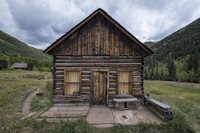
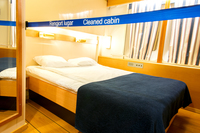
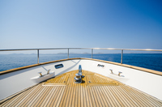
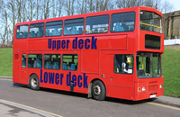
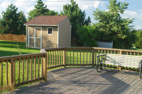
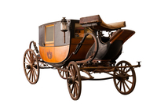
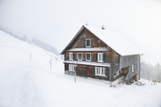

#### scheduled flight
noun

1. a regular flight organized by the company that owns the aircraft.
   

#### charter
noun

1. the renting of a vehicle:
   
   1. boats for charter
   2. a charter flight
   3. a major charter operator

verb

1. to rent a vehicle, especially an aircraft, for a special use and not as part of a regular service:
   
   1. They're chartered a plane to take delegates to the conference.

#### restriction
noun

1. an official limit on something:
   
   1. import/export/currency restrictions
   2. **speed/parking** restrictions
   

#### stopover
noun

1. a short stay in a place that you make while you are on a longer journey to somewhere else:
   
   1. Our tickets to Australia include a stopover for two nights in Singapore.

#### transfer
verb

1. to move someone ro something from one place, vehicle, person, or group to another:
   
   1. He has been transferred **to** a psychiatric hospital.
   2. She transferred her gun **from** its shoulder holster **to** her handbag.
   3. We were transferred **from** one bus **into** another.

#### shuttle
noun

1. a vehicle or aircraft that travels regularly between two places:
   
   1. To get across town, you can **take** the shuttle from Times Square to Grand Central.
   2. The American (**space**) shuttle was able to be used many times to put payloads in space.

#### all-inclusive
adjective

1. including everything:
   
   1. a seven-night all-inclusive package.
   2. an all-inclusive resort.

#### ferry
noun

1. a boat or ship for taking passengers and often vehicles across an area of water, especially as a regular service:
   
   1. a car ferry
   2. We're going to the Channel Islands **by/on the** ferry.
   3. We **took** the ferry to Calais.

#### crossing
noun

1. a place where something such as a road, river, etc. can be crossed safely, or a place where a road and a railway meet and cross each other:
   
   1. a border/river crossing

2. a journey across a large area of water, from one side to the other:
   
   1. It was a really rough crossing - I threw up three times.

#### cruise
noun

1. a journey on a large ship for pleasure, during which you visit several places:
   
   1. He and his wife went **on a** cruise to the Bahamas.
   2. We took a 12-night river cruise from Vienna to Amsterdam.

#### berth
noun

1. a bed in a boat, train, etc., or a place for a ship or boat to stay in a port:
   
   1. She booked a berth on the ferry from Palermo to Naples.

#### cabin
noun

1. a small, simple house made of wood:
   
   

   1. a log cabin

2. a small room where you sleep in a ship:
   
   

3. the area where passengers sit in an aircraft:
   
   

#### deluxe
adjective

1. very comfortable and of very high quality:
   
   1. a deluxe hotel in Paris.

#### deck
noun

1. a flat area for walking on, built across the space between the sides of a boat:
   
   

   1. We sat **on** deck until it was dark.

2. one of the floors of a bus:
   
   

   1. the upper/top deck of the bus.

3. a wooden floor built outside, where people can sit and relax:
   
   

#### exotic
adjective

1. unusual and exciting because of coming(or seeming to come) from far away, especially a tropical country:
   
   1. exotic flowers/food/designs

#### get away from it all
idiom

to go somewhere, usually on holiday, where you can completely relax and forget your responsibilities or problems:

1. People go fishing to get away from it all.
2. We've decided to go hiking in the mountains to get away from it all.

#### carriage
noun

1. a vehicle with four wheels that is usually pulled by horses and was used mainly in the past:
   
   

   1. a horse-drawn carriage

2. any of the separate parts of a train in which the passengers sit:
   
   1. a railway carriage.

#### change train
get off one train and on to another

#### through train
or direct train, one which takes you directly to you destination.

#### direct train

#### get around
phrasal verb

1. to travel to a lot of places:
   
   1. Spain last week and Germany this week - he gets around, doesn't he!

#### mileage
noun

1. the distance that a vehicle has travelled or the distance that it can travel using a particular amount of fuel:
   
   1. "What's the mileage on your car?" "Oh, about 40,000"
   2. Smaller cars have better mileage and so cost less to run.

2. the amount of money that you are paid or that you must pay for each mile you travel:
   
   1. The car costs $70 a day to rent, but you **get** **unlimited mileage** (= no charge for the miles travelled).

#### come and go as you please
go where you want when you want

#### self-catering
adjective

1. (of a holiday) having cooking facilities available so that you can cook meals for yourself rather than having them provided for you:
   
   1. self-catering apartments/accommodation
   2. a self-catering holiday
   3. We decided to go for self-catering rather than stay in a hotel.

#### chalet
noun

1. a small wooden house found in mountain areas, especially in Switzerland, or a house built in a similar style, especially one used by people on holiday:
   
   

#### half board
noun

a hotel room combined with breakfast and another meal either in the evening or in the middle of the day:

1. Expect to pay about $350 for a week's half board in a three-star hotel.
2. half-board **accommodation**

#### full board
noun

an arrangement in which all your meals are provided at the hotel or rooms that you are paying to stay in:

1. The price of the holiday includes flights, full board, and all extras.

