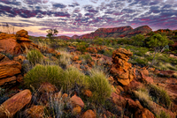

#### escape the crowds

#### off the beaten track
idiom

1. in a place where few people go, far from any main roads and towns:
   
   1. The farmhouse we stayed in was completely off the beaten track.

#### go/get back to nature
idiom

1. to start living a more simple life, often in the country

#### sector
noun

1. one of the areas into which the economic activity of a country is divided:
   
   1. In the **financial** sector, banks and insurance companies have both lost a lot of money.
   2. The country has a new policy of transferring state industries from the **public** sector to the **private** sector.

#### discerning
adjective

1. showing good judgment, especially about style and quality:
   
   1. a discerning customer

#### Caribbean

#### boast
verb

1. to speak too proudly or happily about what you have done or what you own:
   
   1. He didn't talk about his exam results in case people thought he was boasting.
   2. Parents enjoy boasting **about** their children's achievements
   3. They boasted **that** they had never lost a single game.

2. to have or own something to be proud of:
   
   1. Ireland boasts beautiful beaches, great restaurants, and friendly locals.

#### horde
noun

1. a large group of people:
   
   1. Hordes **of** students on bikes made crossing the road difficult.

#### flora and fauna
noun

The flora and fauna of a place are its plants and animals.

#### tract
noun

1. a short piece of writing, especially on a religious or political subject, that is intended to influence other people's opinions:
   
   1. a moral/religious/socialist tract.
   2. Have you read John Milton's tracts **on** divorce?

#### virgin
noun

1. someone who has never had sex:
   
   1. She remained a virgin until she was over thirty.
   2. Do you think he's still a virgin?

adjective

1. a virgin forest or area of land has not yet been cultivated (= used to grow crops) or used by people:
   
   1. The railway is being extended into areas of virgin **forest**.

#### unwind
verb

1. If you unwind something that is wrapped around an object, you unfasten it, and if it unwinds, it becomes unfastened:
   
   1. In a nearby medical tent, a UA Army doctor gently unwinds Metruk's bandage.

2. to relax and allow your mind to be free from worry after a period of work or some other activity that has made you worried:
   
   1. A glass of wine in the evening helps me to unwine after work.

#### recharge
verb

1. If a battery recharges, it becomes filled with electricity so that is can work again and if you recharge a battery, you fill it with electricity.
   
2. to get new energy or to give new energy to something:
   
   1. It's important to have regular breaks and to take time to recharge.

#### bush
noun

1. a plant with many small branches growing either directly from the ground or from a hard stem, giving the plant a rounded shape:
   
   1. a rose bush

2. the bush: (especially in Australia and Africa) an area of land covered with bushes and trees that has never been used for growing crops and where there are very few people:
   
   

#### air-conditioned
adjective

1. An air-conditioned building, room, or vehicle has special equipment that keeps the air in it cool:
   
   1. an air-conditioned office

#### waterfront
noun

1. a part of a town that is next to an area of water such as a river or the sea:
   
   1. She owns a popular tourist restaurant **on** the town's waterfront.

#### stunning
adjective

1. extremely beautiful or attractive:
   
   1. a stunning dress
   2. a stunning view over the bay of Saint Tropez.

#### unbeatable
adjective

1. unable to be defeated or improved because of excellent quality:
   
   1. The 23-year-old US tennis star looks unbeatable this season.
   2. For good pizzas at a reasonable price they're unbeatable.

#### awe-inspiring
adjective

1. causing you to feel great respect or admiration:
   
   1. Niagara Falls really is an awe-inspiring sight.
   2. Her knowledge of computers is quite awe-inspiring.

#### Rambles, hikes and treks
these words represent a scale of length and difficulty: 

a ramble is a long, pleasant walk, not too demanding; 

a hike is more demanding, suggesting more difficult terrain; 

a trek is usually of several days over wild country

#### trek
verb

1. to walk a long distance, usually over land such as hills, mountains, or forests:
   
   1. We spent the day trekking through forests and over mountains.
   2. (informal) I trekked(= walked a long and tiring distance) all the way into town to meet him and he didn't even turn up.

#### unrivalled
adjective

1. having no equal; better than any other of the same type:
   
   1. The museum boasts an unrivalled collection of French porcelain.

#### scenic
adjective

1. having or allowing you to see beautiful natural features:
   
   1. an area of outstanding scenic beauty.
   2. a scenic drive/railway
   3. We **took the** scenic **route** home.

#### paradise
noun

1. a place or condition of great happiness where everything is exactly as you would like it to be:
   
   1. a tropical paradise
   2. His idea of paradise is to spend the day lying on the beach.
   3. This mall is a shopper's paradise.
   

#### ecotourism
noun

1. the business of organizing holidays to places of natural beauty in a way that helps local people and does not damage the environment:

#### savour
verb

1. to enjoy food or an experience slowly, in order to enjoy it as much as possible:
   
   1. It was the first chocolate he'd tasted for over a year, so he savoured every mouthful.

#### renowned
adjective

1. famous for something:
   
   1. The region is renowned **for** its outstanding natural beauty.
   2. Marco Polo is renowned explorer/is renowned **as** an explorer.

#### heartland
noun

1. the central part of a country or area:
   
   1. the heartland of America

2. the part of a country that is most important for a particular activity, or where a political party has the most support:
   
   1. the old insudtrial heartland.

