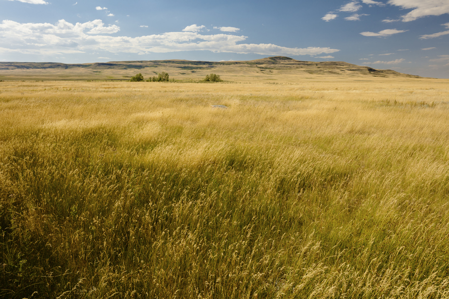
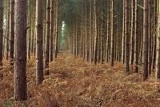

#### rainfall
noun

1. rain, or the amount of rain thats falls:
   
   1. **Heavy** rainfall ruined the match.
   2. The **average** annual rainfall in this region is 750 mm.

#### arid
adjective

1. very dry and without enough rain for plants:
   
   1. The desert is so arid that nothing can grow there.

#### prone to

to prone to something/ do something:

likely to show a particular characteristic, usually a negative one, or to be affected by somthing bad, such as damage or an illness:

1. I've always been prone to headaches.
2. He was prone to depression even as a teenager.
3. She's prone to exaggerate, that's for sure.

#### drought
noun

1. a long period when there is little or no rain:
   
   1. This year (a) severe drought has ruined the crops.

#### tundra
noun

1. (part of) the very large area of land in North Asia, North America, and northern Europe where, because it is clod, trees do not grow and ground below the surface is permanently frozen:
   
   1. Reindeer roam the tundra in large herds.
   2. Few plants grow in tundra regions.

#### vegetation
noun

1. plants in general, or plants that are found in a particular area:
   
   1. The railway track will have to be cleared of vegetation if it is to be used again.
   2. Much of the region's native vegetation has been damaged by developers who are building hotels along the coast.

#### dense
adjective

1. having parts that are close together so that it is difficult to go or see through:
   
   1. dense **fog**
   2. a dense forest
   3. The body was found hidden in dense **undergrowth**.

#### coniferous
adjective

1. (of a tree) producing cones, and having leaves that do not fall off in the winter:
   
   1. An informal mix of trees and shrubs is preferable, with more coniferous than deciduous species.
   2. ancient woodland of mixed deciduous and coniferous trees

#### conifer
noun

1. one of various types of evergreen tree(= one that never loses its leaves) that produce hard oval-shaped fruit called cones

#### deciduous
adjective

1. A deciduous tree loses its leaves in autumn and grows new ones in the spring

#### evergreen
adjective

1. An evergreen plant, bush, or tree has leaves for the whole year.

2. always seeming fresh or remaining popular:
   
   1. that evergreen TV series "Friends"

#### taiga
noun

1. the very large area of wet land in the far northern parts of the world that is covered with conifer trees:
   
   1. a village in the heart of the Siberian taiga.

#### temperate
adjective

1. (of weather conditions) neither very hot nor very cold:
   
   1. a temperate **climate**

#### prairie
noun

1. a wide area of flat land without trees in Canada and the northern US:
   
   

#### paddy
noun

1. a very angry state:
   
   1. There's no need to get **in/out** a paddy.
   

#### drier
adjective, comparative of dry

#### hilly
adjective

1. having a lot of hills:
   
   1. hilly countryside
   2. a hilly area

#### cereal
noun

1. a plant that is grown to product grain:
   
   1. cereal crops

2. a food that is made from grain and eaten with milk, especially in the morning:
   
   

   breakfast cereals

#### tend
verb, formal

1. to care for something or someone:
   
   1. He carefully tended his sunflower plants
   2. The nurse gently tended the patient's cuts and bruises.

#### developed
adjective

1. advanced or powerful:
   
   1. Sharks have a **highly** developed sense of smell.

2. A developed country has had modern industry, transport, etc. for some time and now bases much of its economy on services:
   
   1. In developed countries, blood pressure tends to go up dramatically with age.
   2. less developed nations

#### developing
adjective

1. A developing country or area of the world is poorer and has less advanced industries, especially in Africa, Latin America, or Asia:
   
   1. the developing world/countries/nations

2. growing or becoming stronger or more advanced:

#### the forefront
noun

1. the most noticeable or important position:
   
   1. She was one of the politicians **at/in** the forefront **of** the campaign to free the prisoners.
   2. His team is **at** the forefront **of** scientific research into vaccines.

#### sizeable
adjective

1. large:
   
   1. a sizeable amount/house/area

#### generate
verb

1. to produce energy in a particular form:
   
   1. The wind farm may be able to generate enough **electricty/power** for 2,000 homes.

2. to cause something to exist:
   
   1. Her latest film has generated a lot of **interest/excitement**.

#### proportion
noun

1. the number or amount of a group or part of something when compared to the whole:
   
   1. Children make up a large proportion **of** the world's population.
   2. A higher proportion **of** men are willing to share household responsibilities than used to be the case.

#### vibrant
adjective

1. energetic, exciting, and full of enthusiasm:
   
   1. a vibrant young performer.
   2. a vibrant personality
   3. a vibrant city.
   4. The hope is that this area will develop into a vibrant commercial centre.

#### descend
verb

1. to go or come down:
   
   1. The path descended steeply into the valley.
   2. Jane descended the stairs.

2. If darkness or night descends, it becomes dark and day changes to night.

#### indigenous
adjective

1. used to refer to, or relating to, the people who originally lived in a place, rather than people who moved there from somewhere else:
   
   1. So who are the indigenous people of this land?
   2. The indigenous population has long suffered exclusion and profound injustice.

#### tribe
noun

1. a group of people, often of related families, who live together, sharing teh same language, culture, and history, especially those who do not live in towns or cities:
   
   1. a tribe of Amazonian Indians
   

#### colonial
adjective

1. relating to a colony or colonialism:
   
   1. Turkey was once an important colonial power.
   2. Various parts of Africa have suffered under colonial **rule**.
   3. a colonial mentality.

#### ancestor
noun

1. a person related to you who lived a long time ago:
   
   1. There were portraits of his ancestors on the walls of the room.

#### descendant
noun

1. a person who is related to you and who lives after you, such as your child or grandchild:
   
   1. He has no descendants.
   2. They claim to be descendants **of** a French duke.
   3. We owe it to our descendants (= people younger than us who will live after we have died) to leave them a clean world to live in.
   

#### plantation
noun

1. a large farm, especially in a hot part of the world, on which a particular type of crop is grown:
   
   1. a tea/cotton/rubber plantation.

2. an area where trees are grown for wood:
   
   

   1. plantations of fast-growing conifers.

#### migrant
noun

1. a person that travels to a different country or place, often in order to find work:
   
   1. The cities are full of migrants looking for work.

people who move to live in another country or another part of their own country (often for reasons of economic need)

#### emigrant
noun

1. a person who leave a country permanently and go to live in another one:

an emigrant is someone who leaves a country

#### immigrant
noun

1. a person who has come to a different country in order to live there permanently:
   
   1. a large immigrant population
   2. **Illegal** immigrants are send back across the border if they are caught.

an immigrant is someone who moves to live in a country

#### settled
adjective

1. If you feel settled in a job, school, etc., you have become familiar with it and are comforable and happy there:
   
   1. Now that the children are settled at school, we don't really want to move again.
   2. Although I worked there for over a year, I never really felt settled.

2. living somewhere, especially permanently:
   
   1. After many years of travelling around, we're now enjoying a more settled life.

3. settled weather is calm and unlikely to change:
   
   1. It looks as if we are in for a settled spell this week.

#### textile
nonu

1. a clothe made by hand or machine:
   
   1. the textile industry.

