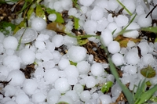

#### nippy
adjective

1. able to change speed and direction easily:
   
   1. a nippy little car.

2. nippy weather or air is quite cold:
   
   1. It's a little nippy today - you might need a coat.

#### chilly
adjective

1. (of weather, conditions in a room, or parts of the body) cold:
   
   1. The bathroom **gets** chilly in the winter.
   2. I felt a bit chilly so I put on a jacket.
   3. a chilly October day

#### sweltering
adjective

1. extremely and uncomfortably hot:
   
   1. In the summer, it's sweltering in the smaller classrooms.

#### roasting
adjective

1. very hot:
   
   1. It was a roasting summer day.
   2. I'm roasting!

#### blowy
adjective

1. with a lot of wind:
   
   1. a blowy day.

#### breezy
adjective

1. with wind that is quite strong but pleasant:
   
   1. It was a breezy day, just right for sailing.

#### oppressive
adjective

1. cruel and unfair:
   
   1. an oppressive government/military regime.

2. If the weather or heat is oppressive, it is too hot and there is no wind:
   
   1. We were unable to sleep because of the oppressive **heat**.

#### sultry
adjective

1. (of weather) uncomfortably warm and with air that is slightly wet:
   

#### stifling
adjective

1. extremely hot and unpleasant:
   
   1. I can't bear this stifling humidity.
   2. Several hundred people were crammed into the stifling room.

#### deluge
noun

1. a very large amount od rain or water:
   
   1. This little stream can become a deluge when it rains heavily.

#### muggy
adjective

1. when the weather is muggy, it is unpleasantly warm and the air contains a lot of water:
   
#### sticky
adjective

1. made of or covered with a substance that stays attached to any surface it touches:
   
   1. a sticky mess
   2. sticky fingers
   3. The floor's still sticky where I spilled the juice.
   4. The children's faces were sticky **with** chocolate.

#### clammy
adjective

1. sticky and slightly wet in an unpleasant way:
   
   1. My hands felt all clammy.
   2. It was a hot, clammy day.

#### secrecy
noun

1. the state of being secret or of keeping something secret:
   
   1. The content of her report is **shrouded in** secrecy.(= being kept secret).
   2. I'd love to tell you about it, but Martin's sworn me **to** secrecy.(= made me promise not to tell anyone)

#### prevailing
adjective

1. existing in a particular place or at a particular time:
   
   1. the prevailing attitude.
   2. The prevailing mood is one of optimism.

#### disposition
noun

1. the particular type of character that a person natually has:
   
   1. She is **of** a nervous/cheerful/sunny disposition.

2. a natural tendency to do something, or to have or develop something:
   
   1. a disposition to deceive

#### frosty
adjective

1. very cold, with a thin layer of white ice covering everything:
   
   1. The frosty air stung my cheeks.
   2. It was a cold and frosty morning.

2. If someone, or someone's behaviour, is frosty, they are unfriendly and not welcoming:
   
   1. He gave me a frosty look.
   2. The chairperson's plan received a frosty **reception** from the committee.
   

#### snowed under
idiom

1. having too much to do:
   
   1. I am totally snowed under at school

#### be under a cloud
idiom

to not be trust or popular because people think you have done something bad:

1. The cabinet minister left office under a cloud after a fraud scandal.

#### cloud

1. If something clouds a situation or feeling, it makes it less clear:
   
   1. The fact that Jack was an old friend **clouded her judgment**.

#### hail
noun

1. small, hard balls of ice that fall from the sky like rain:
   
   

2. a hail of something: a lot of similar things or remarks, thrown or shouted at someone at the same time:
   
   1. a hail of bullets.
   2. The prime minister was greeted with a hail of insults as she arrived at the university.

#### hazy
adjective

1. Hazy air or weather is not clear, especially because of heat:
   
   1. hazy sunshine
   2. the hazy days of summer

2. not remembering things clearly:
   
   1. **hazy memoires** of childhood.

#### whirlwind
noun, US twister

1. a tall, spining column of air that moves across the surface of the land or sea:
   
adjective

1. A whirlwind event happens very fast, and often unexpectedly:
   
   1. They married three months after they met - it was a real whirlwind romance.
   2. a whirlwind tour/visit

#### thunder
verb

1. When it thunders, a loud noise comes from the sky:
   
   1. The sky grew dark and it started to thunder.

2. to move, making a lot of noise:
   
   1. The train thundered past, shaking the whole house.

#### Thunderous
adjective

1. extermely loud:
   
   1. thunderous applause
   2. a thunderous reception

#### thundery
adjective

1. used to describe weather or a storm, etc. in which there is thunder:
   
(Note that thundery is used to describe stormy weather while thunderous describes a loud, deep noise.) 

#### discontent
noun

1. a feeling of wanting better treatment or an improved situation:
   
   1. Discontent **among** junior ranks was rapidly spreading.
   2. There was **widespread** discontent **at/about/over/with** the plan.

