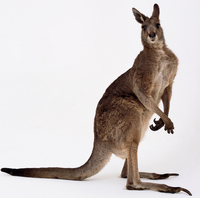
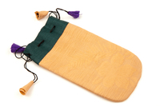
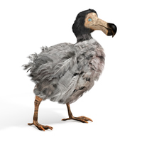
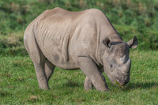

#### mammal
noun, 哺乳动物

1. any animal of which the female feeds her young on milk from her own body. Most mammals give birth to live young, not eggs:
   
   1. Humans, dogs, elephants, and dolphins are all mammals, but birds, fish, and corcodiles are not.

#### kangaroo
noun

#### marsupial
noun,有袋（目）动物, 有袋动物的

#### pouch
noun

1. a bag or soft container for a small object or a small amount of something:
   
   

   1. All our electric shavers are supplied with a free travel pouch.
   2. Food sealed in foil pouches lasts for a long time.

2. a pocket on the lower part of the body of some female animals in which their young are carried and protected after they are born:
   
   1. Kangaroos carry their young in pouches.

#### rodent
noun,啮齿动物（如老鼠等）
1. any of various small mammals with large, sharp front teeth, such as mice and rats:

#### reptile
noun, 爬行动物

1. an animal that produces eggs and uses the heat of the sun to keep its blood warm:
   

#### carnivore
noun,食肉动物

1. an animal that eats meat:
   
   1. Lions and tigers are carnivores.

#### herbivore
noun, 食草动物，草食动物

1. an animal that eats only plants:
   
   1. Cows and sheep are herbivore.

#### predator
noun, 捕食性动物，食肉动物, 尾随伤害他人者，尾随作案者

1. an animal that hunts, kills, and eats other animals:
   
   1. lions, wolves, and other predators.

#### scavenger
noun,食腐动物

1. a bird or an animal that feeds on dead animals that it has not killed itself:
   
   1. Most dead birds are picked up by  crows or other scavengers.

2. someone who collects things that people have thrown away or left somewhere:
   
   1. She earns her living as a scavenger at the city dump.
   2. Then scavengers came and dug up the metals worth selling.

#### warm-blooded

#### cold-blooded

#### docile
adjective

1. quiet and easy to influence, persuade, or control:
   
   1. The once docile population has finally risen up against the ruthless regime.

#### tame
adjective

1. (especially of animals) not wild or dangerous, either natually or because of training or long involvement with humans:
   
   1. After a few months'contact the monkeys become very tame.

#### domesticated
adjective

1. (of animals or plants) brought under human control in order to provide food, power, or company:
   
   1. domesticated animals

2. able or willing to do cleaning, cooking, and other jobs in the home, and to take care of children:
   
   1. Since they had their baby they've both become quite domesticated.

#### savage
adjective

1. extremely violent, wild, or frightening:
   
   1. a savage dog/beast
   2. a brutal and savage attack

#### fierce
adjective

1. physically violent and frightening:
   
   1. a fierce attack/battle
   2. Two men were shot during fierce fighting last weekend.

#### habitat
noun

1. the natural environment in which an animal or plant usually lives:
   
   1. natural habitat
   2. With so many areas of woodland being cut down, a lot of wildlife is losing its natural habitat.

#### migrate
verb

1. When an animal migrates, it travels to a different place, usually when the season changes:
   
   1. These animals migrate annually in search of food.
   2. In September, these birds migrate 2,000 miles south **to** a warmer climate.

2. If people migrate, they travel in large numbers to a new place to live temporarily:
   
   1. Mexican farm workers migrate **into** the US each year to find work at harvest time.

3. to move from one place to another:
   
   1. Trade has migrated **from** local shops to the larger chain stores.

#### migration
noun

1. the process of animals travelling to a different place, usually when the season changes:
   
   1. Christmas Island is known for its anual migration of 50 million bright red land crabs from the forest to the sea.
   2. Some old roads follow the paths of seasonal animal migrations.
   3. Scientists track bird populations and migration patterns.

#### dodo
渡渡鸟（一种大型鸟类，不能飞翔，现已灭绝)

a large bird, unable to fly, that no londer exists.

#### extinct
adjective

1. not now existing:
   
   1. There is concern that the giant panda will soon become extinct.
   2. Many tribes become extinct when they came into contact with Western illnesses.
   3. A lot of trades have become extinct because of the development of technology.

#### game reserve/parks
noun

1. a protected area of land where wild animals can live safely or be hunted in a controlled way:
   
   1. The photograph shows an elephant and giraffes in the Masai Mara game reserve.

#### sanctuary
noun

1. protection or a safe place, especially for someone or something being chased or hunted:
   
   1. Illegal immigrants **found/sought/took** sanctuary in a local church.
   2. The chapel became a sanctuary for the refugees.
   3. If I want some peace and quiet, I **take** sanctuary in my study.
   
2. a place where birds or animals can live and be protected, especially from being hunted or dangerous conditions:
   
   1. a wildlife/bird sanctuary.

#### animal (rescue) shelter
noun

1. a place where animals that have been badly treated, or are lost or not wanted, can be cared for:

#### blood sport
noun

1. any sport that involves animals being killed or hurt to make the people watching or taking part feel excitement:

#### the fur trade

#### the ivory trade

#### poach
verb

1. to cook something such as a fish, or an egg with its shell removed, by putting it gently boiling water or other liquid:
   
   1. We had poached eggs for breakfast.
   2. Do you like pears poached in red wine?

2. to catch and kill animals without permission on someone else's land:
   
   1. The farmer claimed that he shot the men because they were poaching on his land.

3. to take and use for yourself unfairly or dishonestly something, usually an idea, that belongs to someone else:
   
   1. Jeff always poaches my **ideas**, and then pretends that they're his own.

#### poacher
noun

1. someone who catches and kills animals illegally:
   
   1. Poachers hunt and kill the rhinos for their horns.

#### animal rights activist

#### rhino
noun

