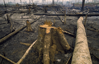

#### biodiversity
noun

1. the number and types of plants and animals that exist in a particular area or in the world generally, or the problem of protecting this:
   
   1. a new National Biological Survey to protect species habitat and biodiversity.

#### species
noun

1. a set of animals or plants in which the members have similar characteristics to each other and can breed with each other:
   
   1. **endangered** species.
   2. Over a hundred species **of** insect are found in this area.

#### sceptic
noun

1. a person who doubts the truth or value of an idea or belief:
   
   1. People say it can cure colds, but I'm a bit of sceptic.
   2. to convince the sceptics.

#### climatic
adjective

1. relating to general weather conditions:
   
   1. Some parts of the world seem to be experiencing climatic changes.

#### emission
noun

1. the act of sending out gas, heat, light, etc.:
   
2. an amount of gas, heat, light, etc. that is sent out:

   1. He uses a night observation device that picks up heat emissions.

#### exert
verb

1. to use something such as authority, power, influence, etc. in order to make something happen:
   
   1. If you were to exert your **influence** they might change their decision.
   2. Some mangers exert considerable **pressure on** their staff to work extra hours without being paid.

#### finite
adjective

1. having a limit or end:
   
   1.We only have a finite **amount** of time or complete this task - we can't continue indefinitely.

#### deforestation
noun

1. the cutting down of trees in a large area, or the destruction of forests by people:
   
   

   1. Deforestation is destroying large areas of tropical rain forest.

#### demographic 
adjective, 人口的, 人口统计的, 人口学的

1. relating to demography(= the study of populations and the different groups that make them up):
   
   1. There have been monumental social and demographic changes in the country.
   2. current demographic **trends**

#### projection
noun,计算, 预测，推测, 影像…

1. a calculation or guess about the future based on information that you have:
   
   1. The company has failed to achieve last year's sales projections by 30 percent.

#### exponentially
adverb

1. in a way that becomes quicker and quicker as something that increases becomes larger:
   
   1. Malthus wrote about the risks involved in the world's population increasing exponentially.
   2. We are growing exponentially in resources, people, and financing.

#### contaminating
verb

1. to make something less pure or make it poisonous:
   
   1. Much of the coast has been contaminated by nuclear waste.
   2. The food which had been contaminated was destroyed.

#### commodity
noun

1. a substance or product that can be traded, bought, or sold:
   
   1. The country's most valuable commodities include tin and diamonds.
   2. the international commodities market

2. a valuable quality:
   
   1. If you're going into teaching, energy is a necessary commodity.

#### pristine
adjective

1. new or almost new, and in very good condition:
   
   1. pristine new offices
   2. Washing machine for sale - only two months old and in pristine condition.

#### green credential
the abilities and experience that make someone suitable for a particular job or activity, or proof of someone's abilities and experience:

#### doom
noun

1. death, destruction, or any very bad situation that cannot be avoided:
   
   1. A sense of doom hung over the entire country.
   2. The newspapers are always full of doom **and gloom**(= bad news and unhappiness) these days.

#### gloom
noun

1. feelings of great unhappiness and loss of hope:
   
   1. Bergman's films are often full of gloom and despair.
   2. There is widespread gloom **and doom** about the company's future.

####  prophets of doom and gloom

#### sustainable
adjective

1. able to continue over a period of time:
   
   1. That sort of extreme diet is not sustainable over a long period.
   2. Solutions put in place now must be sustainable.

2. causing, or made in a way that causes, little or no damage to the environment and therefore able to continue for a long time:
   
   1. A large international meeting was held with the aim of promoting sustainable **development** in all countries.

#### sustainable development

#### renewable energy
（能源）可再生能源

