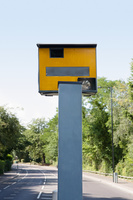

#### landing card
noun, 入境卡

a card given to passengers on a plane or boat that they must fill in with personal information about themselves and show to officials when they arrive in a foreign country:

1. Our officer will scan your passport and check your landing card.

#### customs
noun, plural 海关

the place at a port, airport, or border where travellers' bags are looked at to find out if any goods are being carried illegally

1. to **go through** customs

#### customs declaration
noun

an official document that lists and gives details of goods that are being imported or exported

1. Imported goods must be accompanied by a **customs declaration form**.
2. **file/make/submit a customs declaration**.  Alternatively, you may submit your customs declaration electronically.

#### electronically
adverb，使用或涉及电子器件的，电子的

1. using or involving an electronic device:
   
   1. electronically generated graphics
   2. electronically stored information

#### electrically
adverb, 用电的, 与电有关的

1. using or involving electricity:
   
   1. an electrically powered car

#### vaccination
noun, 疫苗

1. the process or an act of giving someone a vaccine:
   
   1. All the children were given two vaccinations **against** measles.
   2. Flu vaccination is not recommended for children younger than 6 months.

#### certificate
noun

1. an official document that states that the information on it is true:
   
   1. a birth/marriage/death certificate
   2. a doctor's/medical certificate

#### facial recognition technology

#### spot check
noun,抽查, 抽样检查

1. a quick examination of a few members of a group instead of the whole group:
   
   1. The police are doing spot checks **on** motorists to test alcohol levels.

#### ban
verb

1. to forbid(= refuse to allow) something, especially officially:
   
   1. The film was banned in several countries.
   2. She was banned **from** driving for two years.

noun

1. an offcial order that prevents something from happening:
   
   1. There should be a ban **on** talk**ing** loudly in cinemas.

#### restricted
adjective

1. limited, especially by official rules, laws, etc.:
   
   1. Building in this area of town is restricted.
   2. Membership is restricted to (= it is only for) chief executive officers.
   3. Our view of the stage was restricted (= objects prevented us from seeing the whole stage).

#### allowance
noun, 补助金, （尤指为特定事项支付的）定期补贴，津贴, 定量

1. money that you are given regularly, especially to pay for a particular thing:
   
   1. The perks of the job include a company pension and a generous **travel** allowance.
   2. I couldn't have managed at college if I hadn't had an allowance from my parents.

2. an amount of something that you are allowed:
   
   1. The **baggage/luggage** allowance for most flights is 20 kilos.

#### sniffer/detector dogs
noun, 嗅探犬（经过训练专门用于嗅探毒品和炸弹的狗)

1. a dog that is trained and used by the police or army to find hidden drugs or bombs, or find someone the police are looking for, using its sense of smell:
   
   

#### detector
noun, 探测器

1. a device used to find paiticular substances or things, or measure their level:
   
   1. a metal/smoke detector

#### clear customs
successfully get through baggage checking

#### asylum
noun, 保护, （尤指政治）避难，庇护, 医院

1. protection or safety, especially that given by a government to people who have been forced to leave their own countries for their safety or because of war:
   
   1. to **seek/apply for political** asylum.

2. a hospital for people with mental illnesses:
   

#### persecution
noun, （因种族、宗教、政治信仰）迫害, 虐待

1. unfair or cruel treatment over a long period of time because of race, religion, or political beliefs:
   
   1. They left the country out of fear of persecution.
   2. refugees escaping from political persecution

#### enforce
verb, 使服从（法律）, （强制）实行，执行，把…强加于

1. to make people obey a law, or to make a particular situation happen or be accepted:
   
   1. It isn't always easy for the police to enforce speed limits.
   2. The new teacher had failed to enforece any sort of discipline.

#### suspicion
noun

1. a belief or idea that something may be true:
   
   1. [ + that ] I **have** a suspicion **that** he only asked me out because my brother persuaded him to.
   2. She had a **nagging/sneaking** suspicion **that** she might have sent the letter to the wrong address.

#### warrant
verb

1. to make a particular activity necessary:
   
   1. Obviously what she did was wrong, but I don't think it warranted such a severe punishment.
   2. It's a relatively simple task that really doesn't warrant a great deal of time being spent on it.

noun

1. an official document, signed by a judge or other person in authority, that gives the police permission to search someone's home, arrest a person, or take some other action:
   
   1. a search warrent
   2. Judge La Riva had issued an arrest warrant/a warrant for his arrest.

##### safety/speed camera
a camera at the side of the road that takes pictures of cars that are going faster than is legally allowed

#### exceed
verb

1. to be greater than a number or amount, or to go past an allowed limit:
   
   1. The final cost should not exceed $5,000.
   2. The success of our campaign has exceeded our wildest expectations.
   3. She was found guilty on three charges of exceeding the speed limit.

#### traffic warden
noun, 停车监督员

someone whose job is to make certain that people do not leave their cars in illegal places:

1. A traffic warden gave me a ticket for parking on a double yellow line.

#### surveillance
noun, （尤指警察或军队的）监视

1. the careful watching of a person or place, especially by the police or army, because of a crime that has happened or is expected:
   
   1. The police have **kept** the nightclub **under** surveillance because of suspected illegal drug acticity.
   2. More banks are now installing surveillance **cameras**.

#### security forces
often a name for the army and police working together

#### plain-clothes police
police who do not wear uniform

#### undercover police
police who are working secretly, using a false identity

#### drug squad
police specially trained to fight the illegal drug trade

#### bribery
noun, 贿赂，收买

1. an attempt to make someone do something for you by giving the person money, presents, or something else that they want:
   
   1. The organization was rife with **bribery and corruption**.
   2. Charges against the five men include bribery, extortion, and conspiracy.
   

verb: bribe

1. to try to make someone do something for you by giving them money, persents, or something else that they want:

#### extort
noun, 敲诈，勒索；强求

1. to get something by force or threats, or with difficulty:
   
   1. He had been extorting money **from** the old lady for years.
   2. Police have not so far been able to extort a confession **from** the people accused of the bombing.

#### corruption
腐败, （尤指当权者的）贪污，腐败，堕落, （语言）变体

#### anti-corruption squad
police specially trained to discover and fight bribery/corruption.

#### cybercrime
computer crime

#### cyberterrorism
网络恐怖主义

#### cyberwarfare
网络战

#### phishing
网络钓鱼

