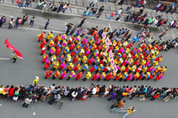
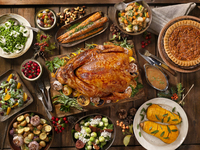

#### fall
verb

1. (happen) to come at a particular time or happen in a particular place:
   
   1. Easter falls late this year.
   2. My birthday will fall **on** a Friday this year.
   3. **Night/Darkness** had fallen by the time we got back to the camp.

#### feature
noun

1. a typical quality or an important part of something:
   
   1. The town's main feature are its beautiful mosque and ancient marketplace.
   2. A unique feature of these rock shelters was that they were dry.

verb

1. to include someone or something as an important part:
   
   1. The movie features James Dean as a disaffected teenager.
   2. This week's broadcast features a report on victims of domestic violence.
   3. It's an Australian company whose logo features a red kangaroo.
   

#### celebrate
verb

1. to take part in special enjoyable activities in order to show that a particular occasion is important:
   
   1. We always celebrate our wedding anniversary **by** going out to dinner.
   2. If this plan works, we'll celebrate **in style**(= in a special way).

#### celebratory
adjective

1. celebrating an important event or a special occasion:
   
   1. When we heard she'd got the job, we all went off for a celebratory drink.

#### festive
adjective

1. having or producing happy and enjoyable feelings suitable for a festival or other special occasion:
   
   1. a festive mood/occasion
   2. The hall looked very festive with its Christmas tree.

#### festivity
noun

1. a situation in which people are happy and celebrating:

#### parade
noun

1. a large number of people walking or in vehicles, all going in the same direction, usually as part of a public celebration of something:
   
   

   1. a victory parade.

#### spectacle
noun

1. an unusual or unexpected event or situation that attracts attention, interest, or disapproval:
   
   1. It was a strange spectacle to see the two former enemies shaking hands and slapping each other on the back.

#### spectacular
adjective

1. very exciting to look at:
   
   1. a spectacular view.
   2. He scored a spectacular goal in the second half.
   3. There was a spectacular sunset last night.

#### feast
noun

1. a special meal with very good or large meal for many people:
   
   

   1. "what a feast!" she said, surveying all the dishes on the table.
   2. a wedding feast

#### feasting

#### ceremony
noun

#### ceremonial
adjective

#### renewal
noun

1. the act of making an official document, agreement, or rule continue for more time:
   
   1. Do you deal with season-ticket renewals here?

#### renew
verb

1. to increase the life of or replace something old:
   
   1. Every year I renew my membership of the sports club.
   2. I forgot to renew my season **ticket**.
   3. I'll use this material to renew the chair covers.

#### renewed
adjective

1. begun or happening again:
   
   1. renewed **interest/enthusiasm**.
   2. The latest outbreak has led to renewed concern about the spread of the disease.

#### superstitious
adjective

1. based on or believing in superstitions(= beliefs based on old ideas about luck and magic rather than science or reason):
   
   1. superstitious nonsense
   2. Some people are superstitious **about** spilling salt on the table.

#### centenary
noun

1. (the day or years that is) 100 years after an important event:
   
   1. centenary celebrations.
   2. Next year is the centenary **of** her death.

#### bi-centenary
noun

1. the day or year that is 200 years after a particular event, especially an important one:
   
   1. A statue was erected to mark the bicentenary **of** the composer's birth.
   2. bicentenary celebrations.

#### flamboyant
adjective,炫耀的, 卖弄的, 艳丽的

1. very confident in your behaviour, and liking to be noticed by other people for example because of the way you dress, talk, etc.:
   
   1. a flamboyant gesture
   2. The writer's flamboyant lifestyle was well known.

#### raucous
adjective,（声音）刺耳的，尖厉的

1. loud and unpleasant:
   
   1. I heard the raucous all of the crows.
   2. Raucous **laughter** came from the next room.
   3. The party was becoming rather raucous.

#### sombre
adjective,严肃的, 忧郁的, 暗淡的，深色的

1. serious, sad, and without humour or entertainment:
   
   1. a sombre atmosphere/voice/face
   2. The funeral was a sombre occasion
   3. I left them in a sombre mood.

#### atmospheric
adjective

1. relating to the air or to the atmosphere:
   
   1. Plants are the main source of atmospheric oxygen.
   2. If atmospheric **conditions** are right, it may be possible to see this group of stars tonight.

#### pagan
adjective, 多神教的, 异教的，非正统的, 多神教徒

1. belonging or relating to a religion that worships many gods, especially one that existed before the main world religious:
   
   1. a pagan religion
   2. The Easter egg has both pagan and Christian origins.

#### commemorate
verb

1. to remember officially and give respect to a great person or event, especially by a public ceremony or by making a statue or special building:
   
   1. Gathered all together in this church, we commemorate those who lost their lives in the war.
   2. A statue has been built to commemorate the 100th anniversary of the poet's birthday.

