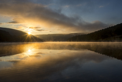
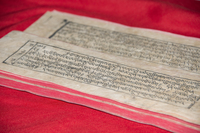
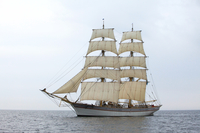

#### archaeologist
noun, 考古学家

1. someone who studies the buildings, graves, tools, and other objects of people who lived in the past

#### archaeology
noun, 考古学

1. the study of the buildings, graves, tools, and other objects that belonged to people who lived in the past, in order to learn about their culture and society
   
   1. Daniel is very interested in history and archaeology, and often visits historic sites.
   

#### remains
noun, 剩余物, 残留物, 遗迹，遗址

1. pieces or parts of something that continue to exist when most of it has been used, destroyed, or taken away:
   
   1. The remains of lunch were still on the table.
   2. We visited the remains **of** a 12th century monastery.

#### civilisation
noun, 文明社会, （特定时期特定社会或国家的）文明，文化, 文明世界，舒适的生活环境

1. human society with its well developed social organizations, or the culture and way of life of a society or country at a particular period in time:
   
   1. Some people think that nuclear war would mean the end of civilization.

#### empire
noun, 国家, 帝国, 组织

1. a group of countries ruled by a single person, government, or country:
   
   1. the Holy Roman Empire

#### imperial
adjective, 帝国, 帝国的, 皇帝的

1. belonging or relating to an empire or the person or country that rules it:
   
   1. Imperial China
   2. Britain's imperial past

#### kingdom
noun, 王国, （某人）占统治地位的地方, 管辖范围

1. a country ruled by a king or queen
   
   1. the United Kingdom of Great Britain and Northern Ireland

2. an area that is controlled by a particular person or where a particular quality is important:
   
   1. the kingdom of God/Heaven
   2. the kingdom of love

#### dynasty
noun,王朝，朝代

1. a series of rulers or leaders who are all from the same family, or a period when a country is ruled by them:

#### dawn
noun, 拂晓，破晓，黎明, 开始

1. the period in the day when light from the sun begins to appear in the sky:
   
   

   1. We woke at dawn.
   2. We left as dawn was breaking (= starting).
   3. We left at the break of dawn.

#### reign
verb, 为王，为君, 当政, 统治

1. to be the king or queen of a country:
   
   1. Queen Victoria reigned **over** Britain from 1837 to 1901.

#### emperor
noun, 皇帝

1. a male ruler of an empire:

#### heir
noun, 继承人, （负责继续处理某一问题或局面的）继承者, （接替某重要位置的）接班人，继任者

1. a person who will legally receive money, property, or a title from another person, especially an older member of the same family, when that other person dies:
   
   1. The guest of honour was the Romanov heir **to** the throne of all Russia.
   2. Despite having a large family, they still had no **son and heir**.

#### successor
noun

1. someone or something that comes after another person or thing:
   
   1. The university is seeking a successor **to** its vice chancellor, who retires this spring.
   2. This range of computers is very fast, but their successors will be even faster.

#### coronation
noun, 加冕典礼

1. a ceremony at which a person is made king or queen:
   
   1. He was present at the coronation of Queen Victoria.

#### conquest
noun, 征服, 制服, 攻克

#### manuscript
noun, 手稿, 原稿, （印刷术发明前的）手写本，手抄本

1. the original copy of a book or article before it is printed:
   
   1. He sent the 400-page manuscript to his publisher.

2. an old document or book written by hand in the times before printing was invented:
   
   

    1. It is thought that the manuscript is the work of a monk and dates from the twelfth century.

#### throne
noun, 王座

#### peasant
noun, （通常指旧时或贫穷国家的）农民，农夫, 没教养的人，粗人

1. a person who owns or rents a small piece of land and grows crops, keeps animals, etc. on it, especially one who has a low income, very little education, and a low social position. This is usually used of someone who lived in the past or of someone in a poor country:
   
   1. Most of the produce sold in the market is grown by peasant farmers.

#### labourer
noun, （尤指在户外的）体力劳动者，劳工，工人

1. a person who does unskilled physical work, especially outside:
   
   1. a farm labourer

#### migration
noun

1. the process of animals travelling to a different place, usually when the season changes:

2. the process of people travelling to a new place to live, usually in large numbers:

#### historian
noun, 历史学家

1. someone who writes about or studies history

#### shred
noun

1. a very small amount of something:
   
   1. There's still **a** shred **of** hope that a peace agreement can be reached.
   2. There isn't **a** shred **of evidence** to support her accusation.

#### Bronze Age

#### medieval
adjective, 中世纪的

1. related to the Middle Ages.

#### Renaissance
noun, （尤指艺术、文学或音乐的）复兴, （15和16世纪时欧洲，尤指意大利北部的）文艺复兴，文艺复兴时期, 文艺复兴的

1. a new growth of activity or interest in something, especially art, literature, or music:

#### pre-colonial

#### post-colonial
adjective, 后殖民的

1. from or relating to the period after colonialism:
   
   1. postcolonial literature.

#### infantry
noun, 步兵

1. the part of an army that fights on foot:
   
   1. The infantry was/were sent into battle.
   2. It's a **light/heavy** infantry unit.

#### cavalry
noun, 机械化部队，装甲部队, （尤指旧时的）骑兵

1. the group of soldiers in an army who fight in tanks, or (especially in the past) on horses:

#### armour
noun, 盔甲

1. strong covering that protects something, especially the body：
   
   1. Police put on **body** armour before confronting the rioters.
   2. In the past, knights used to wear **suits of armour** (= protective covering made of metal) in battle.

#### chariot
noun, （古时用于比赛或战争的）双轮马车

1. a two-wheeled vehicle that was used in ancient times for racing and fighting and was pulled by a horse or horses

#### galleon
noun

1. a large sailing ship with three or four masts, used both in trade and war from the 15th to the 18th centuries
   
   

#### warlord
noun, 军阀

1. a military leader who controls a country or, more often, an area within a country:

#### slave

#### slavery
奴隶制，蓄奴, 奴隶身份

#### ruler
noun, 统治者, 直尺

1. the leader of a country:
   
   1. The country was without a ruler after the queen died.

#### explorer
noun, 勘探者, 考察者, 探险者

1. someone who travels to places where no one has ever been in order to find out what is there:

#### merchant
noun, 商人, （尤指外贸）批发商

1. a person whose job is to buy and sell products in large amounts, especially by trading with other countries:

   1. a wine/grain merchant

#### constitutional
adjective, 法律, 宪法（或章程）允许的，符合宪法（或章程）的

1. allowed by or contained in a constitution:
   
   1. Such a policy would not be constitutional.
   2. Freedom of speech should be a constitutional **right**.

#### monarch
noun

1. a king or queen:
   
   1. a **hereditary** monarch.
   2. Britain's head of state is a **constitutional** monarch(= only has very limited powers)

#### monarchy
noun, 君主国, 君主政体，君主制

1. a country that has a king or queen.

2. the system of having a king or queen:
   
   1. Is monarchy relevant in the modern world or should it be abolished?

#### nobility
noun, 道德的, 高尚，伟大，崇高, 贵族阶层

1. honesty, courage, and kindness:
   
   1. nobility of spirit/purpose

2.  the nobility [ S, + sing/pl verb ] : the people of the highest social rank in a society, considered as a group: (贵族阶层)
   
   1. members of the nobility 

