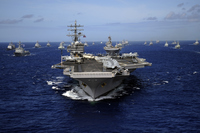

#### resort
noun

1. a place where many people go for rest, sport, or another stated purpose:
   
   1. a **tourist** resort.
   2. a **holiday** resort.
   3. a **seaside/beach** resort
   4. a **ski** resort.

2. the fact that you have to do something because there is no other way of achieving something:
   
   1. He got hold of the money legally, without resort **to** violence. 他没有采取暴力手段，而是通过合法途径拿到了这笔钱。

#### resort
idiom

1. the only choice that remains after all others have been tried:
   
   1. As a last resort, we could ask your mother to help.

#### diplomacy
noun, 外交, （处理人际关系的）手腕，手段

1. the management of relationships between countries:
   
   1. Diplomacy has so far failed to bring an end to the fighting.

2. skill in dealing with people without offending or upsetting them:
   
   1. It took all her tact and dioplmacy to persuade him not to resign.

#### sanction
noun

1. an offical order, such as stopping of trade, that is taken against a country in order to make it obey international law:
   
   1. Many nations have **imposed** sanctions **on** the country because of its attacks on its own people.
   2. **Trade/economic** sanctions will only be **lifted**(= stopped) when the aggressor nation withdraws its troops.

#### impose
verb

1. to officially force a rule, tax, punishment, etc. to be obeyed or received:
   
   1. Very high taxes have recently been imposed **on** cigarettes.
   2. Judges are imposing increasingly heavy fines for minor driving offences.
   3. The council has imposed a ban **on** alcohol in the city parks.

2. to force someone to accept something, especially a belief or way of living:
   
   1. I don't want them to impose their religious beliefs **on** my children.
   2. We must impose some kind of order **on** the way this office is run.

#### withdraw
verb,  抽回；取回；提取；撤回；撤离；退出；移回

1. to take or move out or back, or to remove:
   
   1. This credit card allows you to withdraw up to £200 a day **from** ATMs. 这张信用卡允许你每天从自动取款机中提取200英镑。
   2. The UN has withdrawn its troops **from** the country. 联合国已从该国撤军。
   3. Eleven million bottles of water had to be withdrawn **from** sale due to a health scare. 因为担心危害健康，有1100万瓶水不得不停止销售。
   4. Once in court, he withdrew the statement he'd made to the police (= he claimed it was false). 一上法庭，他便推翻了自己对警方的供词。
   5. All charges against them were withdrawn after the prosecution's case collapsed. 原告诉讼被驳回，所以对他们的指控都撤销了。
   6. She had to withdraw **from** the competition because of a leg injury. 她因伤只好退出了比赛。

2. to stop talking to other people and start thinking thoughts that are not related to what is happening around you (不再说话；沉默；不与人交流)
   
   1. As a child, she frequently withdrew **into** her own fantasy world.
   童年时候，她经常沉浸在自己的幻想世界中。

   2. After the accident, he withdrew **into** himself and refused to talk to family or friends.
   那场事故后，他变得沉默寡言，并拒绝和家人或朋友说话。

#### weaponry
noun

1. weapons in general:
   
   1. nuvlear/conventional weaponry
   2. all hi-tech weaponry demands frequent servicing to ensure accuracy.

#### civilian
noun

1. a person who is not a member of the police or the armed forces:
   
   1. The bomb killed four soldiers and three civilians.

#### casualty
noun

1. a person injured or killed in a serious accident or war:
   
   1. The train was **derailed** but there were no casualties, police said.
   2. The rebels **suffered heavy** casualties.
   
#### civilian casualty

#### intervention
noun

1. the action of becoming intentionally involved in a difficult situation, in order to improve it or prevent it from getting worse:
   
   1. Half the people questioned said they were opposed to **military** intervention **in** the civil war.

#### regime
noun, 管理, 政府, 政权

1. a particular government or a system or method of government:

2. a particular way of operating or organizing a bueiness, etc.:
   
   1. The regime in this office is hard work and more hard work.

#### regime change
noun

a complete change of government, especially one brought about by force:

#### tyrannical
adjective, 残暴的, 专制的

1. using, showing, or relating to the unfair and cruel use of power over other people in a country, group, etc.:
   
   1. a tyrannical leader/regime/political system
   2. In the end she left home just to escape the tyrannical rule of her mother.

#### overthrow
verb

1. to defeat or remove someone from power, using force:
   
   1. He said that Allend's government in Chile was overthrown by the army and the CIA in 1973.

#### tragic
adjective, 哀痛的, 悲惨的, 悲剧的

1. very sad, often involving death and suffering:
   
   1. His friends were deeply shocked and saddened by the tragic **news** of his death.
   2. The bomb explosion resulted in a tragic loss of life.
   3. It is tragic that the theatre has had to close.

#### civil war

#### unrest
noun, 动乱，动荡, 骚乱

1. disagreements or fighting between different groups of people:
   
   1. It is feared that the civil unrest we are now witnessing in this country could lead to full-scale civil war.

#### clash
verb

1. to fight or argue (打斗，打架；发生冲突；争论，争辩):
   
   1. Students clashed **with** police after demonstrations at five universities.
   2. The government and the opposition parties have clashed **over** the cuts in defence spending.

#### rival
noun

1. a person, group, etc. competing with others for the same thing or in the same area:
   
   1. He beat his **closet/nearest** rival by 20 marks.
   2. The companies product rival versions of the toy.

#### ethnic
adjective, 民族的, 种族的,

1. relating or belonging to a group of people who can be seen as distinct(= different) because they have a shared culture, tradition, language, history. etc.:
   
   1. A question on ethnic **origin** was included in the census.
   2. They are the second largest ethnic **group** in Kenya.
   3. The factory's workforce reflects the ethnic **mix** from which it draws its labour.

#### escalate
verb

1. to become or make something become greater or more serious:
   
   1. His financial problems escalated after he became unemployed.

#### all-out
adjective, 竭尽全力的，全力以赴的

1. complete and with as much effort as possible:
   
   1. We made an all-out **effort** to get the project finished on time.

Synonym:

full-scale:  

1. a full-scale model is the same size as original thing: (（模型）与原物大小一致的；原尺寸的)
   
   1. full-scale models of dinosaurs.

2. complete or using all available methods, equipment, money, etc.:
   
   1. a full-scale investigation
   2. a full-scale attack.

#### brutal
adjective

1. cruel, violent, and completely without feelings:
   
   1. a brutal dictator
   2. He had presided over a brutal regime in which thousands of people had "disappeared".
   3. He was imprisoned in 1945 for the brutal **murder** of a twelve-year-old girl.

#### suppression
noun, （用武力）镇压，压制，制止, 抑制，忍住，压抑, 查禁

1. the act of ending something by force:
   
   1. brutal police suppression **of** the riots.
   
2. the act of preventing something from being seen or expressed or from operating:
   
   1. the suppression **of** free speech.
   2. the illegal supression **of** evidence.

#### cleansing
adjective

1. used to describe something that cleans or is used for cleaning:
   
   1. a cleansing cream

#### ethnic cleansing
noun, 种族清洗

the organized, often violent attempt by a particular cultural or racial group to completely remove from a country or area all members of a different group

#### massacre
noun

1. an act of killing a lot of people:
   
   1. He ordered the massacre of 2,000 women and children.

#### conflict resolution

finding a way to end conflict and the negative feelings between groups

#### mistrust
verb

1. to have doubts about the honesty or abilities of someone:
   
   1. I've always mistrusted politicians.

#### hatred
noun

1. an extremely strong feeling of dislike:
   
   1. What is very clear in these letters is Clark's passionate hatred **of** his father.
   2. The motive for this shocking attack seems to be racial hatred.

#### wage
noun

1. a particular amount of money that is paid, usually every week, to an employee, especially one who does work that needs physical skills or strength, rather than a job needing a college education:
   
   1. a very low/high wage
   2. an hourly/daily/weekly/annual wage.
   3. He gets/earns/is paid a good wage, because he works for a fair employer.

verb (发动（战争）, 组织，筹备（活动）)

1. to fight a war or organize a series of activities in order to achieve something:
   
   1. Doesn't the president need Congress's permission to wage war **on** another country?
   2. They've been waging a long campaign to change the law.

#### hostility
noun

1. an occasion when someone is unfriendly or shows that they do not like something:
   
   1. They showed **open** (=obvious) hostility **to/towards** their new neighbours.

2. hostilities: fighting in a war: (战斗；战争行为)
   
   1. Hostilities **began/broke out** just after midnight.
   2. Hostilities were **suspended** (= fighting stopped temporarily) during the talks.

#### besiege
verb

1. to surround a place, especially with an army, to prevent people or supplies getting in or out:
   
   1. The town had been besieged for two months but still resisted the aggressors.

#### siege
noun, 围攻，包围

1. the surrounding of a place by an armed force in order to defeat those defending it:
   
   1. The siege **of** Mafeking lasted for eight months.
   2. The soldiers **laid** siege **to** (= started a siege of) the city.
   3. The castle was **under** siege for months.
   4. (figurative) That whole weekend at Cannes, Brigitte Bardot was under siege by photographers.

#### ambush
verb, 伏击，埋伏突袭

1. to suddenly attack someone after hiding and waiting for them:
   
   1. Five soldiers died after their bus was ambushed on a country road.
   2. He was ambushed **by gunmen** on his way to work.

#### truce
noun

1. a short interruption in a war or augument, or an agreement to stop fighting or arguing for a period of time:
   
   1. After years of rivalry the two companies have **agreed**(US **agreed to**) a truce.
   2. We've got to spend the weekend together, so we might as well **call** a truce.

#### ceasefire
noun

1. an agreement, usually between two armies, to stop fighting in order to allow discussions about peace:
   
   1. declare a ceasefire

#### peacekeeping
noun, 维护和平

1. the activity of preventing war and violence, especially using armed forces not involved in a disagreement to prevent fighting:
   
   1. a peacekeeping force/mission

#### international observer

#### bloodshed
noun, 流血，杀戮

1. killing an violence:
   
   1. The army was brought in to try to prevent further bloodshed.

#### cosmetic
noun

cosmetics [ plural ]
 
substances that you put on your face or body that are intended to improve your appearance:

1. We sell a wide range of cosmetics and toiletries at a very reasonable price.

#### campaign
noun

1. (（尤指政治、商业或军事的）专项活动，运动) a planned group of especially political, business, or military activities that are intended to achieve a particular aim:
   
   1. The protests were part of their campaign **against** the proposed building development in the area.
   2. This is the latest act of terrorism in a long-standing and bloody campaign **of violence**.
   3. The endless public appearances are an inevitable part of an **election** campaign.
   4. a controversial new **advertising** campaign. 备受争议的一则新广告的宣传活动

2. (战役，作战) a group of connected actions or movements that forms part of a war:
   
   1. a bombing campaign. 轰炸行动

#### rebellion
noun, 反叛，造反, 叛乱, 叛逆

1. violent action organized by a group of people who are trying to change the political system in their country:
   
   1. The government has brutally crushed the rebellion.

2. action against those in authority, against the rules, or against normal and accepted ways of behaving:
   
   1. a backbench rebellion **against** the new foreign policy.
   2. her teenage rebellion.

#### rebel
noun

1. a person who is opposed to the political system in their country and tries to change it using force:
   
   1. The rebels took over the capital and set up a new government.
   2. rebel **troops/flighters**

2. a person who does not like rules or authority, and shows this by behaving differently from most people in society:
   
   1. He was a rebel when he was a teenager and dyed his hair pink.

#### suicide bomber

#### fight on our hands

#### fleet
noun

1. a group of ships, or all of the ships in a country's navy:
   
   

   1. a fleet **of** 20 sailing ships
   2. a fishing fleet
   3. The entire Spanish fleet was defeated within 6 hours.

2. a number of buses, aricraft, etc. under the control of one person or organization:
   
   1. He owns a fleet of taxis.

