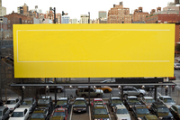
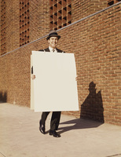
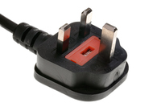
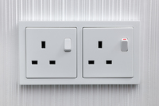

#### innovative
adjective

1. using new methods or ideas:
   
   1. innovative ideas/methods
   2. She was an imaginative and innovative manager.

Synonym:

groundbreaking

#### unsurpassed
adjective

1. better than anyone or anything else:
   
   1. His knowledge of the subject is unsurpassed.

#### leave someone standing
idiom

to be much better than other people or things of the same type:

1. Her voice is excellent - it leaves the others standing.

#### put/leave someone in the shade
idiom

to be so good that another person or thing does not seem important or worth very much:

1. Although I thought I'd done well, my sister's exam results put mine in the shade.

#### rock-bottom
noun

1. the lowest possible level:
   
   1. Confidence in the government is **at** rock bottom.
   2. Prices have **reached** rock bottom.
   3. They were selling the goods at rock-bottom **prices**.
   4. The president's approval ratings have hit rock bottom.

#### slash
verb

1. to cut with a sharp blade using a quick, strong movement:
   
   1. The museum was broken into last night and several paintings were slashed.
   2. She tried to commit suicide by slashing her **wrists**.

2. (informal) to very much reduce something, such as money or jobs:
   
   1. Prices have been slashed by 50 percent!

#### galore
adjective

1. in great amounts or numbers:
   
   1. And to satisfy your sweet tooth, this cafe has desserts galore.

#### pamper yourself
verb

1. to give someone special treatment, making that person as comfotable as possible and giving them whatever they want:
   
   1. She pampers her dog ***with** the finest steak and salmon.
   2. Why not pamper yourself after a hard day **with** a hot bath scented with oils.

#### indulge yourself
verb

1. to allow yourself or another person to have something enjoyable, especially more than is good for you:
   
   1. The soccer fans indulged their patriotism, waving flags and singing songs.
   2. I love champagne but I don't often indulge myself.

#### sumptuous
adjective

1. impressive in a way that seems expensive:
   
   1. The celebrity guests turned up dressed in sumptuous evening gowns.

#### opulent
adjective

1. expensive and luxurious:
   
   1. an opulent lifestyle.
   2. an opulent hotel.

Synonyms:

1. deluxe
2. grand
3. luxurious
4. sumptuous

#### lap
noun

1. the top surface of the upper part of the legs of a person who is sitting down:
   
   1. Come and sit **on** my lap and I'll read you a story.

#### in the lap of luxury

living in very comfortable conditions because you have a lot of money

#### ergonomically
adverb, 人体工程学地

1. in a way that makes furniture or equipment comfortable and effective for people who use it:
   
   1. The new office chairs will be ergonomically correct.
   2. The hotel rooms have ergonomically designed furniture.

#### state-of-the-art
adjective

1. very modern and using the most recent ideas and methods:
   
   1. a state-of-the-art computer.
   2. The control panel uses all the newest technology and is considered state-of-the-art.

#### stand out in the crowd

be noticed

#### guaranteed to turn heads

be noticed

#### tantalisingly
adverb, 逗引性地, 挑逗性地

1. in a way that makes you feel excited and hope that you might get to or do something, especially when this does not in fact happen:
   
   1. They came tantalizingly **close** to winning.
   2. Cooking smells wafted tantalizingly in the air.

#### glossy
adjective

1. smooth and shiny:
   
   1. She has wonderfully glossy hair.
   2. a dog with a glossy coat.

#### radiant
adjective

1. obviously very happy, or very beautiful:
   
   1. He gave a radiant **smile** when he heard her news.

#### poster
noun, 海报

1. a large printed picture, photograph, or notice that you stick or pin to a wall or board, usually for decoration or to advertise something:
   
   1. The children **put up** posters on the classroom walls.
   2. We noticed a poster advertising a circus.

#### billboard
noun, （尤指路旁的）大型广告牌

1. a very large board on which advertisements are shown, especially at the side of a road:
   
   

   1. On the highway we passed dozens of billboards showing his smiling face.

#### trailer
noun, （影视节目、广播的）预告片

1. an advertisement for a film or a television or radio programme, consisting of short parts taken from it:
   
   1. I saw a trailer **for** the new series of "Game of Thrones" last night.

#### sky-writing

#### sandwich board
三明治式广告牌，夹板广告牌（分别挂在胸前和背后的相连的广告牌）

#### pop-up
（计算机屏幕上的）弹出式菜单

1. Select the option you want from the pop-up (menu).

#### plug
noun

1. the act of telling people publicly about a product, event, etc.:
   
   1. She never misses an opportunity to get in a plug **for** her new film.

2. a small plastic or rubber object with two or three metal pins, attached to the end of a wire on a piece of electrical equipment and pushed into a special opening in a wall to connect the equipment to a supply of electricity:
   
   

   1. a three-pin/two-pin plug.
   2. to fit/change a plug
   3. If a plug is wired incorrectly, it can be dangerous.

3. an electric socket:
   
   

   1. Is there a plug in the bedroom that I can use for my hairdryer?

