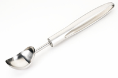

#### pressure group
noun

1. a group of people who work together to try to influence what other people or the government think about a particular subject, in order to achieve the things they want:

Synonym:

lobby

#### air their views
express their opinion

#### press conference
noun

1. a meeting at which a person or organization makes a public statement and reporters can ask questions:

Synonym:

news conference

#### press release
noun, （向媒体发布的）新闻稿

1. a public statement given to the press to publish if they wish:

#### publicity
noun

1. the activity of making certain that someone or something attracts a lot of interest or attention from many people, or the attention received as a result of this activity:
   
   1. He attracted a lot of **adverse/bad** publicity with his speech about unmarried mothers.

#### seek publicity

#### soundbite
noun, （政治家演讲中被新闻报道反复引用的）讲话片段，妙语

1. a short sentence or phrase that is easy to remember, often included in a speech made by a politician and repeated in newspapers and on television and radio:
   
   1. Most politicians want to master the art of the soundbite.

#### tap
verb

1. to get or make use of something:
   
   1. For more than a century, Eastern cities have expanded their water supplies by tapping ever more remote sources.
   2. There is a rich vein of literary talent here just waiting to be tapped by publishers.

#### tapping useful sources

#### airtime
noun, （广播或电视节目的）播出时间（长度）

1. (the amount of) broadcasting time that someone or something has on television or radio:
   
   1. The smaller political parties are campaigning to be allowed free airtime before general elections.

#### paparazzi
noun, （跟踪名人、为报刊偷拍照片的）摄影师，狗仔队

the photographers who follow famous people everywhere they go in order to take photographs of them for newspapers and magazines

#### rag
noun

1. a torn piece of old cloth: 旧布，破布
   
   1. I keep these rags for cleaning the car.

2. (informal) a newspaper or magazine that is considered to be of bad quality:质量低劣的报纸（或杂志）；低俗小报；粗制滥造的杂志
   
   1. He had his picture taken for some **local** rag.

#### gutter press
noun, （刊登耸人听闻的犯罪或色情内容的）低级趣味报纸，下流报纸

the type of newspapers that pay more attention to shocking stories about crime and sex than to serious matters

#### archive
noun

1. a collection of historical records relating to a place, organization, or family:
   
   1. archive **film/footage/material**
   2. These old photographs should go in the family archives.

#### exclusive
adjective, 独家的

#### scoop
noun

1. a tool with a deep bowl-shaped end that is used to dig out and move a soft substance or powder:
   
   

   1. a measuring scoop
   2. an ice-cream scoop

2. the amount held by a scoop:
   
   1. Just one scoop of mashed potato for me, please.

3. a story or piece of news discovered and published by one newspaper before all the others: 抢先报道的新闻；独家新闻
   
   1. The paper managed to secure a major scoop and broke the scandal to the world.

#### libel
noun, （文字性的）诬蔑，诽谤，中伤

1. a piece of writing that contains bad and false things about a person:
   
   1.  She threatened to sue the magazine for libel.

#### defamation
noun, 诋毁、中伤、败坏他人名誉的行为

1. the action of damaging the reputation of a person or group by saying or writing bad things about them that are not true:
   
   1. He is suing for defamation of **character**. 他正在就人格诽谤而提出诉讼。
   2. a defamation lawsuit/action/case

#### defamation of character

#### persuasion
noun

1. the action of persuading someone or of being persuaded:
   
   1. It took a lot of persuasion to convince the committee of the advantages of the new plan.

#### gloss
noun

1. a smooth, shiny appearance on the surface of something:

#### put a gloss on something
to emphasize the good parts of something that has been done, especially those that are to your advantage, and to avoid the bad parts:

1. Politics is all about putting a **good** gloss on unpleasant or difficult situations.

#### muck-raking
noun, （尤指报纸和记者）搜集并揭露丑闻

the activity, especially by newspapers and reporters, of trying to find out unpleasant information about people or organizations in order to make it public:

1. There was so much muckraking about his family life that he decided not to stand for election.

#### heroic
adjective, 英勇的，英雄的, 花费极大力气的

1. very brave or great:
   
   1. a heroic act/deed
 

#### triumph
noun, 巨大成功, 胜利, 狂喜

#### occurrence

