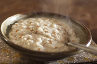

#### artery
noun, 动脉

1. one of the thick tubes that carry blood from the heart to other parts of the body:
   
   1. Hardening of the coronary arteries can lead to a heart attack.

#### circulate
verb, （使）循环, （使）流通, （使）传递

1. to go around or through something, or to make something go around or through something:
   
   1. Hot water circulates through the heating system
   2. I've circulate a good luck card for everyone to sign.

#### impede
verb, 妨碍，阻碍, 阻止

1. to make it more difficult for something to happen or more difficult for someone to do something:
   
   1. Although he's shy, it certainly hasn't impeded his career ini any way.

#### plaque
noun, 扁平物, 铭牌, 匾牌

1. a flat piece of metal, stone, wood, or plastic with writing on it that is attached to a wall, door, or other object:
   
   1. There was a **brass** plaque outside the door listing the various dentists'names.
   2. The First Lady **unveiled** a **commemorative** plaque.

#### clog
verb

1. to (cause something to) become blocked or filled so that movement or activity is difficult:
   
   1. The roads are clogged **with** holiday traffic.
   2. Eating too much fat causes your arteries to clog (**up**).
   3. Leaves are clogging (**up**) the drain.

Synonym:

congest: to make something blocked or crowded in a way that causes difficulties, or to become blocked or crowded:

1. There is no need for us to congest the city with traffic.

#### cholesterol
noun, 胆固醇

1. a substance containing a lot of fat that is found in the body tissue and blood of all animals, thought to be part of the cause of heart disease if there is too much of it:

#### vessel
noun

1. a large boat or a ship:
   
   1. a cargo/fishing/naval/patrol/sailing/supply vessel

2. a curved container that is used to hold liquid:
   
   1. The remains of some Roman earthenware vessels were found during the dig.

3. a tube that carries liquids such as blood throught the body:
   
   1. A heart attack is caused by the **blood** vessels that supply the blood to the heart muscle getting blocked.

#### nutritious
adjective, 营养丰富的，营养价值高的

1. containing many of the substances needed for life and growth:
   
   1. a nutritious diet.
   2. Raw spinach is especially nutritious.

noun: nutrition

#### moderation
noun

1. the quality of doing something within reasonable limits:
   
   1. You can eat whatever you want as long as it's **in** moderation.
   2. All parties will have to show great moderation during these very difficult negotiations.

#### counteract
verb, 抵消, 对抗, 减少

1. to reduce or remove the effect of something unwanted by producing an opposite effect:
   
   1. Drinking a lot of water counteracts the dehydrating **effects** of hot weather.

#### fibre
（水果、蔬菜、黑面包等中的）纤维素

#### high-fibre

#### lentil
noun, 小扁豆

1. a very small dried bean that is cooked and eaten:
   
   1. lentil soup
   2. red/green/brown lentils.

#### oatmeal
noun, 燕麦粉, 燕麦粥

1. a type of flour made from oats:
   
   1. oatmeal bread

2. a thick,soft food made from oats boiled in milk or water, eaten hot for breakfast:
   
   

#### cardiovascular
adjective, 心血管的

1. relating to the heart and blood vessels (= tubes that carry blood around the body):
   
   1. cardiovascular disease

#### diabetes
noun

1. a disease in which the body cannot control the level of sugar in the blood:
   
   1. Diabetes is diagonsed with a blood test.
   2. He had developed diabetes and high blood pressure.
   3. juvenile diabetes

#### diabetics
noun

1. a person who has diabetes

#### glucose
noun, （植物、尤指水果中的）葡萄糖

1. a type of sugar that is found in plants, especially fruit, and supplies an important part of the energy that animals need

#### insulin
noun, 胰岛素

1. a hormone in the body that controls the amount of sugar in the blood:
   
   1. She has to have insulin injections for her diabetes.

#### calorie
noun

1. a unit of energy, often used as a measurement of the amount of energy that food provides:
   
   1. There are about 50 calories in an apple.

#### excessively
adverb

1. in a way that is too much:
   
   1. She was polite but not excessively so.
   2. I don't drink excessively.

#### sporty
adjective

1. a sporty person enjoys sport and is good at it:
   
   1. Guy wasn't really the sporty type.

#### cycling
noun

1. the sport of riding a bicycle:
   
   1. She took up cycling and won five US national titles.
   2. Maybe I'll join a cycling club.

#### metabolism
noun, 新陈代谢

1. all the chemical processes in your body, especially those that cause food to be used for energy and growth:
   
   1. Exercise is supposed to speed up your metabolism.

#### intent on
adjective

1. giving all your attention to something:
   
   1. an intent stare
   2. She had an intent look on her face.

#### brisk
quick, energetic, and active:

1. a brisk walk
2. He set a brisk **pace** and we struggled to keep up.
3. Her tone on the phone was brisk(= she spoke quickly and used few words) **and businesslike**.

#### score an own goal
tried to gain an advantage, but made things worse for myself rather than better

#### move the goalpost
changing the rules

#### in the running
seriously considered

#### neck and neck
level with each other and equally likely to win

#### skate
noun

1. a special boot with a thin metal bar attached to the bottom that you wear to move quickly on ice, or a boot with four small wheels fixed to the bottom so that you can move over a hard surface:
   
   1. a pair of **ice** skates.
   2. a pair of **roller** skates.

#### skate around
dont't talk directly about

### sail through
passed very easily

