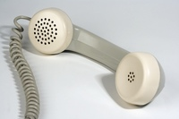
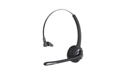

#### photography
noun, 摄影，摄影业

#### superior
adjective, 更好的, 好于平均的，好过其他的，优越的, （人）高傲的，傲慢的，有优越感的

1. better than average or better than other people or things of the same type:
   
   1. This is clearly the work of a superior artist.
   2. She was chosen for the job because she was the superior candidate.
   3. For babies, breastfeeding is superior **to** bottle-feeding.
   4. The government troops were superior **in** numbers (= there were more of them).

2. A superior person believes that or acts as if they are better than other people:
   
   1. a superior manner/smile
   2. I can't stand Amanda - she's so superior.

Opposite:

inferior

#### analogue
adjective

1. An analogue recording is one that is made by changing the sound waves into electrical signals of the same type. An analogue signal is a signal of this type: 模拟录音的
   
   1. I started recording the sounds on analogue reel-to-reel tape.
   2. This is the standard method used to convert analogue signals to digital.

#### disease-resistant

with a high level of protection against diseases

#### ergonomically designed seat

#### techie
noun

someone who knows a lot about computers or other electronic equipment

#### earpiece

#### Technical
adjective

adverb: technically

#### Technological

adverb: technologically

