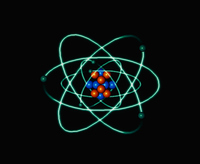
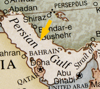

#### interplanetary
adjective

1. between planets:
   
   1. interplanetary space
   2. interplanetary travel

#### outer space
noun, 外层空间，太空

1. the part of space that is very far away from Earth

#### nanotechnology
noun, 纳米技术（指通过控制原子的组合排列开发制造微型器具的学科）

1. an area of science that deals with developing and producing extremely small tools and machines by controlling the arrangement of separate atoms.

#### atom

#### molecule
noun, 分子

1. the simplest unit of a chemical substance, usually a group of two or more atoms

#### keyhole surgery
noun, 微创手术

a medical operation in which a very small hole is made in a person's body to reach the organ or tissue inside

### tissue
noun, 细胞, （动物或植物的细胞）组织, 纸

1. a group of connected cells in an animal or plant that are similar to each other, have the same purpose, and form the stated part of the animal or plant:
   
   1. human tissue
   2. plant tissue
   3. brain/lung/muscle/fat tissue
   4. His face is covered with scar tissue where he was badly burned.

2. soft paper that is used for cleaning, especially your nose, and is thrown away after use, or a small rectangular piece of this:
   
   

   1. She handed me a tissue just before I sneezed.
   2. I always keep a box of tissues in the car.
   3. He used a piece of tissue to clean his sunglasses.

#### doomsday 
noun

1. the end of the world, or a time when something very bad will happen:
   
   1. Ecologists predict a doomsday **scenario** (= a time when death and destruction will happen) if global warming continues to increase at the present rate.
   2. You could talk **till/until** doomsday (= for a very long time), but they will never change their minds.

#### destiny
noun

1. the things that will happen in the future:
   
   1. The destiny **of** our nation depends on this vote!
   2. She felt that her destiny had been **shaped** by her gender.
   3. People want to **control/determine/take charge of** their own destinies.

#### choke
verb

1. If you choke, or if something chokes you, you stop breathing because something is blocking your throat:
   
   1. She choked **to death** on a fish bone.
   2. Children can choke **on** peanuts.
   3. Peanuts can choke a small child.

2. to make someone stop breathing by pressing their throat with the hands

3. to fill something such as a road or pipe, so that nothing can pass through:
   
   1. At lunchtime the streets were choked with traffic.

#### foresee
verb

1. to know about something before it happens:
   
   1. I don't foresee any difficulties so long as we keep within budget.

#### mega-city
noun

1. a very large city, especially one with more than 10 million people living in it:
   
   1. Lagos is a mega-city that now stretches over roughly 300 square kilometres.
   2. London is likely to become one of the world's biggest megacities by 2020.

#### metropolitan
adjective, 大都市的

1. relating to a large city:
   
   1. the Metropolitan Museum of Art in New York
   2. a metropolitan area

#### gridlocked
adjective

1. If a place is gridlocked, the roads are blocked with a lot of traffic so vehicles cannot move:
   
   1. The Chicago area is one of the most gridlocked metropolitan regions in the US, according to a new traffic study.
   2. The radical urban transport scheme is designed to clear London's gridlocked roads.

#### explosion
noun

1. the fact of something such as a bomb exploding:
   
   1. The fire was thought to have been caused by a gas explosion.
   2. The explosion (= the intentional exploding) of nuclear devices in the Bikini Atoll was stopped in 1958.

2. a large increase in the number of something that happens very quickly:
   
   1. The government has had to take measures to halt the **population** explosion.

#### gene 

#### therapy

#### gene therapy

#### genome
noun, 基因组，染色体组

1. the complete set of genetic material of a human, animal, plant, or other living thing

#### envisage
verb, 设想, 展望，预计, 想象

1. to imagine or expect something in the future, especially something good:
   
   1. Train fare increases of 15 percent are envisaged for the next year.
   2. [ + that ] **It's** envisaged **that** building will start at the end of this year.
   3. [ + -ing verb ] When do you envisage finishing the project?
   4. [ + question word ] It's hard to envisage how it might happen.

2. to form a mental picture of something or someone you have never seen:
   
   1. He wasn't what I'd expected - I'd envisaged someone much taller.

#### designer baby
noun, 设计婴儿（基因由父母、医生选定以获得某些特质的婴儿）

1. a baby whose genes have been chosen by its parents and doctors so that it has particular characteristics.

#### nuclear family
noun, （由父母与子女组成的）核心家庭

1. a family consisting of two parents and their children, but not including aunts, uncles, grandparents, etc.

#### extraterrestrial beings
adjective

1. in or coming from a place outside the planet Earth:
   
   1. In those rocks may lie the best chance of finding extraterrestrial life.
   2. extraterrestrial beings

#### gulf
noun

1. a very large area of sea surrounded on three sides by a coast: 海湾
   
   

   1. the Gulf of Mexico

2. an important difference between the ideas, opinions, or situations of two groups of people: 不可逾越的鸿沟，巨大的差距；隔阂
   
   1. There is a widening gulf **between** the rich and the poor in our society.
   2. It is hoped that the peace plan will **bridge** the gulf (= reduce the very large difference) **between** the government and the rebels.

#### drastic
adjective, （尤指行动）严厉的，猛烈的，激烈的

1. (especially of actions) severe and sudden or having very noticeable effects:
   
   1. drastic **measures** . 严厉的措施
   2. Many employees have had to take drastic cuts in pay. 许多员工不得不接受大幅降薪。

