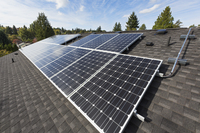

#### fossil fuel
noun

1. fuels, such as gas, coal, and oil, that were formed underground from plant and animal remains millions of years ago

#### oil well
noun, 油井

a hole that is made in the ground so that oil can be taken out of it

#### offshore
adjective

1. away from or at a distance from the coast:
   
   1. offshore engineering
   2. an offshore breeze
   3. The wind was blowing offshore.

#### onshore
adjective

1. moving towards land from the sea, or on land rather than at sea:
   
   1. onshore winds
   2. onshore oil reserves

#### coal-fired
adjective, 以煤为燃料的

1. using coal as a fuel:
   
   1. a coal-fired boiler

#### coal mine
noun, 煤矿

1. the deep hole or system of holes under the ground from which coal is removed

#### solar panel
noun

1. a device that changes energy from the sun into electricity:
   
   

   1. Solar panels are used to power satellites.

#### hydroelectric
adjective, 水力发电的，水电的

1. producing electricity by the force of fast moving water such as rivers or waterfalls:
   
   1. a hydroelectric power station

#### biomass
noun, 生物物质（指能转换成燃料的死亡的动植物有机体）, 生物量

1. dead plant and animal material suitable for using as fuel:
   
   1. biomass **fuel/energy**.

#### tidal power
noun, 潮汐能

1. power that comes from the movement of the tide (= the rise and fall of the sea that happens twice every day) and that can be used especially for producing electricity:
   
   1. The Government pledged investment into the research and development of wind, solar, and tidal power.

#### wave power
using the force of waves in the sea to produce energy

#### power-hungry
using a great amount of energy

#### appliance
noun, 家用电器

equipment, especially electrical equipment, used in
the home, e.g. washing machines, fridges

#### gas-guzzler
noun

1. a car that uses a lot of fuel

#### energy-efficient

#### food miles

#### deposit
noun

1. a layer that has formed under the ground, especially over a long period:
   
   1. mineral/oil/coal deposits

verb

1. to leave something somewhere。 留下；存放
   
   1. The flood waters fell, depositing mud over the whole area.
   2. The bus deposited me miles from anywhere.
   3. I deposited my luggage in a locker at the station.

2. to put something valuable, especially money, in a bank or safe (= strong box or cupboard with locks). （在银行或保险柜中）存放，存储（尤指钱款）
   
   1. I deposited £500 in my account this morning.
   
3. to pay someone an amount of money when you make an agreement with that person to pay for or buy something, that either will be returned to you later, if the agreed arrangement is kept, or that forms part of the total payment.支付（押金、定金或预付款）
   
   1. When we moved in, we had to deposit $1,000 with the landlord in case we broke any of his things.

