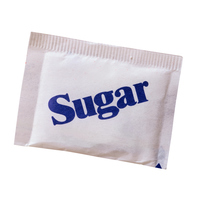

#### content
adjective

1. pleased with your situation and not hoping for change or improvement:
   
   1. He seems fairly content **with** (his) life.
   2. They're content **to** socialize with a very small circle of people.

verb

1. to make someone feel happy and satisfied:
   
   1. You're quite easily cntented, aren't you?
   2. My explanation seemed to content him.

noun

1. a happy and satisfied feeling:
   
   1. Once had he resolved what to do, there followed almost immediately a feeling of content.

2. contents [plural]:
   
   1. the articles or parts contained in a magazine or book, with the number of the page they begin on:
      
      1. the **table of** contents.

   2. everything that is contained within something:
        
      1. The contents **of** his bag spilled all over the floor.
      2. She opened her bag on the table, turned it upside down, and all the contents fell out.
 
#### bar
noun

1. a substance that has been made into a solid rectangular shape:
   
   1. a bar of soap
   2. a bar of chocolate
   3. a chocolate bar

2. a long, thin, stright piece of metal or wood:
   
   1. The gorilla rattled the bars of its cage.

#### packet
noun

1. a small paper or cardboard container in which a number of small objects are sold:
   
   1. a packet **of** cereal/biscuits/crisps/peannuts
   2. a packet **of** chewing gum/cigarettes

   

2. a small closed container made of paper or plastic, containing a small amount of something, usually enough for only one occasion:

   

   1. a packet of sugar

3. an object that is wrapped in paper, etc. for example so that it can be sent by post:
   
   

   1. It will be cheaper to send it as a small packet.

