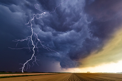

#### lightning
noun

1. a flash of bright light in the sky that is produced by electricity moving between clouds or from clouds to the ground:
   
   

   1. **thunder and** lightning.
   2. a **flash/bolt of** lightning
   3. That tree was **struck by** lightning.
   4. She changed her clothers **with** lightning **speed**(= extremely quickly).

7.4

1. We had really thick fog this morning.
2. I don't mind wet weather if it stays quite mild. I just hate the humid
3. We had a heavy shower this morning, but it only lasted a few minutes.
4. It was pouring with rain when we left the house.
5. It was minus ten degrees in New York yesterday. It is often below zero here in winter. It's freezing cold!.
6. It's getting very humid. We might have a thunderstorm later.
7. It was cloudy and grey this morning, but when the sun came out it was quite hot.
8. What's the weather today? It feels much colder than yesterday.
9. It was hot sitting in the sun, but under the beach umbrella it was nice and cool.

7.5 

Do you have these weather conditions in your country? When do you have them?

humid weather  storms and thunderstorm  strong winds  thick fog  temperatures below zero  showers

