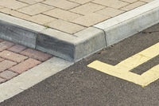
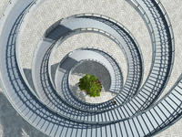

#### concrete
1. [noun] a very hard building material made by mixing together cement, sand, small stones and water:
   
   reinforced concrete

   a concrete floor/path

   a grey concrete building

2. [verb] to cover something in concrete
   Why did you concrete **over** that nice garden?

3. [adjective] clear and certain, or real and existing in a form that can be seen or felt:
   
   They think she killed her husband, but they have no concrete evidence

   We have a general idea of what we want, but nothing concrete at the moment.

   opposite:

   abstract

#### curb
1. [verb] to control or limit something that is not wanted:
   
   The government should act to curb tax evasion

   You really need to curb your spending

2. [noun] a limit on something that is not wanted

   You must try to put a curb **on** your bad temper/spending habits.

   synonyms:

   1. check
   2. constraint
   3. control
   4. curtailment
   5. limit
   6. limitation
   7. restraint
   8. restriction   

3. (also kerb) the edge of a raised path nearest the road
   
   Pavements, kerbs, signs, road markings, diverse street furniture, pedestrians and moving traffic were represented

   

#### spiral

1. [noun] a shape made up of curves, each one above or wider than the one before:
   
   A corkscrew is spiral-shaped.

   The pasta was in small spiral shapes.

   The staircase was a grand spiral of marble.

   

2. downward spiral: a situation in which a price, etc. becomes lower, or a situation gets worse and is difficult to control because one bad event causes another:
   
   This year's downward spiral of house prices has depressed the market.

   We have to avoid the downward spiral in which unemployment leads to homelessness and then to crime.

   The country's economy is on a downward spiral.

3. [verb] to move in spiral:
   
   With one wing damaged, the model airplane spiralled downwards.

4. If costs, prices, etc. spiral, they increase faster and faster:

   Spiralling costs have squeezed profits.

5. spiral downwards: (of prices, etc.) to become less, at a faster and faster rate

6. If a situation spirals, it quickly gets worse in a way that becomes more and more difficult to control:

   Violence in the country is threatening to spiral out of control.

   He spiralled into a drug addiction that cost him his life.

7. [adjective] shaped in a series of curves, each one above or wider than the one before:
   
   a spiral staircase

   a spiral galaxy
   

