#### passage
noun

1. (connecting way) a usually long and narrow part of a building with rooms on one or both sides, or a covered path that connects places:(also passageway)
   
   .jpg)

   A narrow passage led directly through the house into the garden.

   The bathroom's on the right at the end of the passage

2. a short piece of writing or music that is part of a larger piece of work:

   Serveral passages **from** the book were printed in a national newspaper before it was published.

3. travel, especially as a way of escape:
   
   The gunman demanded a plane and safe passage to an unspecified destination.         

#### arcade
noun 

1. a covered area of passage in which there are shops:

   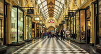

   a shopping arcade

2. a covered passage joined to a building on one side and with columns and arches along the other side

#### archway
noun

an entrance or passage formed by an arch

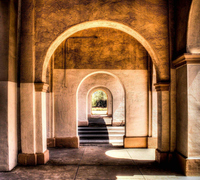

#### breezeway
noun

an outdoor passage with a roof:

His detached garage was separated from the brick home by a breezeway

#### concourse
noun

a large space or room in a pulbic building such as a station or airport that people meet in or pass through:

There's a ticket machine in the main concourse.

#### corridor
noun

a long passage in a building or train, especially with rooms on either side:

Her office is at the end of the corridor.

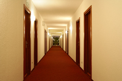

#### desk 
noun, service area

a place, often with a counter (= a long flat narrow surface) especially in a hotel or airport, where you can get information or service:

a check-in/information/reception desk

#### entryway 
noun

1. a way into a place; an entrance:

   The doors were an entryway to a basement area.

2. an inside area through which you enter a building or that leads to other rooms within a building:
   
   They stood in the home's entryway with its tall ceilings and dramatic arched windows.

synonyms:
hall / hallway

#### foyer
noun

a large open area just inside the entrance of a public building such as a theatre or a hotel,where people can wait and meet each other:

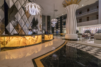

I'll see you downstairs in the foyer in half an hour.

#### gangway
1. a passage between rows of seats, for example in a cinema or bus:
   

   His suitcase was blocking the gangway.

   The performers enter the arena dramatically via the gangways.

2. a board or passage that joins a ship, aircraft, or building to the land or to another building, for people to walk along: 
   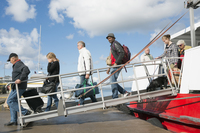   

   Visitors board the ship directly from shore via a long gangway.
   
   The room looked out onto a gangway between two buildings.

#### lobby
1. [verb] to try to persuade a politician ,the government, or an official group that a particular thing should or should not happen, or that a law should be changed:
   
   Small businesses have lobbied hard **for/against** changes in the tax laws.

   [+ to infinitive] Local residents lobbied to have the factory shut down.

   [+ obj + to infinitive] They have been lobbying Congress **to** change the legislation concerning guns.

2. [noun] a group of people who try to persuade the govement or an official group to do something

    the anti-smoking lobby

3. [noun, ROOM] the (large) room into which the main entrance door opens in a hotel or other large building
   
   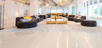
   
#### marquee
noun

1. a large tent used for eating and drinking in at events held mainly outside that involve a lot of people
   
   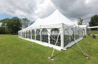

   We're planning to hold the wedding reception in a marquee in the garden.

2. a roof-like structure that sticks out over the entrance to a public building,especially a theatre, and on which there is usually a sign.
   
   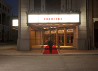

3. [adjective] being the main performer or sports person in a show, film, sports event, etc. or being the performer, etc. whose name will attract most people to show, film, etc.:
      
   The studio chiefs wanted a marquee name in the lead role, not some unknown.

#### patio
noun

an area outside a house with a solid floor but no roof, used in good weather for relaxing, eating, etc.:

In the summer we have breakfast out **on** the patio.

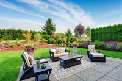

#### porch
noun

a covered structure in front of the entrance to a building

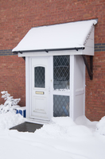

For details, see the poster in the church porch.

The front porch held pots of flowers, all looking healthy and strong.

#### portal
noun

1. a way to get or do something
   
   The laptop is my portal **to** the outside world.

   The post office has lost any sense that its core business is to provide a portal **to** delivery services.

2. an entrance to a building, especially a large or important one:
   
   Carrell's name remains above the portal to his day.

   Passing through the portals **of** the BBC for the first time, she felt slightly nervous.

#### portico
noun

a covered entrance to a building, usually a large and impressive building, that is supported by columns

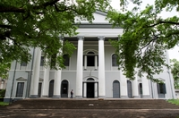

#### reception
noun

1. a formal party at which important people are welcomed:

   The president gave a reception for the visiting heads of state.

2. the way in which people react to something or someone:

   Her first book got a wonderful/warm/frosty reception from the critics.

3. the place in a hotel or office building where people go when they first arrive:
   
   Ask for me at reception.

   I signed in at the reception desk.

   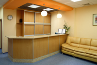

#### side entrance
noun

1. a door at the side of a house or other building that is not the main entrance:

   They had to sneak in through a side entrance.

2. (also, side return)a passage down the side of a house or other building, leading to the back of the building:
   
   Walk through the side entrance and into the garden.

#### vestibule
noun

1. a small room just inside the outer door of a public building where you can leave your coat, etc.:
   I'll wait for you in the vestibule

2. a small closed area on the front of a house
   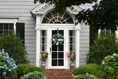

synonym:

porch
