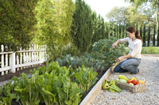
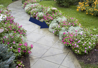
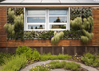
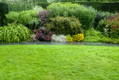
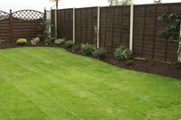
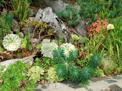
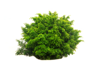

#### arbour
noun,UK (US arbor)

a sheltered place in a garden formed by trees and bushes that are grown to partly surround it:

a rose arbour

#### bed
noun (area of ground)

a piece of ground used for growing plants outside:

They have some beautiful flower beds in their garden

#### border
noun

a norrow strip of ground around a garden, usually planted with flowers

to weed/plant the borders

#### bower
noun

a pleasant place under the branches of a tree in a wood or garden

On the ground outside the bower are two juvenile males

#### flower bed
noun

a part of a garden where flowers are planted

#### green wall
noun also living wall, vertical garden

a wall covered with plants that are growing in containers or on special material attached to the wall, often used when there is not much space to grow things on the ground

Green walls can help the health of a city

Wrap the garden with edible green walls planted with salad leaves.

#### hedging
noun,mainly uk

bushes or small trees planted very close together,especially along the edges of a garden, field, or road:

One of my favourite parts of the garden is a raised lawn, flanked by two lines of yew hedging.

Make the back of the house secure by using prickly hedging or high fencing.

#### herbaceous border
noun, UK (US perennial border)

a narrow strip of land in a garden, planted with different types of flowering plants that live for more than two years:

The large garden has neatly manicured lawns and herbaceous border

#### kitchen garden

an area, especially a part of a large garden, where fruit, vegetables, and herbs are grown

Produce from the farm was usually for sale, and that from the kitchen garden was for self-consumption.

#### lawn
noun

an area of grass, especially near to a house or in a park, that is cut regularly to keep it short:

Will you **mow** the lawn at the weekend?

We enjoyed a leisurely picnic lunch on the lawn.

#### parterre
noun

a flat area in a garden, with a formal arrangement of plants or flowers:

The parterre was planted with herbs.

The garden features a duck pond, French parterres and a Victorian greenhouse.

#### patio
noun

an area outside a house with a solid floor but no roof, used in good weather for relaxing, eating, etc.:

In the summer we have breakfast out **on** a patio

#### raised bed
a bed(= piece of ground for growing plants in) that is higher than the ground around it, and usually surrounded by low walls or a wooden frame:

I built a formal rectangular raised bed out of concrete blocks.

Consider raised beds if your soil is heavy and wet.

#### rock garden
noun, US (Uk rockery)

a garden or an area within a garden that has plants growing between piles of stones

#### seedbed
noun

1. an area of ground prepared for growing plants from seeds:

Prepare the seedbed thoroughly first, being sure to eliminate all weeds.

2. a situation from which something develops:
   They perceive politics as the seedbed **of** corruption.

   The discussions will serve as a seedbed **for** ideas.

#### shrubbery
noun

a part of a garden where a lot of shrubs have been planted.

#### shrub
a large plant with a rounded shape formed from many small branches growing either directly from the ground or from a hard stem, grown in gardens:

She planted some roses and other flowering shrubs.

#### terrace
noun 

1. a flat raised area
   
2. a flat area of stone or grass outside a house, where people sit and sometimes eat
   
    

