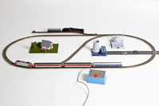
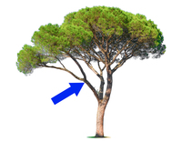
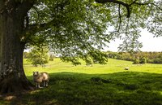
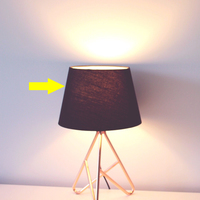
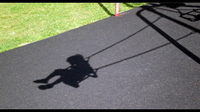

#### some collocations:
1. rich vocabulary: a wide / limited vocabulary
   
2. classical music: classical music was playing softly in the background
   
3. common sense:
   
4. to take sides: to support one person or opinion over another 
   My mother never took sides when my brother and I argued.

5. train set: a toy train and the tracks, equipment, toy housees, etc. that go with it
   
     

6. a sense of humor 
       
7. at a loss for words: unable to think of anything to say
   I was so surprised to see her that I was at a loss for words.

8. be lost for words: to be so shocked, surprised, full of admiration, etc. that you cannot speak:
   Mary was lost for words when she was awarded the prize.

#### gutted
adjective

extremely disappointed and unhappy:

He was gutted when she finished the relationship.

#### gut
1. the long tube in the body of a person or animal, through which food moves during the process of digesting food:
   
   Meat stays in the gut longer than vegetable matter.

2. (informal) a person's stomach when it is extremely large:

   He's got a huge beer gut(= large stomach caused by drinking beer).

3. guts: bowels:

   My guts hurt.

   He got a knife in the guts.

#### articulate
adjective

1. able to express thoughts and feelings easily and clearly, or showing this quality:
   
   an intelligent and highly articulate young woman

   She gave a witty, entertaining, and articulate speech.

2. to express in words:

   I found myself unable to articulate my feelings

   Many people are opposed to the new law, but have had no opportunity to articulate their opposition.   

#### witty
using words in a clever and funny way:

noun: wit : 

1. the ability to use words in a clever and humorous way:

a woman of great intelligence and wit

Her conversation sparkled with her own subtle blend of wit and charm.

2. a person who is skilled at using words in a clever and humorous way:
   

#### blend
noun

1. a mixture of different things or styles:
   
   a rich blend of finest coffee beans

   Their music is a blend of jazz and African rhythms

2. a word formed by combining two other words:

   "Meritage" is a blend that combines "merit" and "heritage"

verb

1. to mix or combine things together, or to mix or combine with something else, to make one substance:
   
   In a separate bowl, blend the egg an cream.

   Stir until the flour is blended **into** butter.

2. to combine with something else in a way that is attractive or works well, or to combine things like this:
   
   The carpet blends well **with** the colour of the walls

   They seamlessly blend elements of jazz and classical music

#### convey
verb

1. to express a thought, feeling, or idea so that it is understood by other people:
   
   His poety conveys a great sense of religious devotion.

   Please convey our condolences **to** the family.

   You don't want to convey the impression **that** we're not interested.

2. to take or carry someone or something to a particular place:

   The goods are usually conveyed by rail.

   Could you convey a message **to** Mr Merrick for me, please?

#### limb
noun

1. an arm or leg of a person or animal:
   
   The accident victims mostly had injuries to their lower limbs(= legs).

   an artificial limb.

2. a large branch of a tree:

   

   An 18-year-old student at California State University died yesterday when she was struck by a falling limb from a large oak tree.

#### drip
if a liquid drips, it falls in drops, or you make ie fall in drops:

Water dripped **down** the wall.

She dripped paint on the carpet.

#### daisy

#### recruit
verb

1. to persuade someone to work for a company or become a new member of an organization, especially the army:
   
   Charities such as Oxfam are always trying to recruit volunteers to help in their work.

   Even young boys are now being recruited **into** the army

   Having **slimmed** to around 1,400 staff, the company is now recruiting again.

   An army recruiting centre/officer

noun

1. a new member of an organization, especially the army:
   
   **Raw** recruits(= completely new soldiers) were trained for six months and then sent to the war front.

#### charity
noun

1. an organization whose purpose is to give money, food, or help to those who need it, or to carry out activities such as medical research that will help people in need, and not to make profit:
   
   Proceeds from the sale of these cards will **go to**(= be given to) local charities.

   a cancer research charity

2. help, especially in the form of money, given freely to people who are in need, for example because they are ill, poor, or have no home, and organizations that provide this help:

   She does a lot of work **for** charity.

   People tend to **give to**(= give money to) charity at Christmas time.

   They did a charity **performance** on the first night, to raise money for AIDS research.

   She **directs**(to control or be in charge of an activity, organization) a large charity.

   An anonymous businesswoman donated one million dollars to the charity.

   Thanks to a large gift from an anonymous donor, the charity was able to continue its work.

3. the quality of being kind to people and not judging them in a severe way

#### proceeds
the amount of money received from a particular event or activity or when something is sold:

1. **The** proceeds **of** today's festival will go to several local charities.
2. It says on the back of the the card **all proceeds to charity**.
   
#### coin
verb

1. to invent a new word or expression, or to use one in a particular way for the first time:
   
   to coin new words/ a term / a phrase

#### royal
adjective

1. belonging or connected to a king or queen or a member of their family:
   
   the royal family

   a royal visit

2. good or excellent, as if intended for or typical of royalty:
   
   The term was given a royal reception/welcome.

3. big or great:

   a royal pain/ a royal mess / a royal palace

#### regal
adjective

very special and suitable for a king or queen:

1. a regal manner

2. He made a regal entrance

#### majestic
adjective

beautiful, powerful, or causing great admiration and respect:

The majestic Montana scenery will leave you breathless.

Synonyms:
1. magnificent
2. splendid

#### subtle
adjective

1. not loud, bright, noticeable, or obvious in any way:
   
   The room was painted a subtle shade of pink.

   The play's message is perhaps too subtle to be understood by young children

2. small but important:

   There is subtle difference between these two plans.

3. achieved in a quiet way that does not attract attention to itself and is therefore good or clever:

   a subtle plan/suggestion

   subtle questions      

   I could detect subtle variances in fragrance as we strolled through the garden.

   Her conversation sparkled with her own subtle blend of wit and charm.

   The directors managed to secure a good deal for the company with a bit of subtle manoeuvring

#### fragrance
noun

1. a sweet or pleasant smell:

    the delicate fragrance of roses

2.  a liquid that people put on their bodies to make themselves smell pleasant:
   
    a brand new fragrance for men

#### stroll
verb

to walk in a slow relaxed way, especially for pleasure:

1. We could stroll along the beach after dinner
2. An elderly couple strolled hand in hand in the park

Synonyms:
1. saunter
2. walk

noun

a slow relaxed walk, especially for pleasure:

1. After dinner, we went for a stroll along the beach.
2. The whole family  was enjoying a leisurely stroll in the subshine

#### manoeuvring
noun

1. the action of cleverly planning something to get an advantage:

   1. The directors managed to secure a good deal for the company with a bit of subtle manoeuvring.

   2. He claimed he knew nothing about the political manoeuvrings which had got him into power.

2. the action of moving, or of moving something, with skill and care:

   With some careful manoeuvring, I was able to get the car into the narrow space

####  alight
adjective

1. burning:
   
   I had to use a bit of petrol to get the fire alight

   He was smoking in bed and his blankets caught alight.

2. brightly lit up:
   
   The sky was alight with hundreds of fireworks.

3. to get out of a vehicle, especially a train or bus:

   The suspect alighted from the train at Euston and proceeded to Heathrow

#### felon
noun, usually used in LAW

a person  who is guilty of a serious crime

Synonyms:
1. criminal: noun, someone who commits a crime

2. malefactor: a person who does bad or illegal things
   
3. perpetrator: someone who has committed a crime or a violent or harmful act

   the perpetrators of the massacre must be brought to justice as war criminals.

#### shade
noun

1. slight darkness caused by something blocking the direct light from the sun:
   
   

   The sun was hot, and there were no trees to offer us shade.

   The children played in/under the shade of a large beach umbrella.

2. a covering that is put over an electric light in order to make it less bright:

   The lamps all had matching purple shades.

   lampshade

   

3. shades[informal]: sunglasses:

   She was wearing a black leather jacket and shades.

4. a piece of material fixed onto a wooden or metal roller that can be pulled down to cover a window:

        

#### shadow
noun

an area of darkness, caused by light being blocked by something:

The children were playing, jumping on each other's shadows

Jamie followed his mother around all day like a shadow

The sun shone through the leaves, casting/throwing shadows on the lawn.

This corner of the room is always **in** shadow(= slight darkness)

eye shadow:

a coloured cream or powder that is put around the eyes to make them look larger or more attractive

