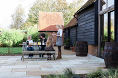
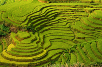
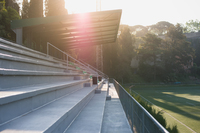
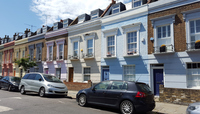

#### detached
adjective

1. separated: (分离的，分开的；拆下的)
   The label became detached **from** your parcel (标签已经从你的包裹上掉下来了。)
   
2. a detached house is not connected to any other building (（房子）独幢的，独立的)
   Prices are rising so fast that people can't afford detached houses. (房价上涨得如此之快，人们已经买不起独栋房屋了。)

3. a detached person does not show any emotional involvement or interest in a situation: (认为与己无关的；毫不关心的，心不在焉的)
   + She seemed a bit detached, as if her mind were on other things (她似乎有些心不在焉，好像心思在别的事情上。)
   + Throughout the novel, the story is seen through the eyes of a detached observer. (整部小说的故事情节都是从一个旁观者的角度展开的。)

synonyms:
+ aloof: [adjective]  不友善的；冷漠的 ( /əˈluːf/ )
  1. not friendly or willing to take part in things
    
     She seemed rather aloof when in fact she was just shy (她看似孤傲不群，可实际上只是腼腆。)
     
  2. not interested or involved, usually because you do not approve of what is happening (（通常因为对所发生的事情不赞同而）漠不关心的，无动于衷的，不参与的)
     
     Whatever is happening in the office, she always **remains** aloof (不管办公室发生了什么，她都一概不闻不问。)

     She kept herself aloof **from** her husband's business (她对丈夫的事情漠不关心。)

+ distant [adjective] (not friendly)
   used to describe someone who does not show much emotion and is not friendly (拒人千里的，不亲近的，冷漠的)

   She seemed cold and distant (她似乎很冷漠，不容易接近。)

+ offhand [adjective]  ( /ˌɒfˈhænd/ )
  not friendly, and showing little interest in other people in a way that seems slightly rude: (不友好的；漫不经心的；怠慢的)

  I didn't mean to be offhand **with** her - it's just that I was in such a hurry (我希望我没有表现出怠慢了她——我不过是太匆忙了。)

  offhandedly[adverb]: in a way that does not seem to show much interest or careful thought: (漫不经心地；怠慢地)

  He offhandedly mentioned his interest to his boss.

  She spoke almost offhandedly.

  offhandedness[noun]: the quality of not showing much interest or careful thought: (漫不经心；怠慢)
  
  He said whatever came into his mind with brutal offhandedness

  She concealed her true feelings beneath an appearance of offhandedness.
  
#### conceal
verb
/kənˈsiːl/

kept hidden or where it cannot easily be seen: (隐藏；隐匿；隐瞒；隐蔽)

The robbery had been recorded on a concealed security camera

He was carrying a concealed weapon

The room had concealed lighting

#### terrace
noun
/ˈter.əs/

1. a flat raised area (台地)
   

2. a flat area of stone or grass outside a house, where people sit and sometimes eat (露天平台，阳台)
    
    

3. one of several narrow strips of land that are built like steps on the slope of a hill, used for growing crops on (梯田；阶地)
    
    

4. the terraces (（足球）阶梯看台)
    wide steps on which people stand to watch a football match

    

5. (UK,HOUSE) a row of often small houses joined together along their side walls.(US row) (排屋，排房)

       

#### terraced
adjective
/ˈter.əst/

built as or belonging to a row of often small houses joined together along their side walls: (排房的，排屋的)

a terraced street (两侧是排屋的街道)

we rented a little terraced house in South London. (我们在伦敦南岸租了一个小排屋。)

#### separate
做形容词时的读音和作动词时的读音不一样

adjective
/ˈsep.ər.ət/ 
1. [adjective]  existing or happening independently or in a different physical space. (各自的；单独的，不同的)
   
   The art department and the music department are in two separate buildings. (艺术系和音乐系在两座不同的大楼中。)

   I try to **keep** meat separate **from** other food in the fridge. (我尽量把肉同冰箱里的其他食物分开放。)

   I have my public life and my private life,and as far as possible I try ro **keep** them separate. (我有自己的公众生活和私人生活，并尽可能使两者分开。)

   Three youths have been shot and killed in separate incidents this month. (这个月有3名年轻人在不同的事件中被枪杀。)

verb 
/ˈsep.ər.eɪt/ 
2. [verb] to (cause to) divide into parts (（使）分离；（使）分开)
   The north and south of the country are separated **by** a mountain range ( /reɪndʒ/ ). (这个国家的南北两部分被一条山脉隔开。)

   You can get a special device for separating egg whites from yolks ( /jəʊk/ ). (你可以买一种把蛋白与蛋黄分开的专用器具。)

3. [verb] to make people move apart or into different places, or to move apart. (（使）分开；（使）分散)
   At school they always tried to separate Jane and me because we were troublemakers.

   Somehow, in the rush to get out of the building, I got separated **from** my mother. (急急忙忙冲出大楼的时候，不知怎么的，我和妈妈走散了。)

   Perhaps we should separate now and meet up later. (或许我们现在应该分开，晚些时候再见面。)

#### studio flat
/ˈstjuː.di.əʊ/

（艺术家的）工作室；（尤指）画室，摄影室

#### villa
/ˈvɪl.ə/

别墅；花园住宅

#### utility room
/juːˈtɪl.ə.ti ˌruːm/

（放置洗衣机等生活用品的）杂物室，储物间

#### shed
/ʃed/

（通常为木质、存放物品用的）棚子，小屋

a tool/storage shed (工具／储物棚)

#### attic/loft
/ˈæt.ɪk/

阁楼；顶楼

#### cellar
（通常用于储物的）地窖，地下室

#### basement
地下室

#### landing
（连接两段楼梯的）平台；（连接楼梯顶端的）过道

#### hall
/hɔːl/

门厅；走廊

I left my bags **in** the hall.  我把书包落在门厅里了。

礼堂，大厅，会堂

#### porch
门廊

#### peeler
 /ˈpiː.lər/
去皮器，削皮器

