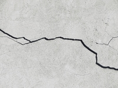
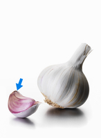
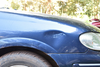
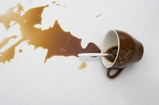
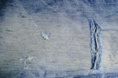

#### leak
verb

1. (of a liquid or gas) to escape from a hole or crack in a pipe or container; (of a container) to allow liquid or gas to escape:
   
   Water was leaking from the pipe.

   Oil leaked out the car.

   The car leaked oil all over the drive.

   The kitchen roof is apt to leak when it rains.

2. to allow secret information to become generally known:
   
   He leaked the name **to** the press.

   News of the pay cuts had somehow leaked out.

noun:

1. (liquid / gas) a hole or crack through which a liquid or gas can flow out of a contaniner, or the liquid or gas that comes out:
   
   There's water on the floor - we must have a leak.

   If you suspect a gas leak, phone the emergency number.

2. (information) the origin of secrte information that becomes known, or the act of making it known:
   
   There have been serveral **security** leaks recently.

   They traced the leak to a secretary in the finance department.

Idiom:

(informal) leak like a sieve : to leak a lot

#### smash
verb

1. to cause something to break noisily into a lot of small pieces:
   
   Rioters ran through the city, smashing **windows** and looting shops.

   She dropped her cup and watched it smash **to pieces/to smithereens** on the stone floor.

2. to cause something to move with great force against something hard, usually causing damage or injury:
   
   Several boats were smashed against the rocks during the storm.
   
   He tried to smash the door **down** to get to me.

   The car was travelling very fast when it smashed **into** the tree.

   He threatened to smash my face in if i didn't give him the money.

3. to defeat someone or to destory something completely:

   The country's government said it would do whatever was necessary to smash the rebellion. 

4. to do much better than the best or fastest result recorded previously:
   
   Petersen smashed the 400 metres record by over half a second.

#### smithereens
noun

a lot of very small broken pieces:

The city was bombed **to** smithereens during the war.

So many films involve everyone and everything being **blown to** smithereens.

#### looting
noun

the activity of stealing from shops during a violent event:

There were reports of **widespread** looting as hooligans stampeded through the city centre.

synonyms:

1. pillage[formal]: (verb) to steal something from a place or a person by using violence, especially during war:
   
   Works of art were pillaged from many countries in the dark day of the Empire.
   
2. plunder: (verb) to steal goods violently from a place, especially during a war:
   
   After the president fled the country, the palace was plundered by soldiers.
   
   Tragically, the graves were plundered and the contents scattered.

3. despoil[formal]: to make a place less attractive especially by taking things away from it by force:
   
   Many of the tombs had been despoiled.

#### flee
verb

present participle **fleeing** | past tense and past participle **fled**

1. to escape by running away, especially because of danger or fear:

   She fled (from) the room in tears

   In ordre to escape capture, he fled to the mountains.

2. flee the country: to quickly go to another country in order to escape from something or someone:
   
   It is likely that the suspects have fled the country by now.

#### stampede
noun

an occasion when many large animals or many people suddenly all move quickly and in uncontrolled way, usually in the same direction at the same time, especially because of fear:

Two shoppers were injured in the stampede as shop doors opened on the first day of the sale.

verb

When animals or people stampede, they all move quickly in the same direction, often because they are frigntened:

A loud clap of the thunder made the herd stampede.

No amount of pressure will stampede(=force) this committee **into** making hasty decisions.

a herd of cattle/elephants/goats

#### crack
verb

1. to break something so that it does not separate, but very thin lines appear on its surface, or to become broken in this way.
   
   A stone hit the window and cracked the glass.

   I cracked my tooth as I fell

   The walls cracked and the roof collapsed in the earthquake.

2. [informal] to become mentally and physically weak:
   
   Stress and overwork are causing teachers to crack (up).

3. If someone cracks, that person begins to feel weak and agrees that they have been defeated:

   He cracked during questioning and told us where to find the stolen goods.

4. to break something open, especially in order to reach or use what is inside.
   
   Crack three eggs into a bowl and mix them together.

   He cracked(open) the nuts with his hands.

5. to find a solution to a problem:

   They cracked the code and read the secret message.

   I've been trying to solve this problem all week, but I still haven't cracked it.

6. to hit something or someone:

   I cracked my head **on/against** the door.
   
   The cracked him over the head with a baseball bat.

7. to make a sudden, short noise, or to cause something to make this noise:

   The whip cracked over the horses's heads.

   He's always cracking his **knuckles**(=pulling the joints of his fingers to make a noise).

8. If a voice cracks, its sound changes because the person is upset:

   Her voice cracked with emotion as she told the story.

 noun

1. a very narrow space between parts of something:

   

   Cracks had appeared in the dry ground.

   We peered through the crack in the floorboards.

2. a sudden loud sound:

   the crack of a rifle/whip/breaking branch

#### chipped
adjective

1. with a small piece or pieces broken off:
   
   a chipped glass.

   All the plates were old and chipped.

#### crush
verb

1. to press something very hard so that it is broken or its shape is destroyed:
   
   The package had been badly crushed in the post.

   Add three cloves of crushed garlic.

   His arm was badly crushed in the car accident.

2. to press paper or cloth so that it becomes full of folds and is no longer flat:
   
   My dress got all crushed in my suitcase.

3. If people are crushed against other people or things, they are pressed against them:
   
   Tragedy struck when several people were crushed to death in the crowd.

   Use the back of a wooden spoon to crush the garlic.

4. to upset or shock someone badly:

   He was crushed by the news of the accident

5. to defeat someone completely:

   The president called upon the army to help crush the rebellion.

6. [informal] a strong but temporary feeling of liking someone:

   She has a crush on one of her teachers at school.

7. a crowd of people forced to stand close together:

   I had to struggle through the crush to get to the door.

   You can come in our car, but it'll be a bit of a crush(= there will be a lot of people in it).              

#### clove
noun

a small separate part of a bulb of garlic(= a plant used in cooking):

This recipe takes four cloves of garlic.

#### crash
verb

1. (have an accident) if a vehicle crashed or someone crashes it,it is involved in an accident, usually a serious one in which the vehicle is damanged and someont is hurt:
   
   We skidded on the ice and crashed.

   The plane crashed into a mountainside.

2. (make a noise) to hit something, often making a loud noise or causing damage:
   
   We could hear waves crashing **on/against** the shore.

   A dog came crashing through the bushes.

3. (fail) if something such as a business crashes, it suddenly fails or becomes unsuccessful:

   Investors were seriously worried when the stock market began to crash.

4. If a computer or system crashes, it suddenly stops operating:

   My laptop's crashed again.

5. to suddenly fall to a low level:

   Demand slumped and prices crashed.

#### twist
verb

1. to turn something, especially repeatedly, or to turn or wrap one thing around another:
   
   The path twists and **turn** for over a mile.

   She sat there nervously twisting the ring around on her finger.

   She twisted her head(round) so she could see what was happening.

   Twist the rope tightly round that post over there.

2. if you twist a part of your body, such as your ankle, you injure it by suddenly turning it:

   She slipped on the ice and twisted her knee.

3. to change information so that it gives the message you want it to give, especially in a way that is dishonest:

   This report shows how she twisted the truth to clain successes where none, in fact, existed.

   You're twisting my words - that's not what i said at all.

noun

1. an act of twisting something:
   
   She gave the cap another twist to make sure it was tight.

2. the shape of or a piece of something that has been twisted:
   
   a twist of hair

   a twist of lemon

#### bump
verb

1. to hit something with force:
   
   She bumped into his tray, knocking the food onto his lap.

2. to hurt part of your body by hitting it against something hard:

   I bumped my head **on** the shelf as I stood up.

   I bumped my head and was concussed for several days. 

3. to travel, usually in a vehicle, in an uncomfortable way because the surface you are moving over is rough:
   
   We bumped **along** the dirt road in our car, holding on to our seats.

   The bottom of the boat was bumping **over** a coral reef.

4. to remove someone or something from a particular position, sometimes to a different one:
   
   He had been playing badly and was bumped **from** the team.

   These movies may be well loved but they're never going to bump Casablanca or Citizen Kane **off** the classic film lists.

   The 18-year-old has been bumping other players down the rankings ever since he started in competitive tennis.

noun

1. a round, raised area on a surface or on the body:
   
   Her bicycle hit a bump in the road and threw her off.

   Enrique Had a nasty bump on his head from when he fell down.

2. the sound of something falling to the ground:

   We heared a bump from the next room.

3. an accident involving a car, especially one that is not serious:

   A van drove into their car but luckily it was just a bump.

4. an increase in something:

   There had been a bump in the number of students with learning disorders.

#### bang
verb

1. to (cause something to) make a sudden very loud noise or noises:
   
   She banged her fist angrily on the table.

   Outside a door was banging in the wind.

   He could hear someone banging **at** the door.

2. to hit a part of the body against something by accident:

   I banged my head **against/on** the shelf as I stood up.

3. (offensive) to have sex with someone

noun

1. a sudden very loud noise:
   
   The window slammed shut with a loud bang.

2. an act of hitting someone or something:

   I think she must have got a bang **on** the head.

#### trip
noun

1. (fall) an occasion when you knock your foot against something and fall or lose your balance, or someone causes you to do this, when you are walking or running:
   
   She broke her ankle when she had a nasty trip on the stairs.

#### graze
verb

1. to break the surface of the skin by rubbing against something rough:
   
   He fell down and grazed his knee.

   He was lucky, the bullet just grazed his leg.

2. if an object grazes something, it touches its surface lightly when it passes it:
   
   The aircraft's landing gear grazed the treetops as it landed.

noun

1. an injury on the surface of your skin caused by rubbing it against something rough:
   
   Her legs were covered with cuts and grazes.

#### dent
noun

1. a small hollow mark in the surface of something, caused by pressure or by being hit:
   
   a dent in the door of a car

   

verb

1. to make a small hollow mark in the surface of something:

   I dropped a hammer on the floor, and it dented the floorboard.

2. If you dent someone's confidence or pride, you make them feel less confident or proud:
   
   His confidence was badly dented when he didn't get the job.

#### spill
verb

1. to (cause to) flow, move, fall, or spread over the edge or outside the limits of something:
   
   I spilled coffee on my silk shirt.

   You've spilled something down your tie.

   Let's see if I can pour the juice into the glass without spilling it.

   He dropped a bag of sugar and it spilled all over the floor.

noun

1. an amount of something that has come out of a container:
   
   

   a fuel spill on the road
   
   Could you wipe up that spill, please?

#### stain
verb

1. [verb/noun] to leave a mark on something that is difficult to remove:
   
   Tomato sauce stains terribly - it's really difficult to get it out of clothes.

   While she was changing the wheel on her car, her coat had become stained with oil.

2. to permanently spoil something such as someone's reputation:
   
   Several important politicians have had their reputations stained by this scandal.

   The country's history is stained with the blood of (= the country is guilty of killing) millions of innocent men and women.

#### split
verb

1. to (cause to) divide into two or more parts, especially along a particular line:
   
   The prize was split **between** Susan and Kate.

   Split the aubergines **in** half and cover with breadcrumbs.

   The teacher split the children (up) **into** three groups.

   His trousers split when he tried to jump the fence.

2. to form cracks:

   The wooden floor had cracked and split in the heat.

3. If the people in an organization or group split, or if something splits them, they disagree and form smaller groups:

   The childcare issue has split the employers' group.

   A group of extremists split **(off) from** the Labour Party to form a new "Workers Party".

noun

1. a long, thin hole in something where it has broken apart:
   
   Rain was getting in through a split in the plastic sheeting

   

2. the splits:  the action of sitting on the floor with your legs straight out and flat along the floor in opposite directions:
   
   

   Can you do the splits?

   

   

