#### club
a long, thin stick used in golf to hit the ball:

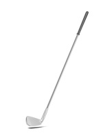

a set of golf clubs

#### squash
noun

a game played between two or four people on a special closed playing area that involves hitting a small rubber ball against a wall:

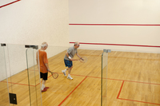

#### racket
noun

an object used for hitting the ball in various sports, consisting of a net fixed tightly to a round frame with a long handle:

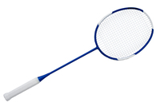

a tennis/squash/badminton racket

#### dart
noun

a small, thin object with a sharp point that is thrown by hand in a game, shot from a gun, or blown from a tube when used as a weapon

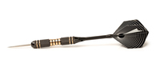

#### darts
noun

a game in which darts are thrown at a ciraular board. The number of points won depends on where the darts land on the board:

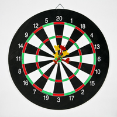

a game of darts

a darts tournament

#### archery
noun

the art or sport of shooting arrows:

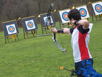

#### bow
noun

a weapon for shooting arrows, made of a long, thin piece of wood bent into a curve by a tightly stretched string:

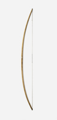

bow and arrows

### bat
noun

a specially shaped piece of wood used for hitting the ball in some games:

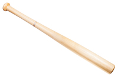

a baseball/circket/rounders/table tennis bat

#### stick
noun

1. a thin piece of wood or other material:
   
   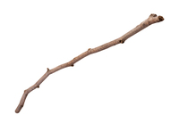 

   The old man was carrying a load of sticks.

   Police said that the child had been beaten with a stick.

2. (mainly UK)(US usually cane): a long, thin wooden pole that especially old or injured people use to help them walk:
   
   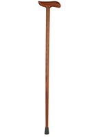

   a walking stick

   At 84 he's still quite active, although he walks with the aid of a stick.

3. a long, thin piece of wood used in playing various sports:

   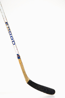
   
   a hockey/lacrosse/polo stick

#### cue
noun

a long, thin wooden pole with a small piece of leather at one end, used for hitting the ball in games such as billiards or snooker

#### paddle
noun

a short pole with a wide, flat part at one end or both ends, used for moving a small boat or canoe through the water:

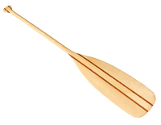

#### canoe
noun

a small, light, narrow boat, pointed at both ends and moved using a paddle(= a short pole with a flat blade)

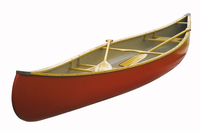

#### oar
noun

a long pole with a wide, flat part at one end, used for rowing a boat:

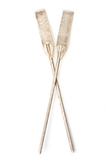

a pair of oars

She dipped her oars into the water and pulled.

#### dip
to put something into a liquid for a short time:

1. Dip the fish in the batter, then drop it into the hot oil.
2. She dipped her toe into the pool to see how cold it was.

#### rowing
noun

the sport or activity of rowing a boat:

I love rowing.

She started rowing six months ago.

#### rod
noun

a long, thin pole made of wood or metal:

He was given a fishing rod for his birthday.

The concrete is strengthened with steel rods

#### trophy
a prize, such as a gold or silver cup, that is given to the winner of a competition or race, and often returned after a year to be given to the winner of the competition in the following year:

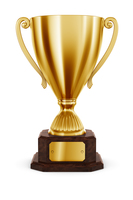

#### spectator 
noun

a person who watches an activity, especially a sports event, without taking part:

