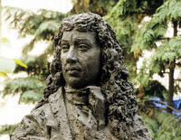
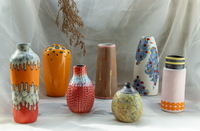

#### allege
verb

to say that someone has done something illegal or wrong without giving proof:

#### allegedly
adverb

1. used when something illegal or wrong is said to have been done, but has not been proved.
   
   1. That's where he allegedly killed his wife.
   2. She was arrested for allegedly stealing a car.

2. used when something is said to be true but has not been proved.
   
   1. It's a collection of recipes which allegedly can be prepared in 30 minutes.
   2. Two oil companies allegedly spent $6 million trying to free two surviving grey whales trapped in the Arctic ice.

#### sculpture
noun

1. the art of forming solid objects that represent a thing, person, idea, etc. out of a material such as wood, clay, metal, or stone, or an object made in this way:
   
   

   1. Tom teachers sculpture at the local art school.
   2. The museum has several life-sized sculpture **of** people and animals.

verb: sculpt

adjective: sculpted

noun: sculptor

#### ceramics
noun

1. the art of making objects by shaping pieces of clay and then baking them until they are hard.
   

2. the objects produced by shaping and baking clay, especially when considered as art.
      
   

adjective: ceramic : made from clay that has been shaped and then baked until hard.

#### plot
noun

the story of a book, film, play, etc.:

1. The movie has a very simple plot.
2. The plots **of** his books are basically all the same.

