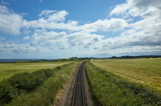
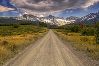
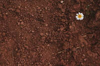
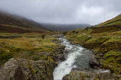

#### album
noun

1. a collection of several pieces of music, made available as a single item on a CD, the internet, etc.:
   
   1. Have you heard their new album?

2. a book with plain pages, used for collecting together and protecting stamps, photographs, etc.:
   
   1. a stamp/photograpsh album
   2. We've put the best wedding photos into an album.

#### track
noun

1. the pair of long metal bars fixed on the ground at an equal distance from each other, along which trains travel:
   
   

   1. a ten-mile stretch of track.
   2. Passengers are requested not to walk across the tracks.

2. a path or rough road that is made of soil rather than having a surface covered with stone or other material:
   
   1. The house is at the end of a dirt/an unmade track.

   

3. a type of path or road, often in the shape of a ring, that has been specially designed and built for sports events, especially racing:
   
   

   1. an all-weather track
   2. a dog/horse track
   3. the runners are now on their final lap of the track.

4. the direction in which someone's job or education develops:
   
   1. She was a lawyer, but then she changed track completely and became a doctor.

5. one of several songs or pieces of music on a CD or other musical recording:
   
   1. The album includes four previously unreleased tracks.

#### dirt
noun

1. (not clean) dust, soil, or any substance that makes a surface not clean:
   
   1. His coat was covered with dirt.

2. (mainly US) soil on the ground:
   
   1. I've been digging in the dirt, planting seeds.
   
   

#### sync
noun, informal for synchronize.

He's putting himself forward as a president whose ideas are in sync with(= are suited to and show an understanding of) a nation demanding change.

in/out of sync: if two things are in/out of sync, they reach the same or related stage at the same time/at different times.

#### synchronize
verb

1. to (cause to) happen at the same time:
   
   1. The show was designed so that the lights synchronized **with** the music.

2. When people synchronized their watchers, they make sure that all their watches show the same time:
   
   1. We'd better synchronized our watches if we all want to be there at the same time.

#### stream
noun

1. water that flows naturally along a fixed route formed by a channel cut into rock or ground, usually at ground level:
   
   

   1. a mountain stream
   2. underground streams
   3. There's a bubbling stream that flows through their property.

2. any current of water or liquid:
   
   1. the level of cholesterol in your blood stream.

3. the direction in which water is moving:
   
   1. She stopped rowing and let the boat float with the stream.

4. a continuous flow of things or people:
   
   1. There has been a steady stream of phone calls from worried customers.
   2. I had a constant stream of visitors while I was ill.

verb

1. to flow somewhere or produce liquid, quickly and in large amounts without stopping:
   
   1. There were **tears** streaming **down** his face.
   2. One woman was carried from the scene of the accident with **blood** streaming **from** her head.
   3. I've got a terrible cold and my nose has been streaming all week.

2. stream in, out, through, etc.: to move continuously in one direction:
   
   1. We were all very excited as we streamed out of our final exam.
   2. Officials estimate that 20,000 refugees streamed into the city last week.

3. to send or receive sound or video directly over the internet as a continuous flow:
   
   1. On YouTube, millions of videos are streamed every day.

#### soundtrack
noun

1. the sounds, especially the music, of a film, or a separate recording of this:
   
   1. The best thing about the movie is its soundtrack.

#### canned
adjective

1. perserved and sold in a metal container:

canned fruit/tomatoes

2. canned music is recorded music, especially played in public places:
   
   1. Canned music annoys me.

#### read music
the written system of symbols representing musical notes:

Can you read music?

#### pick out a tune
If you pick out a tune, you play it slowly or with difficulty, note by note:

I can pick out a simple tune on the piano, but that's about it.

   

