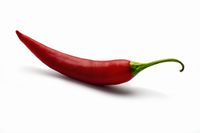
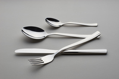
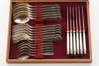

#### mild
adjective

1. not violent, severe, or extreme:
   
   1. She can't accept even mild critisism of her work.
   2. He has suffered a mild heart attack - nothing too serious.

2. mild weather is not very cold or not as cold as usual:
   
   1. We've had a mild winter this year.

3. used to describe food or a food flavour that is not very strong:
   
   1. He doesn't like a hot curry - he prefers a mild one.
   2. a mild chilli sauce.

4. (gentle) gentle and calm:
   
   1. a shy, mild sort of guy.

#### chilli
noun

the small, red or green seed case from particular types of pepper plant that is used to make some foods spicy:

1. Add 2 chopped red chillies.
2. I like to add a bit of green chilli
3. chilli sauce/oil

#### bland
adjective, usually disapproving

1. not having a strong taste or character or not showing any interest or energy:
   
   1. I find chicken a little bland.
   2. Pop music these days is ao bland.

adverb: blandly
noun: blandness

#### sickly
adjective

1. weak, unhealthy, and often sick:
   
   1. a sickly child/plant
   2. A sickly looking woman handed me my ticket.

2. (vomit) causing a slight feeling of wanting to vomit:
   
   1. A sickly smell of decaying fish came from the dirty river.
   2. The chocolate cake was sickly sweet(= too sweet).

#### decay
verb

1. to become gradually damaged, worse, or less; to cause something to do this:
   
   1. Sugar makes your teeth decay
   2. The role of the extended family has been decaying for some time.
   3. the smell of decaying meat.
   4. Pollution has decayed the surface of the stonework on the front of the cathedral.

noun

1. the process of decaying
   
   1. environmental/industrial/moral/urban decay
   2. dental/tooth decay
   3. The buildings had started to **fall into** decay
   4. This industry has been in decay for some time.

#### savoury
adjective

1. Savoury food is salty or spicy and not sweet in taste:
   
   1. a savoury dish/sauce/flavour
   2. savoury dumplings/pancakes
   3. A pie can be sweet or savoury

2. If you say that something is not savoury, you mean that it is pleasant or socially acceptable:
   
   1. The hotel doesn't have a very savoury reputation.

#### moreish
adjective

(of food) having a very pleasant taste and making you want to eat more:

These peanuts are very moreish, aren't they?

#### buffet
noun

a meal where people serve themselves different types of food:

Are you having a sit-down meal or a buffet at the wedding?

verb

(of wind, rain, etc.) to hit something repeatedly and with great force:

The little boat was buffeted mercilessly by the waves.

#### unripe
adjective

(of food or crops) not yet ready to be eaten or collected; not yet ripe:

Here are some ideas for what you can do with unripe green tomatoes.

#### stodgy
adjective, informal disapproving

1. Stodgy food is heavy and unhealthy, sometimes in an unpleasant way:

   I've been eating too many stodgy puddings.

2. boring, serious and formal:
   
   Younger consumers, it is said, regard their products as stodgy and unfashionable.

####  processed
adjective

Processed food has had some sort of chemical or industrial treatment in order to cook it, preserve it, or improve its taste or appearance:

1. processed cheese/meat
2. highly processed convenience foods

#### set menu
a menu(= a list of the dishes available at a restaurant) that has a small number of meals to choose from, at a fixed price, or the food on this menu:

1. I'll have the set menu
2. The restaurant serves moderately priced food on both its a la carte and set menus.

#### cater
verb

1. to provide, and sometimes serve, food:
   
   1. I'm catering **for** twelve on Sunday - the whole family is coming
   2. Which firm will be catering at the wedding reception?
   3. Who catered your party?

### bar
noun

1. a place where drinks, especially alcoholic drinks, are sold and drunk, or the area in such a place where the person serving the drinks stands:
   
   1. They noticed him going into the hotel bar.
   2. There weren't any free tables, so I sat **at** the bar.
   3. Why don't you ask the guy **behind** the bar(= serving drinks there)?

2. a long, thin, straight piece of metal or wood:
   
   1. The gorilla rattled the bars of its cage.

3. a substance that has been made into a solid rectangular shape:
   
   1. a bar of soap
   2. a chocolate bar

4. something that prevents a particular event or development from happening:
   
   1. A lack of formal education is no bar **to** becom**ing** rich.

verb

1. to prevent something or someone from doing something or going somewhere, or to not allow something:
   
   1. The centre of the town was barred **to** football supporters.
   2. The incident led to him being barred **from** the country/barred **from** enter**ing** the country.
   3. I tried to push past her but she barred my **way/path** (= stood in front of me and prevented me from getting past).

2. to put bars across something, especially to keep it closed:
   
   1. We barred the door to stop anyone getting into the room.

#### cutlery
noun, usually UK, US usually silverware

knives, forks, and spoons used for eating food.

#### silverware
noun

1. objects, especially knives, forks, spoons, etc., made of silver

2. knives, forks, spoons, etc. made of steel or other materials
   

