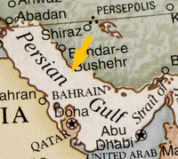

#### gulf
noun

1. a very large area of sea surrounded on three sides by a coast:
   
   

   the gulf of Mexico

2. (formal) a very large, deep hole in the ground:
   
3. (difference) an important difference between the ideas, opinions, or situations of two groups of people:

   1. There is a widening gulf **between** the rich and the poor in our society.
   2. It is hoped that the peace plan will **bridge** the gulf(= reudce the very large difference) **between** the government and the rebels.

#### bay
noun

1. (coast) a part of the coast where the land curves in so that the sea is surrounded by land on three sides:
   
   

   We sailed into a beautiful, secluded bay.

   San Francisco Bay

   the Bay of Naples

2. (space) a partly surrounded or marked space:

   1. A truck pulled into the loading bay
   2. Visitors must park their cars in the marked bays.

#### strait
noun

1. a narrow area of sea that connects two larger areas of sea:

   
   
   1. The Straits of Gibraltar
   
2. straits [plural] : a difficult situation, especially because of financial problems:
   
   So many companies are in such **dire/difficult** straits that their prices have come right down.

#### landscape
noun

1. a large area of land, especially in relation to its appearance:
   
   1. a rural/barren landscape
   2. Demolition films and builders are busy changing urban landscapes.
   3. The landscape is dotted with the tents of campers and hikers.
   4. The cathedral dominates the landscape for miles around.

2. a view or picture of the countryside, or the art of making such pictures:
   
   

   A watercolour landscape
   
   J.M.W Turner is one of the best-known British landscape painters.   

#### dot
noun

1. a very small round mark:
   
   1. The full stop at the end of this sentence is a dot.
   2. Her skirt was blue with white dots.

verb

1. to put a dot or dots on something:
   
   1. Your handwriting is hard to read because you don't dot your i's

2. (often passive) to be spread across an area, or to spread many similar things across an area:
   
   1. We have offices dotted **around/all over** the region.
   2. The area is dotted **with** beautiful churches.

#### barren
adjective

1. unable to produce plants or fruit:
   
   1. We drove through a barren, rocky **landscape**.

2. (formal) unable to have children or young animals

3. not creating or producing anything new:
   
   1. She became very depressed during the barren years when she was unable to paint.

#### plain
adjective

1. not decorated in any way; with nothing added:
   
   1. She wore a plain black dress.
   2. We've chosen a plain carpet(= one without a pattern) and patterned curtains.
   3. He prefers plain food - nothing too fancy.

2. plain paper: paper that has no lines on it:
   
   a letter written on plain paper

3. obvious and clear to understand:

   1. It's quite plain that they don't want to speak to us.
   2. The reason is perfectly plain.
   3. I made it quite plain(that) (= explained clearly that) I wasn't interested.
   
4. (not beautiful) (especially of a woman or girl) not beautiful:
   
   1. She had been a very plain child.

noun

1. (also plains)a large area of flat land:
   
   the coastal plain

   High mountains rise above the plain.

#### volcano
noun

a mountain with a large, circular hole at the top through which lava(= hot liquid rock) gases, steam, and dust are or have been forced out:

an extinct/dormant volcano

an active volcano

**Erupting** volcanoes discharge massive quantities of dust into the stratosphere.

#### thermal
adjective

1. connected with heat:
   
   1. thermal conductivity(= ability of a substance to carry heat)
   2. It was the Romans who first recognized the medicinal benefits of Hungary's thermal springs(= ones which produce hot water)

#### geyser
a hole in the ground from which hot water and steam come out:

#### shore
noun

the land along the edge of a sea, lake, or wide river:

1. You can walk for miles along the shore
2. The boat was about a mile **from/off** (the) shore when the engine suddenly died.

#### onshore
adjective, adverb

moving towards land from the sea, or on land rather than at sea:

onshore winds

onshore oil reserves

#### offshore
adjective, adverb

away from or at a distance from the coast:

offshore engineering

an offshore breeze

The wind was blowing offshore.

#### valley
an area of low land between hills or mountains, often with a river running through it:

1. the Nile Valley
2. the Thames/Hudson valley
3. There was snow on the hill tops but not in the valley

#### gorge
noun

a deep, narrow valley with steep sides, usually formed by a river or stream cutting through hard rock.

verb

to eat until you are unable to eat any more:

If you gorge yourself **on** snacks like that, you won't eat your dinner.

Synonym:

#### binge
noun, informal

an occasion when an activity is done in an extreme way, especially eating, drinking, or spending money:

a drinking/eating/spending binge

He **went on** a five day drinking binge.

#### ridge
noun

1. a long, narrow raised part of a surface, especially a high edge along a mountain:

   1. We walked along the narrow mountain ridge.

   2. A ridge (= a narrow area) of high pressure will bring good weather this afternoon.

2. the part of a roof where the sloping sides join at the top
   
   

#### peak
noun

1. the highest, strongest, or best point, value, or level of skill:
   
   1. Prices reach a peak during August.
   2. Beat the egg whites until they are stiff enought to form firm peaks.

2. the pointed top of a mountain, or the mountain itself:
   
   1. It is one of the most difficult peaks to climb

   

Synonyms:

1. mountaintop
2. pinnacle (top)
3. summit (highest point)
4. top (highest part)

adjective

1. peak times are the times when most people are using or doing something:
   
   1. Traffic congestion is really bad at peak periods(= when it is busiest).
   2. It is most expensive to advertise at peak viewing times.
   3. Don't go there in the peak (= busiest) season - it'll be hot and crowded.

#### stiff
adjective

1. firm or hard:

   1. stiff cardboard
   2. a stiff collar
   3. His clothes were stiff with dried mud
   4. This hair spray has made my hair stiff
   5. Mix the powder and water into a stiff paste

2. not easily bent or moved:
   
   1. The handle on this door is rather stiff

3. If you are stiff or part of your body is stiff, your muscles hurt when they are moved:
   
   1. Sitting still at a computer terminal all day can give you a stiff neck.

4. behaving in a way that is formal and not relaxed:
   
   1. The general is a tall man with steel spectales and a stiff, pompous manner.

#### summit
noun

1. an important formal meeting between leaders of governments from two or more countries:
   
   1. a summit meeting
   2. World leaders will meet next week for their annual economic summit.

2. the highest point of a mountain:
   
#### glacier
noun

a large mass of ice that moves slowly:

#### cape
noun

a very large piece of land sticking out into the sea:

#### peninsula
noun

a long piece of land that sticks out from a larger area of land into the sea or into a lake:

#### tributary
a river or stream that flows into a larger river or a lake:

#### estuary
nonu

the wide part of a river at the place where it joins the sea:

#### delta
noun

an area of low, flat land, sometimes shaped like a triangle, where a river divides into several rivers before flowing into the sea:

the mississippi delta

the delta of the Nile

#### mouth
noun

the opening of a narrow container, the opening of a hole or cave, or the place where a river flows into the sea:

