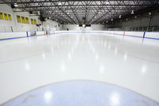
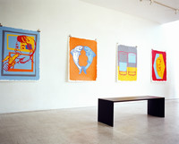
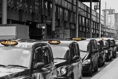

#### metropoils
noun, formal

1. a very large city, often the most important city in a large area or country:
   
   1. Soon afterwards he left to begin his career in the metropoils.
   2. a sprawling/bustling/modern metropoils

#### suburb
noun

1. an area on the edge of a large town or city where people who work in the town or city often live:
   
   1. Box Hill is a suburb of Melbourne
   2. We drove from a middle-class suburbs to a very poor inner-city area.

2. the suburbs: the outer area of a town, rather than the shopping and business centre in the middle:
   
   1. The company decided to relocate to the suburbs because the rent was much cheaper.

#### overcrowded
adjective

1. containing too many people or things:
   
   1. overcrowded cities/prisons/schools
   2. The world market for telecommunications is already overcrowded with businesses.

#### overcrowd
verb

to make a place contain too many people or things:

1. The new housing development will overcrowd the village.
2. Don't overcrowd the fridge or it will not cool as effectively.

noun: overcrowding 

#### hilly
adjective 

having a lot of hills:

1. hilly countryside
2. a hilly area

#### mountainous
adjective

1. having a lot of mountains:

   a mountainous region

2. very big:
   
   mountainous waves

#### besiege
verb

1. to surround a place, especially with an army, to prevent people or supplies getting in or out:
   
   1. The town had been besieged for two months but still resisted the aggressors.

2. When someone is besieged, a lot of people surround them:
   
   1. When the pop star tried to leave her hotel, she was besieged **by** waiting journalists and fans.

#### imposing
adjective

having an appearance that looks important or causes admiration:

1. an imposing mansion
2. He was an imposing figure on stage.

#### mansion
noun

a very large, expensive house:

The street is lined with enormous mansions where the rich and famous live.

#### lively
adjective

1. full of energy and entuusiasm; interesting and exciting:
   
   1. It's hard work teaching a class of lively children.
   2. a lively city
   3. They take a lively interest in their grandchildren.
   4. There was some lively discussion at the meeting.

2. (of colors) bright and strong:
   
   1. The room was painted a lively electric blue.

#### exhibition
noun

1. an event at which objects such as paintings are shown to public,a situation in which someone shows a particular skill or quality to the public, or the act of showing these things:
   
   1. The photographs will be **on** exhibition until the end of the month.
   2. There's a new exhibition **of** sculpture on at the city gallery.

#### contemporary
adjective

1. existing or happening now, and therefore seeming modern:
   
   1. contemporary music/literature/art/fashion
   2. Although the play was written hundreds of years ago, it still has a contemporary feel to it.
   3. I wanted to update my kitchen and put in something more contemporary.

2. belonging to the same period, or to a stated preiod in the past:
   
   1. Almost all of the contemporary accounts of the event have been lost.
   2. Most of the writers he was contemporary **with** were interested in the same subjects.

#### residential
adjective

1. A residential road, area, etc. has only private houses, not offices and factories.
   
2. A residential building is one in which people live:
   
   1. Behind the beach are high-rise hotels and residential buildings
   2. The architect's tallest building is a 75 storey residential tower.

3. a residential job, position, course, etc. is one for which you live at the same place where you work for study.
   
   1. The college runs residential courses throughout the summer.

#### district
noun

1. an area of a country or town that has fixed borders that are used for offical purposes, or that has a particular feature that makes it different from surrounding areas:
   
   1. the business district of New York
   2. the Lake District/the Peak District
   
#### overlook
verb

1. to provide a view of, especially from above:
   
   1. Our hotel room overlooked the harbour
   2. The house is surrounded by trees, so it's not overlooked at all(= it cannot be seen from any other buildings)

2. to fail to notice or consider something or someone:
   
   1. I think there is one key fact that you have overlooked.
   2. No one will be overlooked when we select players for the team.

#### harbour
noun

an area of water next to the coast, often protected from the sea by a thick wall, where ships and boats can shelter:

Our hotel room overlooked a pretty little fishing harbour.

#### picturesque
adjective

1. (especially of a place) attractive in appearance, especially in an old-fashioned way:
   
   1. the picturesque narrow streets of the old city.
   2. It was a pretty town with a picturesque harbour and well-preserved buildings.
   3. The town itself is not especially picturesque

#### the outskirts
noun

the areas that form the edge of a town or city:

The factory is **in/on** the outskirts of New Delhi.

#### pharmacy
noun

1. a shop or part of a shop in which medicines are prepared and sold:
   
   

2. part of a hospital where medicines are prepared:

#### skating rink
noun

a specially prepared area for skating:

#### gallery
noun

1. a room or building that is used for showing works of art, sometimes so that they can be sold:
   
   

   1. the National Portrait Gallery
   2. a contemporary art gallery 

#### youth hostel
noun

a place where people, especially young people, can stay cheaply for short periods when they are travelling:

#### taxi rank
noun

a place where taxis wait for customers.

#### registry
noun

a place where official records are kept:

a land/business/electoral registry

#### bureau
noun

1. (organization) an organization or a business that collects or provides information:
   
   1. Her disappearance was reported to the police department's Missing Persons Bureau

2. (mainly US) a government organization:
   
   the Federal Bureau Of Investigation

   the Central Intelligence Agency

#### estate
noun

1. a large area of land in the country that is owned by a family or an organization and is often used for growing crops or raising animals:
   
   1. It's a typical country estate with a large house for the owner, farm buildings, and estate workers'houses.

2. (Law, specialized) everything that a person owns when they die:
   
   1. She left her entire estate to her niece.

3. (buildings) a group of houses or factories built in a planned way:
   
   1. a housing estate
   2. an industrial estate(= a group of factories)
   
#### slum
noun

1. a very poor and crowded area, especially of a city:

   1. an inner-city slum
   2. She was brought up in the slums of Lima

2. a very untidy or dirty place:
   
   1. This house would be an absolute slum if I wasn't here to clean it.

#### vandal
noun

1. a person who intentionally damages property belonging to other people:
   
   1. Vandals smashed windows and overturned cars in the downtown shopping district.

verb: vandalize : The teenager was accused of vandalizing cars

noun: vandalism: the mayor promised to crack down on vandalism.

#### deterioration
noun

the fact or process of becoming worse:

1. We've seen a deterioration **in** relations between the countries.

2. When we arrived, we were appalled at her deterioration.

3. Surveys are starting to show a sharp deterioration in consumer confidence.

4. The program is intended to prevent the significant deterioration of air quality.
   
5. The disease causes a gradual deterioration of the brain.

#### appalled
adjective

having strong feelings of shock or disapproval:

1. an appalled silence/fascination
2. I am absolutely appalled **by/at** the state of our cities.

#### spacious
adjective, approving

large and with a lot of space:

1. a spacious house/living room
2. spacious accommodation

Synonym:

#### roomy
adjective

if something such as a house or car is roomy, it has a lot of space inside it.

#### deserted
adjective

1. (empty) if a place is deserted, there are no people in it:
   
   1. a deserted building/street
   2. The coastal resorts are deserted in winter.

#### bustling
adjective

If a place is bustling, it is full of busy activity:

1. This used to be a bustling town but a lot of people have moved away over recent years.
2. The house, usually bustling with activity, was strangely silent.

#### packed
adjective

1. completely full:

   1. The train was so packed that I couldn't find a seat.

   2. This book is packed with useful information.

2. packed out: very full of people:
   
   The bar was packed out last night.

#### filthy
adjective

1. (dirty) extremely or unpleasantly dirty:
   
   1. Wash your hands - they're filthy.
   2. I've never smoked - it's a filthy habit.

2. (OFFENSIVE) containing sexually offensive words or pictures:
   
   1. filthy language
   2. a filthy joke
   3. (humorous) You've got a filthy mind!

#### run-down
adjective

1. run-down buildings or areas are in very bad condition:

   1. a run-down building/cemetery

2. tired and not healthy, especially because of working too much:
   
   1. My doctor said I was looking run-down.

#### cemetery
noun

an area of ground in which dead bodies are buried.

