#### wing
noun

1. the flat part of the body that a bird, insect, or bat uses for flying, or one of the flat, horizontal structures that stick out from the side of an aircraft and support it when it is flying:

   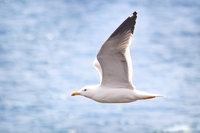

   1. the delicacy of a butterfly's wings
   2. I could see the plane's wing out of my window.

2. (usually plural) the wing of a chicken eaten as food:
   
   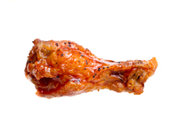

   1. We sat there eating wings and watching a ball game.

#### delicacy
noun

1. (food) something especially rare or expensive that is good to eat:
   
   1. In some parts of the world, sheep's eyes are considered a great delicacy.

2. (politeness) acting and speaking carefully so that no one is offended, or the possibility of causing offence:
   
   1. He raised the matter with great delicacy.
   2. I don't think you fully appreciate the delicacy **of** the situation.

3. (being easily damaged) the quality of being easy to damage or looking very easy to damage:
   
   1. Because of their great delicacy, the books cannot be moved.

4. (care) the quality of being done carefully or gently:
   
   We admired the delicacy of her brush strokes.

#### horizontal
adjective

parallel to the ground or to the bottom or top edge of something:

#### horizon
noun

1. the line at the farthest place that you can see, where the sky seems to touch the land or sea:
   
   1. The moon rose slowly above the horizon.
   2. We could see a row of camels silhouetted **on** the horizon.

Idioms:
1. broaden/expand/widen sb's horizons: to increase the range of things that someone knows about or has experienced:
   
   1.  Travelling certainly broadens your horizons.

2. on the horizon: likely to happen or exist soon:
   
   1. There is no new drug on the horizon that will make this disease easier to treat.

3. A person's horizons are the limit of that peroson's ideas, knowledge, and experience:
   
   1. Spending her junior year abroad has broadened her horizons.

#### silhouette
noun

a dark shape seen against a light surface:

1. The silhouette of the bare tree on the hill was clear **against** the winter sky.

silhouetted: forming a silhouette:

The goats high up on the mountain were silhouetted **against** the snow.

#### beak
noun

1. (bird's mouth) the hard, pointed part of a bird's mouth:
   
   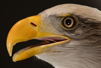

   Birds use their beaks to pick up food.

2. (informal) a large nose:

   1. He'd be handsome if it wasn't for that huge beak of his.

#### nest
noun

1. (home) a structure built by birds or insects to leave their eggs in to develop, and by some other animals to give birth or live in:
   
   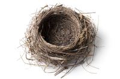

   1. a bird's nest
   2. a rat's nest
   3. Cuckoos are famous for laying their eggs in the nests of other birds.

2. a comfortable home:
   
   1. One day the children grow up and leave the nest.

3. a place where something unpleasant or unwanted has developed:
   
   1. The diplomats have been sent home because their embassy has become a nest of spies.

#### feather
noun

1. one of the many soft, light things that cover a bird's body, consisting of a long, thin, central part with material like hairs along each side:
   
   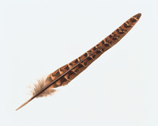

   1. peacock feathers
   2. feather pillows
   3. The bird ruffled its feathers.

#### whisker
noun

1. any of the long, stiff hairs growing on the face of a cat, mouse, or other mammal:
   
   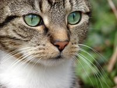

   1. He watched the cat cleaning the milk off her whiskers.

#### fur
noun

1. the thick hair that covers the bodies of some animals, or the hair-covered skin(s) of animals,removed from their bodies:
   
   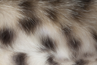

   1. She stroked the rabbit's soft fur.
   2. "Is that real fur on your collar?" "Certainly not - I only wear fake fur."
   3. a fur coat

#### claw
noun

1. one of the sharp curved nails at the end of each of the toes of some animals and birds:
   
   1. Our cat likes to sharpen her claws on the legs of the dining table.

   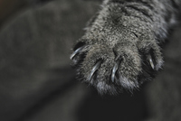   

2. one of the two pointed parts, used for holding things, at the end of the legs of some insects and sea creatures:
   
   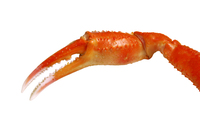

   Keep your fingers away from the crab's claws when you pick it up.

#### paw
noun

the foot of an animal that has claws or nails, such as a cat,dog,or bear:

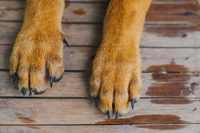

I found paw **prints** in the kitchen.

#### tail
noun

1. a part of an animal's body, sticking out from the base of the back, or something similar in shape or position:
   
   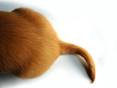

   The dog **wagged** its tail excitedly.

2. tails : the side of a coin that does not have a picture of someone's head on it:

   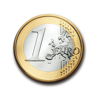

   Compare: head (coin side)

#### mane
noun

the long, thick hair that grows along the top of a horse's neck or around the face and neck of a lion:

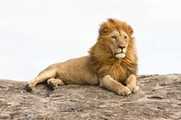

thick, long hair on a person's head:

The painting depicts a beautiful young man with a flowing mane **of** red hair.

#### horn
noun

a hard, pointed, often curved part that grows from the top of the head of some animals, or the hard substance of which a horn is made:

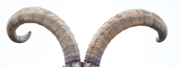

#### petal
noun

1. any of the usually brightly coloured parts that together form most of a flower:
   
   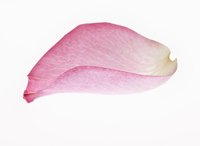   

   1. rose petals.

#### pollen
noun

a powder, produced by the male part of a flower, that causes the female part of the same type of flower to produce seed. It is carried by insects or the wind.

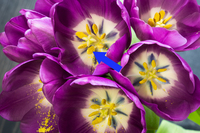

verb: pollinate: Bees pollinate the plants by carrying the pollen from one flower to another.

noun: pollination: Many species of tree depend on the wind for pollination.

#### bud
noun

1. a small part of a plant, that develops into a flower or leaf.

   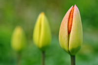

2. in bud : covered with buds

   1. It was springtime and the fruit trees were in bud.

Idioms: nip sth in the bud: to stop something before it has an opportunity to become established:

1. Many serious illnesses can be nipped in the bud if they are detected early enough.

2. It's important to nip this kind of bullying in the bud.

#### thorn
noun

1. a small, sharp pointed growth on the stem of a plant:
   
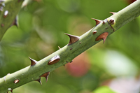

#### stem
noun

1. a central part of something from which other parts can develop or grow, or which forms a support:

2. the stick-like central part of a plant that grows above the ground and from which leaves and flowers grow, or a smaller thin part that grows from the central part and supports the leaves and flowers:
   
   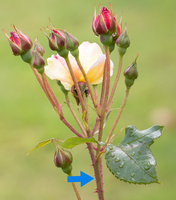

   flower stems

3. the thin vertical part of a glass or similar container that joins the part that holds liquid to the flat bottom part on which it stands:
   
   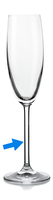

   Champagne glasses usually have long stems.

#### bough
noun

1. a large branch of a tree

#### twig
noun

a small, thin branch of a tree or bush, especially one removed from the tree or bush and without any leaves:

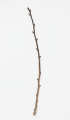

We collected dry twigs to start the fire.

#### bark
noun

1. the hard outer covering of a tree

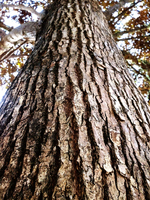

2. the loud, rough noise that a dog and some other animals make.

#### trunk
noun

1. the thick main stem of a tree, from which its branches grow.

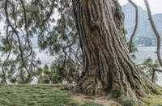

2. the main part of a person's body, not including the head, legs, or arms:

   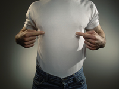   
   
   1. The statue shows the head, trunk, and arms of an old man.

3. (medical, specialized) the main part of a blood vessel or nerve:
   
   1. a nerve trunk injury

4. the long, tube-shaped nose of an elephant
   
   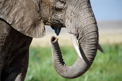

5. a covered space at the back of a car, for storing things in:

   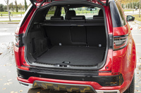

   1. I always keep a blanket and a toolkit in the trunk for emergencies.
   2. Stolen goods were found in the trunk of her car.   

#### vessel
noun

1. (formal) a large boat or a ship:
   
   1. a cargo/fishing/naval/patrol/sailing/supply vessel

2. a tube that carries liquids such as blood through the body:
   
   1. A heart attack is caused by the blood vessels that supply the blood to the heart muscle getting blocked.

#### nerve
noun

1. a group of long, thin fibres(= structures like threads) that carry information or instructions between the brain and other parts of the body:
   
   1. the optic nerve
   2. a spinal nerve
   3. nerve damage
   4. nerve fibres

2. the courage or confidence necessary to do something difficult, unpleasant, or rude:
   
   1. It takes a lot of nerve to be a bomb disposal expert.
   2. I wanted to ask her out, but I **lost** my nerve and couldn't go through with it.
   3. I didn't have **the** nerve to tell him what I really thought of his suggestion.

3. nerves(plural): worry or anxiety about something that is going to happen:
   
   1. I never suffer from nerves when I'm speaking in public.
   2. She was **a bundle of** nerves(= very nervous) before the audition
   3. I always have a cigarette to **calm/steady** my nerves(= make me less nervous) before I go on stage.

4. get on sb's nerves: to annoy someone a lot:
   
   1. We really got on each other's nerves when we were living together.
   2. Please stop making that noise! It really gets on my nerves.

#### root
noun

1. the part of a plant that grows down into the earth to get water and food and holds the plant firm in the ground.

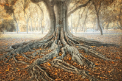

2. the cause or origin of something bad:
   
   1. We must **get to the** root **of**(= discover the cause of) this problem.
   2. What **is/lies at** the root **of** the problem is their lack of interest.
   3. The high crime rate has its roots **in** unemployment and poverty.
   4. So what's the root **cause** of his anxiety?

#### seal
noun

1. a large mammal that eats fish and lives partly in the sea and partly on land or ice:
   
   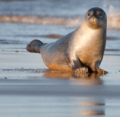

2. something fixed around the edge of an opening to prevent liquid or gas flowing through it:

   1. Clean the seal **on/around** the fridge door regularly so that is remains airtight. 

3. a thin piece of material such as paper or plastic that covers the opening of a container and has to be broken in order to open the container and use the contents:
   
   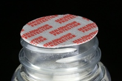

4. an official mark on a document, sometimes made with wax, that shows that it is legal or has been officially approved:

   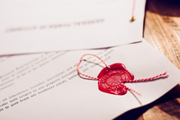   

   The lawyer stamped the certificate with her seal.

#### blossom
verb

1. when a tree or plant blossoms, it produces flowers before producing fruit that can be eaten:
   
   1. The cherry tree is beginning to blossom

2. when people blossom, they become more attractive, successful, or confident, and when good feelings or relationships blossom, they develop and become stronger:
   
   1. She has really blossomed recently.
   2. She is suddenly blossoming **into** a very attractive woman.
   3. Sean and Sarah's friendship blossomed **into** love.

noun

a small flower, or the small flowers on a tree or plant:

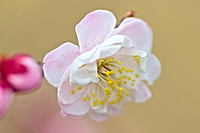

#### purse
noun

1. a small container for money, usually used by a woman:
   
   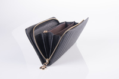

   1. a leather purse

2. a handbag:
   
   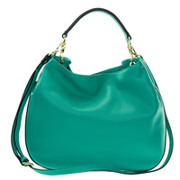

   