#### collar
noun

1. the part around the neck of a piece of clothing, usually sewn on and sometimes made of different material:
   
   1. a shirt collar
   2. a fur collar
   3. a dress with a big collar

adjective:

2. blue-collar: blue-collar workers do work needing strength or physical skill rather than office work.
   
3. pink-collar (mainly US): a pink-collar job is one that is traditionally done by a woman. 
   
4. white-collar: relating to people who work in offices, doing work that needs mental rather than physical effort:
   
   1. white-collar workers/unions

#### zip
noun

1. a device consisting of two rows of metal or plastic teeth-like parts that are brought together by pulling a small sliding piece over them, used for closing openings in clothing, bags, etc.:
   
   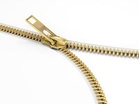

   1. to do up/undo a zip
   2. I can't open my bag - the zip has **stuck**.

#### hoodie
noun, informal (also hoody)

1. a sweatshirt(= cotton clothing for the upper body) that has a hood to cover the head.

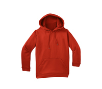

#### hood
noun

1. (clothing) part of a piece of clothing that can be pulled up to cover the top and back of the head:
   
   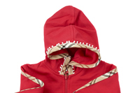

   1. The coat has a detachable hood.
   2. It's pouring - why don't you put up your hood?
   3. You can detach the hood if you prefer the coat without it.

2. a bag that is put over someone's head so that they cannot see or be recognized:
   
   1. The prisoners had been tortured and make to wear hoods.

3. a part that covers or shelters a piece of equipment:
   
   1. The hood over the air vent is loose.

   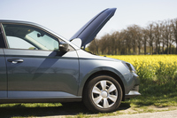

#### cuff
noun

1. (around wrist, ankle) the thicker material at the end of a sleeve closest to the hand:
   
   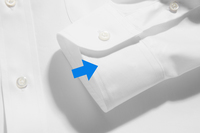

   1. He buttoned his cuffs
   2. a black shirt with white cuffs

2. (UK turn-up) a part at the end of a trouser leg that is turned up:
   
   

   He wears a polo shirt and cuffs on his pants.

#### sleeve
noun

1. (clothing part) the part of a piece of clothing that covers some or all of the arm:
   
   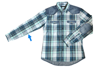

   1. short/long sleeves
   2. The sleeves are too long for me
   3. You'd better **roll** your sleeves **up** or you'll get them dirty.

#### hem
noun

1. the edge of a piece of cloth, such as the bottom edge of a skirt or dress, that is folded over and sewn so that it does not develop loose threads:
   
   1. I **took the** hem **up** 
   2. I **let the** hem **down**

#### belt
noun

1. a strip of leather or material worn around the waist to support clothes or for decoration:
   
   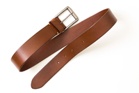

   1. She fastened her belt tightly around her waist.
   2. He had eaten so much that he had to loosen his belt a couple of notches.

2. a flat strip of material in a machine that moves along continuously to keep another part turning, or to keep objects on it moving along:
   
   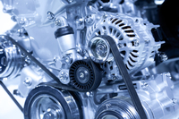

   1. a fan belt
   2. a conveyor belt

#### buckle
noun

a piece of metal at one end of a belt or strap, used to fasten the two ends together

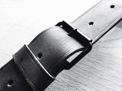

#### lace
noun

1. a decorative cloth made by twisting thin thread in delicate patterns with holes in them:
   
   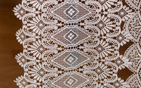

   lace curtains

2. (usually plural) a string that you use to fasten openings, especially in shoes, by putting it through two lines of small holes and trying the ends together:
   
   1. Your shoe laces are undone.

verb

1. to add alcohol or drugs to food or drink, often secretly:
   
   1. coffee laced **with** brandy

#### delicate
adjective

1. needing careful treatment, especially because easily damaged:
   
   1. Peaches have delicate skins which are easily bruised.
   2. Delecate plants need to e kept in a greenhouse during the winter.

#### sole
adjective

1. being one only; single:
   
   1. My sole objective is to make the information more widely available.
   2. The sole **survivor** of the accident was found in the water after six hours.

2. (plural, soles) the bottom part of the foot that touches the ground when you stand or walk, or the bottom part of a shoe that touches the ground, usually not including the heel:
   
   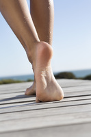

   1. a cut on the sole of her foot
   2. shoes with rubber soles

#### dress up
1. to put on formal clothes for a special occasion:

You don't need to dress up to go to the mall - jeans and a T-shirt are fine

2. to put on special clothes in order to change your appearance:
   
Little kids usually love dressing up **in** their mothers'clothes.

He dressed up **as** a cowboy for the party.

#### baggy
adjective

1. (of clothes) hanging loosely because of being too big or having been stretched:
   
   1. baggy trousers
   2. My T-shirt went all baggy in the wash.

Synonym:

loose-fitting: (adjective), loose-fitting clothing is quite large and does not fit tightly:

a loose-fitting shirt.

#### close-fitting
adjective

close-fitting clothing fits very tightly.

Synonyms:

1. snug (fitting closely or tightly)
2. tight
3. tight-fitting

#### long-sleeved
adjective

having long sleeves:

a long-sleeved T-shirt

Opposite:

short-sleeved.

sleeveless: a sleeveless piece of clothing has no sleeves:

#### denim
noun

1. a thick, strong cotton cloth, often blue in colour, used especially for making jeans:
   
   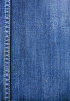

   1. a denim jacket and jeans

#### woollen
adjective, (US usually woolen)

made of wool:

a woollen scarf

#### suede
noun

leather that is slightly rough to touch and is not shiny:

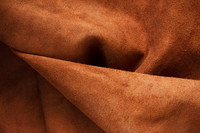

suede shoes.

#### pinstriped
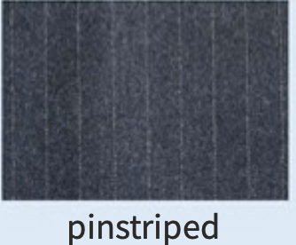

#### spotted
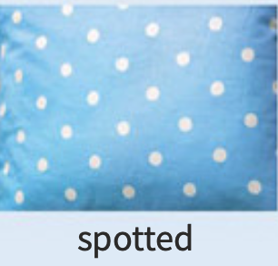

#### plain
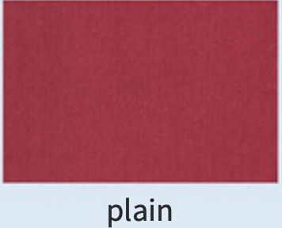

#### striped
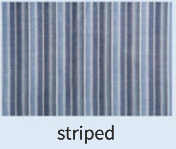

#### checked
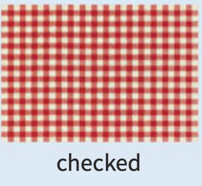

#### flowery

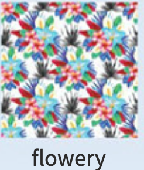

#### tartan
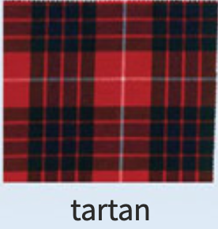

#### disguise
verb

1. to give a new appearance to a person or thing, especially in order to hide its true form:
   
   1. He disguised himself by wearing a false beard.
   2. We tried to disguise the fact that it was just a school hall by putting up coloured lights and balloons.

2. to hide an opinion, a feeling, etc.:
   
   1. I couldn't disguise my disappointment.

