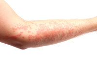
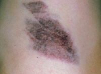
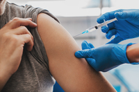

#### rash
noun

1. a lot of small red spots on the skin:
   
   

   1. I've got an **itchy** rash all over my chest.
   2. If you stay in the sun too long you'll get (a) heat rash.
   3. (UK) He **came out/up in** a rash after he fell in a patch of nettles.

2. a rash of sth: a large number of unpleasant events of the same type:
   
   1. There has been a rash of robberies/accidents/complaints in the last two months.

adjective

1. careless or unwise, without thought for what might happen or result:
   
   1. That was a rash decision - you didn't think about the costs involved.
   2. [+ to infinitive] I think **it** was a bit rash **of** them **to** get married when they'd only known each other for a few weeks.

Synonyms:

1. foolhardy: (adjective) brave in a silly way, taking unnecessary risks:
   
   1. a foolhardy decision
   2. Sailing the Atlantic in such a tiny boat wasn't so much brave as foolhardy.
   3. It would be foolhardy **to** try and predict the outcome of the talks at this stage.

2. reckless: (adjective) doing something dangerous and not worrying about the risks and the possible results:
   
   1. He was found guilty of reckless driving.

#### bruise
noun

1. an injury or mark where the skin has not been broken but is darker in colour, often as a result of being hit by something:

   
   
   1. His arms and back were covered in bruises.
   2. She had a few **cuts and** bruises but nothing serious.
   3. One or two of the peaches had bruises on them.

#### lump
noun

1. a hard swelling found in or on the body, especially because of illness or injury:
   
   1. She found a lump in her breast.

2. a piece of a solid substance, usually with no particular shape:
   
   1. a lump of coal
   2. a sugar lump
   3. You don't want lumps in the sauce.

#### black eye
noun

an area of skin around the eye that has gone dark because it has been hit:

He had a fight at school and came home with a black eye.

#### indigestion
noun

pain that you get in your stomach when you have eaten food that is difficult to digest:

1. Do you **suffer from** indigestion after you have eaten?.
2. You'll give yourself indigestion if you swallow your dinner so quickly.

#### diarrhoea
noun

1. an illness in which the body's solid waste is more liquid than usual and comes out of the body more often:
   
   1. diarrhoea and sickness
   2. **an attack of** diarrhoea

#### itch
verb

1. to have or cause an uncomfortable feeling on the skin that makes you want to rub it with your nails:
   
   1. I can't wear wool - it makes me itch.

noun: itching
adjective: itchy: The sweater was itchy.

#### trembling
adjective

1. shaking slightly in a way that you cannot control, for example because you are frightened, angry, or excited, or because of illness:

   1. "I was scared," she said in a trembling voice.
   2. He reached out for her with trembling hands.

2. of the ground or an object, shaking slightly:
   
   1. Eyewitnesses to the explosion reported a fireball and trembling ground.

#### shiver
verb

1. when people or animals shiver, they shake slightly because they feel cold, ill, or frightened:
   
   1. The poor dog - it's shivering!
   2. He shivered **with** cold in his thin cotton shirt.
   3. She shivered, and gatherd the blanket around her.
   
noun

1. the act of shaking slightly because you are frightened, cold, or ill:

   1. I felt/gave a shiver as I looked out at the dark expanse of sea.

#### expanse
noun

1. a large, open area of land, water, or sky:
   
   1. The Great Plains are a broad expanse of grassland.
   2. vast expanses **of** sand and pine.

#### breathless
adjective

1. not able to breathe easily:
   
   1. I was breathless after climbing the stairs.
   2. That one kiss had left her breathless **with** excitement.

#### dizzy
adjective

1. feeling as if everything is turning around, and that you are not able to balance and may fall over:
   
   1. Going without sleep for a long time makes me feel dizzy and light-headed.
   2. I felt dizzy **with** excitement as I went up to collect the award.
   3. Someone who is suffering from sunstroke feels dizzy and has a high temperature, but does not sweat.

#### appetite
noun

1. the feeling that you want to eat food:
   
   1. All that walking has given me an appetite.
   2. I won't have any chocolate, thanks. It will spoil(= reduce) my appetite.
   3. I haven't **got much of** an appetite.(= I am not hungry).
   4. The children all **have healthy/good** appetites.(= they eat a lot)
   5. Both viruses cause fever and **loss of** appetite.

2. the feeling of wanting or needing something:
   
   1. her appetite **for** adventure.
   2. his insatiable sexual appetite.
   3. I've read an excerpt of the book on the Web and it's **whetted** my appetite.(= increased my interest in it)

#### insatiable
adjective

(especially of a desire or need) too great to be satisfied:

1. Like so many politicians, he had an insatiable **appetite/desire/hunger** for power.
2. Nothing, it seemed, would satisfy his insatiable curiosity.

#### whet
verb

whet sb's appetite: to increase someone's interest in and wish for something, usually by giving them a small experience of it:

   1. That one kiss had whetted his appetite.
   
#### sprain
verb

1. to cause an injury to a joint(= a place where two bones are connected) by a sudden movement:
   
   1. She sprained her ankle playing squash.
   2. He stumbled and sprained a knee.

#### dislocated
adjective

1. a dislocated joint (= a part of the body where bones join) is one in which a bone has been suddenly forced out of its correct position:
   
   1. a dislocated hip
   2. The jaw is not broken, just dislocated.

2. not in the right or usual place:
   
   1. How can we resettle hundreds of thousands of dislocated people?

3. feeling that you are in the wrong place or that you are not connected to things or people around you:
   
   1. No one would have guessed how alienated I felt, how dislocated and adrift.

#### alienated
adjective

1. feeling that you have no connection with the people around you or that you are not part of a group:
   
   1. These women tell us that they feel very alienated **from** other women.
   2. I was a really alienated, angry kid.

#### adrift
adjective

1. If a boat adrift, it is moving on the water but is not controlled by anyone because of a problem:

He spent three days adrift on his yacht.

2. If a person is adrift, they do not have a clear purpose in life or know what they want to do:
   
   1. Da Silva plays a bright, lonely student from New York, adrift in small-town Arizona.

#### stroke
noun

1. a sundden change in the blood supply to a part of the brain, sometimes causing a loss of the ability to move particular parts of the body:
   
   1. She **suffered/had** a stroke that left her unable to speak.

2. (a line or mark made by) a movement of a pen or pencil when writing or a brush when painting:
   
   1. a brush stroke
   2. with a few **bold** strokes, she signed her name.

#### injection
noun

1. the act of putting a liquid, especially a drug, into a person's body using a needle and a syringe(= small tube):
   
   

   1. Daily insulin injections are necessary for some diabetics.
   2. This steroid is sometimes given by injection.

#### plaster
noun

1. a substance that becomes hard as it dries and is used especially for spreading on walls and ceilings in order to give a smooth surface:
   
   1. The plaster on the walls was cracked and flaking.

#### flake
noun

1. a small, thin piece of something, especially if it has come from a surface covered with a layer of something:
   
   1. flakes of snow
   2. soap flakes
   3. This room needs decorating - flakes of paint keep coming off the walls.

#### surgeon
noun

1. a doctor who is specially trained to perform medical operations
   
   

   1. The surgeon makes a small incision into which a tube is inserted.
