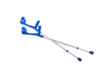
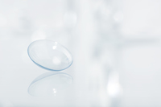
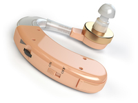
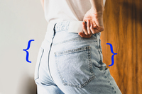
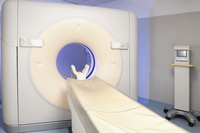
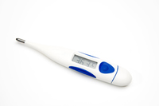

#### crutch
noun

1. a stick with a handle and a part that fits around your lower arm, or a stick with piece that fits under the arm, that you lean on for support if you have difficulty in walking because of a foot or leg injury:
   
   

   1. Martin broke his leg and has been **on** crutches for the past six weeks.
   2. Anna uses crutches and sometimes a wheelchair.

#### spectacles
noun, a more formal word for glass.

glasses:

You could just see his eyes behind the thick lenses of his spectacles.

#### vision
noun

1. (mental image) an idea or mental image of something:
   
   1. We see in his novels his sinister, almost apocalyptic, vision **of** the future.

   2. Johnny was late home and, as usual, I **had** visions **of** him lying dead in some alley.

2. (view of the future) the ability to imagine how a country, society, industry, etc. could develop in the future and to plan for this:
   
   1. He didn't have the mental agility or vision required for a senior politician.
   2. a person of great artistic vision

3. the ability to see:
   
   1. She has very little vision in her left eye.

Synonyms:

1. eyesight: the ability to see:
   
   1. good/bad/poor eyesight
   2. You need to have your eyesight tested.
   
2. sight(ability to see):

#### anaesthetic
noun

1. a substance that makes you unable to feel pain:
   
   1. The operation is performed under anaesthetic.
   2. The procedure is carried out under local anaesthetic.(= a substance that makes you unable to feel pain in part of your body)
   3. I've never had a **general** anaesthetic(= a substance that makes you unconscious so you do not feel pain).

#### unconscious
adjective

1. in the state of not being awake and not aware of things around you, especially as the result of a head injury:
   
   1. She was hit on the head by a stone and knocked unconscious.

2. An unconscious thought or feeling is one that you do not know you have:
   
   1. my unconscious desire to impress him.

#### radiation
noun

1. a form of energy that comes from a nuclear reaction and that can be very dangerous to health:
   
   1. Many servicemen suffered radiation sickness after the early atomic tests.

2. energy from heat or light that you cannot see:
   
   1. microwave/ultraviolet/electromagnetic radiation

#### contact lens
noun

a small round curved piece of transparent plastic, worn on the surface of the eye to improve your sight:

I usually wear contact lenses, but i sometimes wear glasses when my eyes are tired.

#### rapid
adjective

1. fast or sudden:
   
   1. The 1990s were a period of rapid change/growth.
   2. His response to the accusation was rapid.
   3. I was startled by a rapid movement to my left.

#### vast
adjective

1. extremely big:
   
   1. a vast audience watched the broadcast.
   2. The amount of detail the book contains is vast.
   3. The people who have taken our advice have saved themselves vast **amounts/sums** of money.
   4. The vast **majority** of children attend state schools.

Synonyms:

1. enormous
2. huge

#### sophisticated
adjective

1. having a good understanding of the way people behave and/or a good knowledge of culture and fashion:
   
   1. She was slim, svelte, and sophisticated.
   2. I don't think I have any books that would suit your sophisticated tastes.
   3. He was older than me and from London and I thought him very sophisticated.

2. intelligent or made in complicated way and therefore able to do complicated tasks:
   
   1. I think a more sophisticated approach is needed to solve this problem.
   2. These are among the most sophisticated weapons in the world.

#### hearing aid
noun

a small device worn inside or next to the ear by people who cannot hear well in order to help them to hear better.

#### pacemaker
noun

1. a small device that is put inside someone's chest in order to help the heart beat at the correct speed.
   

#### artificial
adjective

1. made by people, often as a copy of something natural:
   
   1. clothes made of artificial fibres
   2. an artificial heart
   3. an artificial lake
   4. artificial fur/sweeteners/flowers

#### sweetener
noun

an artificial substance that has a similar taste to sugar, or a smell pill made of this

#### hip
noun

1. the area below the waist and above the legs at either side of the body, or the joint that connects the leg to the upper part of the body:
   
   

   1. This exercise is designed to trim your hips and stomach.
   2. The skirt was a bit tight across the hips.

#### prosthetic
adjective

1. relating to an artificial body part, such as an arm, foot, or tooth, that replaces a missing part:
   
   1. a prosthetic hand
   2. People have learned to ski,kayak,and run marathons with their prosthetic limbs.

#### prosthesis
noun

an artificial body part, such as an arm, foot, or tooth, that replaces a missing part

#### laser
noun

1. (a device that produces) a powerful, narrow beam of light that can be used as a tool to cut metal, to perform medical operations, or to create patterns of light for entertainment:
   
   1. laser beam
   2. laser surgery

#### scanner
noun

a device for making images of the inside of the body or for reading information into a computer system:

1. an ultrasound scanner
2. bar code scanners

#### diagnose
verb

1. to recognize and name the exact character of a disease or a problem, by examining it:
   
   1. The specialist diagnosed cancer.
   2. His condition was diagnosed **as** some type of blood disorder.
   3. She was diagnosed **with/as** having diabetes.

#### thermometer
noun

a device used for measureing temperature, especially of the air or in a person's body

