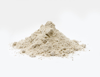

#### oily
adjective

1. consisting of or similar to oil:
   
   1. an oily liquid

2. coverd in oil or containing a lot of oil:
   
   1. an oily rag
   2. oily fish

#### wholemeal
adjective

1. (of flour or food made from flour) containing all the natural features of the grain, with nothing taken away:
   
   1. wholemeal bread/flour/pastry

#### flour
noun

powder made from grain, especially wheat, used for making bread, cakes, pasta, pastry, etc.:

1. Thicken the sauce with a little flour.
2. Do you prefer flour or corn tortillas?

#### fizzy
adjective

having a lot of bubbles:

fizzy orange/mineral water

#### cholesterol
noun

1. a substance containing a lot of fat that is found in the body tissue and blood of all animals, thought to be part of the cause of heart disease if there is too much of it:
   
   1. an oil that is high in polyunsaturates and low in cholesterol.

#### boost
verb

1. to improve or increase something:
   
   1. The theatre managed to boost its audiences by cutting ticket prices.
   2. I tried to boost his ego(= make him feel more confident) by praising his cooking.

#### immune
adjective

