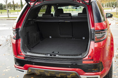
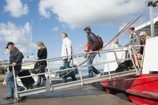
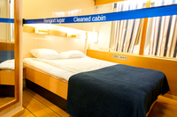

#### tram
noun

an electric vehicle that transports people, usually in cities, and goes along metal tracks in the road.

#### boot
noun

1. (UK, US trunk)a covered space at the back of a car, for storing things in:
   
   
   
   1. I always keep a blanket and a toolkit in the boot for emergencies.
   2. Stolen goods were found in the boot of her car.

#### steering wheel
noun

1. a wheel in a vehicle that the driver turns in order to make the vehicle go in a particular direction.
   
   

#### steer
verb

1. to control the direction of a vehicle:
   
   1. She carefully steered the car around the potholes.
   2. This car is very easy to steer.

2. (T usually + adv/prep) to take someone or something or make someone or something go in the direction in which you want him, her, or it:
   
   1. She steered her guests into the dining room.
   2. I'd like to steer our discussion **back to** our original topic.
   3. The main task of the new government will be to steer the country **towards** democracy.

#### mechanic
noun

1. someone whose job is repairing the engines of vehicles and other machines:
   
   1. a car/garage/bike mechanic
   2. Buying that second-hand car without having it checked by a mechanic first cost us dear.

#### chauffeur
noun

someone whose job is to drive a car for a rich or important person:

a chauffeur-driven limousine

#### petrol station
noun

1. (also mainly UK filling station)(US gas station) a place where fuel is sold for road vehicles, often with a small shop
   
   

#### break down
1. if a machine or vehicle breaks down, it stops working:

   1. Our car broke down and we had to push it off the road.

   2. The lift has broken down again.

2. If a system, relationship, or discussion breaks down, it fails because there is a problem or disagreement.

3. to be unable to control your feelings and to start to cry:
   
   1. When we gave her the bad news, she broke down and cried.

#### sleeping car
noun

1. a railway carriage with beds for passengers to sleep in.
   
   

#### coach
noun, UK also carriage, US car

any of the separate parts of a train in which the passengers sit

#### conductor
noun

1. someone who directs the performance of musicians or a piece of music:
   
   

   1. The conductor raised his baton.
   2. a guest conductor.

2. (US, Uk guard) a railway official who travels on and is responsible for a train.
3. someone whose job is to sell tickets on a bus,train, or other public vehicle.

#### liner
noun

1. a large ship for carrying passengers in great comfort on long journeys.

#### ferry
noun

1. a boat or ship for taking passengers and often vehicles across an area of water, especially as a regular service:
   
   1. a car ferry
   2. We're going to the Channel Islands **by/on the** ferry.
   3. We took the ferry to Calais.

#### yacht
noun

1. a boat with sails and sometimes an engine, used for either racing or travelling on for pleasure:
   
   1. a luxury yacht
   2. a yacht club

#### deck
noun

1. a flat area for walking on, built across the space between the sides of a boat:
   
   

   1. We sat on deck until it was dark.

2. one of the floors of a bus:
   
   

   1. the upper/top deck of the bus

#### bridge
noun

1. something that makes it easier to make a change from one situation to another:
   1. Part-time work can provide a bridge **between** staying at home **and** working full-time.

2. the raised part of a ship on which the captain and other officers stand and from where they control the movement of the ship.

   

3. the top part of the nose, between the eyes, or (on a pair of glasses) the piece that is supported by the top part of the nose:
   
   

   1. The blow caught him right on the bridge of his nose.

#### gangway
noun

1. a passage between rows of seats, for example in a cinema or bus:
   
   

   1. His suitcase was blocking the gangway.
   2. The performers enter the arena dramatically via the gangways.

2. a board or passage that joins a ship, aircraft, or building to the land or to another building, for people to walk along:
   
   

   1. Visitors board the ship directly from shore via a long gangway.
   2. The room looked out onto a gangway between two buildings.

#### steward
noun, femal stewardess

1. a person who serves passengers on a ship or aircraft:
   
   

#### cabin
noun

1. a small, simple house made of wood:
   
   

   a log cabin

2. a small room where you sleep in a ship:
   
   

3. the area where passengers sit in an aircraft

   

#### cabin crew
noun

in an aircraft, the people whose job it is to take care of the passengers.

#### cruise
noun

a journey on a large ship for pleasure, during which you visit several places:

1. They've just set off on a round-the-world cruise.

#### jumbo jet
noun

a very large aircraft that can carry a lot of people:

#### cockpit
noun

1. the small closed space where the pilot sits in an aircraft, or where the driver sits in a racing car:
   
   

2. the area on a boat where the person operating the controls sits or stands:

   

#### aisle
noun

a long, narrow space between rows of seats in an aircraft, cinema, or church:

.jpg)

Would you like an aisle seat or would you prefer to be by the window?

#### ground staff
noun

the people whose job is to take care of a sports ground and its equipment

#### cabin crew
noun

in an aircraft, the people whose job it is to take care of the passengers

#### air traffic controller
noun

a person who manages aircraft from the ground as they take off, fly, and land:

1. an air traffic controllers's strike
2. She likes aviation but didn't want to fly, so she became an air traffic controller.

#### aviation
noun

1. the activity of flying aircraft, or of designing, producing, and keeping them in good condition:
   
   1. the British Civil Aviation Authority
   2. the US Federal Aviation Administration
   3. aviation fuel

#### duty-free shop
noun

a store, for example, in an airport, that sells goods without charging the tax that would normally be added to their price:

1. The company runs duty-free shops at airports throughout south-east Asia.

#### excursion
noun

1. a short journey usually made for pleasure, often by a group of people:
   
   1. This year's annual excursion will be to Lincoln
   2. Next week we're going on an excursion.

#### hitchhike
verb

to travel by getting free rides in someone else's vehicle:

1. I would never hitchhike on my own.
2. They hitchhiked to Paris.

#### punctually
adverb

at the expected or correct time and not late:

1. The meeting started punctually at 10 am.
2. Everyone arrived punctually.

adjective: punctual
noun: punctuality

#### turbulence
noun

a state of confusion without any order:

1. The era was characterized by political and cultural turbulence.
2. There are signs of turbulence ahead for the economy.

#### bumpy
adjective

not smooth:

1. We drove along a narrow, bumpy road.
2. It might be a bumpy flight(= an uncomfortable and rough flight) because there's a lot of air turbulence ahead.

#### airsick
adjective

1. having the feeling that you will vomit because of the movement of an aircraft you are travelling in

Compare:

1. carsick
2. seasick

#### runway
noun

a long, level piece of ground with a specially prepared smooth, hard surface on which aircraft take off and land.

Synonyms:

1. airstrip: a long, flat piece of land from which trees, rocks, etc. have been removed so that aircraft can take off and land:
   
   1. We landed at a tiny airstrip in the middle of the jungle.

2. landing strip: a long, flat area of ground that is used by aircraft with wings when taking off and landing:
   
   

