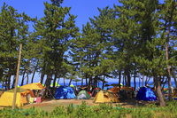
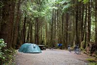
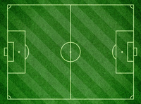
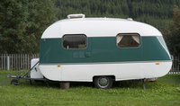
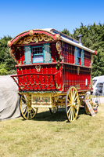
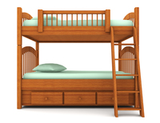
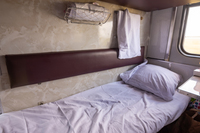
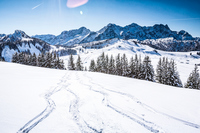

#### campsite
noun

1. a piece of land where people on holiday can camp, usually with toilets and places for washing:
   
   

   The campsite is in a beautiful location next to the beach.

2. a place for one tent at a place where people stay in tents:

   

   Our tent was so large that they charged us for two campsites.

#### pitch
noun

1. an area painted with line for playing particular sports, especially football:
   
   

   1. a football/hockey/cricket pitch
   2. Supporters invaded(= ran onto) the pitch.
   
verb

1. to put up a tent and make it ready to use:
   
   1. We pitched camp/out tent in the shade.

#### caravan
noun

1. (UK, US trailer)a wheeled vehicle for living or travelling in, especially for holidays, that contains beds and cooking equipment and can be pulled by a car.
   
   

2. a painted wooden vehicle that is pulled by a horse and in which people live:
   
   

#### youth hostel
noun

a place where people, especially young people, can stay cheaply for short periods when they are travelling:

#### hostel
noun

1. a large house where people can stay free or cheaply:

   1. a student hostel.

2. a place where people, especially young people, can stay cheaply for short periods when they are travelliing, with shared rooms and sometimes some private rooms:
   
   1. We stayed in a lovely hostel just off the main square.

#### bunk
noun

1. (also bunk bed) one of two beds attached together, one on top of the other:
   
   

   1. The twins sleep in bunk beds.
   2. Can I sleep in the top bunk?

2. a narrow bed that is attached to a wall, especially in a boat or a train:
   
   

#### excursion
noun

1. a short journey usually made for pleasure, often by a group of people:
   
   1. This year's annual excursion will be **to** Lincoln.
   2. Next week we're **going on** an excursion.

2. excursion into sth: a short involvement in a new activity:
   
   1. A teacher by profession, this is her first excursion into writing.

#### cruise
noun

1. a journey on a large ship for pleasure, during which you visit several places:
   
   1. They're going on a cruise round the Med.
   2. They've just set off on a round-the-world cruise.

verb

1. to travel on ships for pleasure
2. If a ship or aircraft cruises, it travels at a continuous speed.

#### adventurous
adjective

1. willing to try new or difficult things:
   
   1. I'm trying to be more adventurous with my cooking.

2. exciting and often dangerous:
   
   1. She led an adventurous life.

adverb: adventurously

#### get away

1. to leave or escape from a person or place, often when it is difficult to do this:
   
   1. We walked to the next beach to get away from the crowds.
   2. I'll get away from work as soon as I can.

2. to go somewhere to have a holiday, often because you need to rest:
   
   1. I just need to get away for a few days.
   2. I had to get away from the party. It was awful.

#### winding
adjective

1. A winding path, road, river, etc. repeatedly turns in different directions:
   
   1. There's a very long, winding path leading up to the house.
   2. They struggled up the narrow winding stairs.

2. A winding story or series of events is complicated and involves many changes:
   
   1. The TV series featured a winding, complex story line.

#### terrifying
adjective

1. very frightening:
   
   a terrifying experience/ordeal

#### memorable
adjective

1. likely to be remembered or worth remembering:
   
   1. a memorable performance
   2. a memorable tune
   3. I haven't seen them since that memorable evening when the boat capsized.

#### capsize
verb

to (cause a boat or ship to) turn upside down by accident while on water:

1. A huge wave capsized the yacht.
2. When the boat capsized we were trapped underneath it.

#### delightful
adjective

1. very pleasant, attractive, or enjoyable:
   
   1. Our new neighbours are delightful.
   2. Thank you for a delightful evening.

#### inconvenient
adjective

1. causing problems or difficulties:
   
   1. an inconvenient time/place.
   2. **It** will be very inconvenient **for** me **to** have no car.

#### exceptional
adjective

1. much greater than usual, especially in skill, intelligence, quality, etc.:
   
   1. an exceptional student
   2. exceptional powers of concentration
   3. The company has shown exceptional growth over the past two years.

#### exaggerated
adjective

seeming larger, more important, better, or worse than it really is:

1. exaggerated reports of the problem
2. The slimming effect of wearing black has been greatly exaggerated.

#### breathtaking
adjective

extremely exciting, beautiful, or surprising:

1. The view from the top of the mountain is breathtaking.
2. His performance is described in the paper as "a breathtaking display of physical agility".

#### agile
adjective

able to move your body quickly and easily:

1. You need to have agile fingers to do this kind of work.

#### piste
noun

a snow-covered area or track that is suitable for skiing:

#### exclusive
adjective

1. limited to only on person or group of people:
   
   1. This room is for the exclusive use of guests.
   2. an exclusive interview

2. expensive and only for people who are rich or of a high social class:
   
   1. an exclusive private club
   2. an exclusive part of town

#### exhilarating
adjective

making you feel very excited and happy:

1. an exhilarating walk in the mountains.

#### exotic
adjective

unusual and exciting because of coming (or seeming to come) from far away, especially a tropical country:

1. exotic flowers/food/designs

#### glamorous
adjective

attractive in an exciting and special way:

1. a glamorous woman/outfit
2. a glamorous job
3. She was looking very glamorous

noun: glamorousness
adverb: glamorously

#### luxurious
adjective

very comfortable and expensive:

1. They have a very luxurious house.
2. We spent a luxurious weekend at a country hotel.

#### unspoiled
UK also unspoilt

1. an unspoiled place is beautiful because it has not been changed or damaged by people:
   
   1. an island with clean, unspoiled beaches

#### unique
adjective

being the only existing one of its type or, more generally, unusual, or special in some way:

