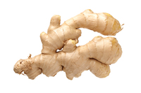
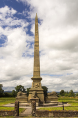

#### vase
noun

a container used for holding cut flowers or for decoration: (花瓶)

a vase of flowers

#### flowerpot
noun

a container, usually made of clay or plastic,in which a plant is grown (花盆)

#### superstitious
adjective

based on or believing in superstitions(= beliefs based on old ideas about luck and magic rather than science or reason):

Some people are superstitious **about** spilling salt on the table. (有些人迷信地认为把盐撒在桌上不吉利。)

#### ginger
noun

1. the spicy root of a tropical plant that is used in cooking or preserved in sugar, or a powder made from this root, used as a spice:

   

   ground(= powdered) ginger (姜粉)

   crystallized ginger

   ginger biscuits/cake (姜味饼干／饼)

2. a red or orange-brown color (姜黄色，赤黄色)
   
   

#### reptile
noun

an animal that produces eggs and uses the heat of sun to keep its blood warm. (爬行动物)

Humans, insects, reptiles, birds and mammals are all animals.

Birds, fish, mammals, amphibians, and reptiles are all vertebrates.

There was a fashion for keeping reptiles as pets.

#### mammal
哺乳动物

#### longevity
noun

1. living for a long time: （长寿）

   To what do you attribute your longevity? （你的长寿归功于哪些因素？）

2. remaining popular or useful for a long time: (长期受欢迎)
   
   For longevity in car design, you really need to keep it simple. (为了让汽车设计延续长久，你真的必须保持简单。)

#### majestic
adjective

beautiful, powerful, or causing great admiration and respect: (雄伟的；壮丽的；威严的)

The majestic Montana scenery will leave you breathless. (蒙大拿的壮丽景色会令你屏息凝神。)

#### magnificent
adjective

very good, beautiful, or deserving to be admired: (极好的；壮丽的；令人羡慕的)

a magnificent view (壮丽的景色)

a magnificent piece of writing (文笔出众的杰作)

They live in a magnificent Tudor house. (他们住在一座都铎时代的豪宅内。)

#### splendid
adjective

excellent, or beautiful and impressive: (极佳的，非常好的；华丽的；壮丽的)

We had splendid food/a splendid holiday/ splendid weather. (我们的食物／我们的假期／我们碰到的天气简直太棒了。)

You look splendid in that outfit. (你穿那一身衣服简直棒极了。)

#### glorious
adjective

deserving great admiration, praise, and honour: (辉煌的；光荣的；荣耀的)

a glorious victory (辉煌的胜利)

a memorial to the glorious dead of two world wars (为缅怀在两次世界大战中光荣献身的人们而修建的纪念碑)

#### memorial
noun

an object, often large and made of stone, that was been built to honour a famous person or event: (纪念物；纪念碑)

a war memorial

The status was erected as a memorial **to** those who died in the war. (这尊雕像是为纪念战争中死去的人而竖立的。)

