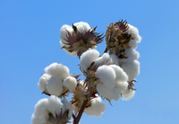
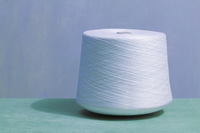
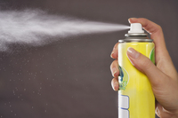

#### cotton
noun

1. the threads that grow around the seeds of a tall plant grown especially in the US,China, and South Asia:

   

   1. a bale of cotton

2. thread or cloth made from the fibres of the cotton plant:
   
   

   1. a shirt made of pure cotton
   2. She looked pretty in a simple cotton dress.
   3. (UK) a reel of cotton (= thread)

#### fibre
noun, US fiber

1. any of the thread-like parts that form plant or artificial material and can be made into cloth:

#### fabric
noun

1. cloth or material for making clothes, covering furniture, etc.:
   
   1. dress fabric
   2. cotton fabrics

2. the fabric of sth: the structure or parts of something:
   
   1. the fabric of society
   2. Unhappiness was woven into the natural fabric of people's lives.
   3. We must invest in the fabric of our hospital and start rebuilding them.

#### weave
verb

1. to make cloth by repeatedly crossing a single thread through two sets of long threads on a loom(= special frame).
   
   1. This type of wool is woven **into** fabric which will make jackets.

2. to twist long objects together, or to make something by doing this:
   
   1. We were shown how to roughly weave ferns and grass **together** to make a temporary shelter.
   2. It takes great skill to weave a basket **from/out of** rushes.

3. to go or make a path by moving quickly and changing direction often, especially to avoid hitting things:
   
   1. The boy weaved **through/between/in and out of** stationary traffic on a bicycle.

#### nylon
noun

an artificial substance used especially to make clothes, ropes, and brushes:

These covers are 100 percent nylon.

a nylon shirt/bag.

#### vivid
adjective

1. vivid descriptions, memories, etc. produce very clear, powerful, and detailed images in the mind:
   
   1. He gave a very vivid and often shocking account/description of his time in prison.
   2. He's one of those people with a very vivid imagination - every time he hears a noise he's convinced it's someone breaking in.

2. very brightly coloured:
   
   1. She was wearing a vivid pink shirt.

adverb: vividly
noun: vividness

#### sombre
adjective

serious, sad, and without humour or entertainment:

1. a sombre atmosphere/voice/face
2. The funeral was a sombre occasion.
3. I left them in a sombre mood.

#### opaque
adjective

1. preventing light from travelling through, and therefore not transparent or translucent:

   1. opaque glass/tights

2. opaque writing or speech is difficult to understand:
   
   I find her poetry a little too opaque.

#### faulty
adjective

a faulty machine or device is not perfectly made or does not work correctly:

faulty wiring/brakes

#### stiff
adjective

firm or hard:

1. stiff cardboard
2. a stiff collar
3. His clothes were stiff with dried mud.
4. This hair spray has made my hair stiff.

#### spray
noun

1. a mass of very small drops of liquid carried in the air:
   
   1. Can you feel the spray from the sea/waterfall?

2. a liquid that is forced out of a special container under pressure so that it becomes a mass of small liquid drops like a cloud:
   
   

   1. a quick spray of perfume/polish

#### spoiled
adjective, also mainly UK spoilt

1. A spoiled child is allowed to do or have anything that they want, usually so that they behave badly and do not show respect to other people:

   1. You're behaving like a spoiled **brat**!

2. destroyed, damaged, or no longer able to be used:
   
   1. spoiled meat

#### delicate
adjective

needing careful treatment, especially because easily damaged:

1. Peaches have delicate skins which are easily bruised.
2. Delecate plants need to be kept in a greenhouse during the winter.
3. delicate china
4. Molly's health has always been delicate(= she get sick easily).

#### fragile
adjective

1. a fragile object is easily damaged or broken:
   
   1. Be careful with that vase - it's very fragile.
   2. Some of the more fragile items are kept in a locked case.

#### sturdy
adjective

1. physically strong and solid or thick, and therefore unlikely to break or be hurt:
   
   1. sturdy walking boots
   2. a sturdy table.
   3. sturdy little legs.

#### genuine
adjective

If something is genuine, it is real and exactly what it appears to be:

1. genuine leather
2. If it is a genuine Michelangelo drawing, it will sell for millions.

#### trivial
adjective

1. having little value or importance:
   
   1. I don't know why he gets so upset about something so trivial.
   2. Sexual harassment in the workplace is not a trivial **matter**.

2. A trivial problem is easy to solve:
   
   1. Getting computers to understand human language is not a trivial problem.

#### characterize
verb

something that characterizes another thing is typical of it:

#### solidify
verb

to change from being a liquid or gas to a solid form, or to make something do this:

1. The chemical reaction solidifies the resin.

#### trivialize
verb

to make something seem less important that it really is:

1. I don't want to trivialize the problem, but I do think there are more important matters to discuss.

#### conventional
adjective

traditional and ordinary:

1. conventional behaviour/attitudes/clothes
2. conventional medicine/farming
3. a conventional wedding

#### bizarre
adjective

very strange and unusual:

1. a bizarre situation
2. bizarre behaviour

#### decorative
adjective

made to look attractive:

1. a decorative display of plants and flowers
2. a mirror in a decorative frame.

