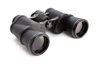
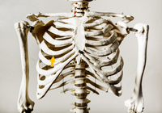
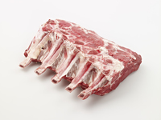
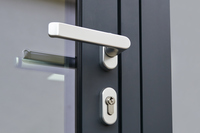
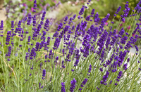

#### perception
noun

a belief or opinion, often held by many people and based on how things seem:

1. These photographs will affect people's perceptions of war.

#### extrasensory perception
noun

the ability to know things without using hearing, seeing, touch, taste, or smell.

#### glance
verb

1. to give a quick short look:
   
   1. She glanced **around/round** the room to see who was there.
   2. He glanced **up** from his book as I passed.
   3. Could you glance **over/through** this letter and see if it's alright?

2. to shine, reflect light, or sparkle:
   
   1. The sunlight glanced **on** the lake.

#### binoculars
noun

a pair of tubes with glass lenses at either end that you look through to see things far away more clearly:

a pair of binoculars

#### glimpse
verb

to see something or someone for a very short time or only partly:

1. We glimpsed the ruined abbey from the windows of the train.

#### peer
verb

to look carefully or with difficulty:

1. When no one answered the door, she peered **through** the window to see if anyone was there.
2. The driver was peering into the distance trying to read the road sign.

noun

a person who is the same age or has the same social position or the same abilities as other people in a group:

1. Do you think it's true that teenage girls are less self-confident than their male peers?
2. He wasn't a great scholar, but as a teacher he had few peers(= not as many people had the same ability as him).

#### gaze
verb

to look at something or someone for a long time, especially in surprise or admiration, or because you are thinking about something else:

1. Annette gazed admiringly **at** Warren as he spoke.
2. He spends hours gazing **out of** the window when he should be working.

#### stare
verb

to look for a long time with the eyes wide open, especially when surprised, frightened, or thinking:

1. Don't stare **at** people like that, it's rude.
2. Chuck sat quietly for hours staring into the distance, thinking of what might have been.
   

#### peep
verb

1. to secretly look at something for a short time, usually through a hole:
   
   1. I saw her peeping through the curtains/into the room.

#### peek
verb

1. to look, especially for a short tiem or while trying to avoid being seen:
   
   1. Close your eyes. Don't peek. I've got a surprise for you.
   2. I peeked out the window to see who was there.
   3. The children peeked over the wall to see where the ball had gone.

#### deafen
verb

If a very loud noise deafens you, it makes you deaf, or makes you temporarily unable to hear the other sounds near you:

1. The explosion permanently deafened her in her right ear.

#### deafening
adjective

extremely loud:

1. The music was deafening.

Synonym:

thunderous: extremely loud

1. thunderous applause
2. a thunderous reception

#### poke
verb

1. to push a finger or other pointed object quickly into someone or something:
   
   1. You'll poke someone **in** the eye with that umbrella if you're not careful!
   2. Two kids were poking a stick **into** the drain.

#### rib
noun

1. a bone that curves round from your back to your chest:

   1. My son broke a rib when he fell off a ladder.

   

2. a piece of meat taken from this part of an animal:
   
   1. He cooked rib of lamb for Sunday lunch.

   

#### stroke
verb

1. (touch) to move a hand, another part of the body, or an object gently over something or someone, usually repeatedly and for pleasure:
   
   1. Stroke the dog if you want, he won't bite.
   2. She lovingly stroked Chris's face with the tips of her fingers.

#### pat
verb

to touch someone or something gently and usually repeatedly with the hand flat:

1. He patted my head/patted me on the head affectionately.
2. I bent down to pat the little puppy.
3. She patted him on the head as she went past.
4. He patted her on the back affectionately.

#### tap
verb

1. to hit something gently, and often repeatedly, especially making short, sharp noises:
   
   1. The branches tapped **against** the window.
   2. I could hear him tapping his fingers on the desk.
   3. I was tapping my feet to the music. (= hitting the floor gently with my feet)
   4. Someone tapped me on the shoulder.

#### grasp
verb

1. to quickly take something in your hand(s) and hold it firmly:
   
   1. Roise suddenly grasp my hand.

#### grab
verb

to take hold of something or someone suddenly and roughly:

1. A mugger grabbed her handbag as she was walking across the park.
2. He grabbed (hold of) his child's arm to stop her from running into the road.

#### snatch
verb

1. to take hold of something suddenly and roughly:

   1. He snatched the photos out of my hand before I had a chance to look at them.

2. to take something or someone away by force:

   1. The six-year-old girl was snatched from a playground and her body was found two days later. 
   2. She had her purse snatched(= stolen) while she was shopping.

#### handle
noun

1. a part of an object designed for holding, moving, or carrying the object easily:
   
   

   1. a door handle
   2. the handle on a suitcase
   3. I can't pick the kettle up - the handle's too hot.
   4. She turned the handle and slowly opened the door.
   
verb

1. to deal with, have responsibility for, or be in charge of:
   
   1. I thought he handled the situation very well.
   2. Some people are brilliant with computers, but have no idea how to handle(= behave with) other people.
   3. If you can't handle the job I'll get someone else to do it.
   4. Who handles the marketing in your company?

2. to pick something up and touch, hold, or move it with your hands:
   
   1. Always wash your hands before handling food.
   2. Please don't handle the vases - they're very fragile.

#### stinking
adjective, informal

having a very unpleasant smell:

a pile of stinking rotten food.

#### foul
adjective

1. extremely unpleasant:
   
   1. Those toilets smell foul.
   2. I've had a foul day at work.
   3. Why are you in such a foul mood this morning?
   4. What foul weather!

#### putrid
adjective

decayed and having an unpleasant smell:

1. the putrid body of a dead fox
2. What's that putrid smell?

#### musty
adjective

smelling unpleasantly old and slightly wet:

1. musty old books
2. a musty smell
3. a musty room

#### pungent
adjective

smelling or tasting very strong and sharp:

1. the pungent whiff of a goat.
2. I sat down to a cup of wonderfully pungent Turkish coffee.

adverb: pungently
noun: pungency

#### fragant
adjective

with a pleasant smell:

1. fragrant flowers
2. The sauce itself was light, fragrant and slightly sweet.

#### aromatic
adjective

having a pleasant smell:

1. aromatic herbs

#### perfumed
adjective

having a pleasant perfume:

1. perfumed bath oil
2. expensively perfumed women

#### scented
adjective

having a pleasant strong smell, usually because a pleasant-smelling substance has been added to it:

1. scented candles
2. scented soaps/bath products
3. The air was scented **with** lavender.

#### lavender
noun

#### telepathy
noun

the ability to know what is in someone else's mind, or to communicate with someone mentally, without using words or other physical signals.

#### premonition
noun

a feeling that something, especially something unpleasant, is going to happen:

1. He had a premonition **that** his plane would crash, so he took the train.
2. She had a sudden premonition **of** what the future might bring.

#### intuition
noun

(knowledge from) an ability to understand or know something immediately based on your feelings rather than facts:

1. Often there's no clear evidence one way or the other and you just have to base your judgment on intuition.
2. I can't explain how I knew - I just had an intuition **that** you'd been involved in an accident.

