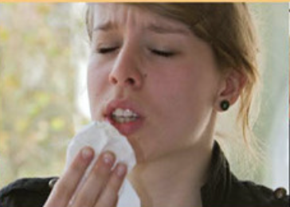
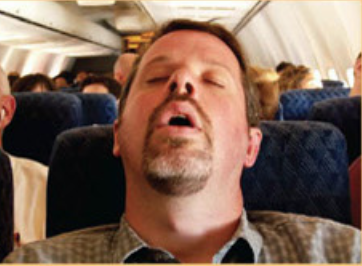
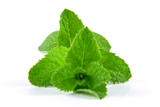

#### yawn
verb

to open the mouth wide and take a lot of air into the lungs and slowly send it out, usually when tired or bored:

1. I can't stop yawning - I must be tired.

#### sneeze
verb

when you sneeze, air and often small drops of liquid suddenly come out of your nose and mouth in a way you cannot control:

Cats make him sneeze - I think he's allergic to them.

#### allergy
noun

a condition that makes a person become sick or develop skin or breathing problems because they have eaten certain foods or been near certain substances:

1. an allergy to wheat
2. a wheat allergy
3. Your rash is caused by an allergy to peanuts.

#### allergic
adjective

1. having an allergy:
   
   1. I'm allergic **to** cats.

2. caused by an allergy:
   
   1. an allergic **reaction**

#### snore
verb

to breathe in a very noisy way while you are sleeping:

1. Sometimes my husband snores so loudly, it keeps me awake at night.
2. Do you know any cures for snoring?

#### sigh
verb

1. to breathe out slowly and noisily, expressing tiredness, sadness, pleasure, etc.:
   
   1. She sighed deeply and sat down.
   2. "I wish he was here", she sighed.

#### chew
verb

1. to crush food into smaller, softer pieces with the teeth so that is can be swallowed:
   
   1. This meat is difficult to chew.
   2. You don't chew your food enough - that's why you get indigestion.

#### rumble
verb

1. to make a continuous low sound:
   
   1. Please excuse my stomach rumbling - I haven't eaten all day.
   2. Thunder rumbled in the distance.
   3. Convoys of tanks rumbled(= moved while rumbling) through the city streets.

#### swallow
verb

1. to cause food, drink, pills, etc. to move from your mouth into your stomach by using the muscles of your throat:
   
   1. My throat is so sore that it really hurts when I swallow.
   2. He put a grape into his mouth and swallow it whole.

2. to use the muscles of you throat, as if moving something from your mouth into your stomach, because you are nervous or frightened, or are about to say something:
   
   1. He swallowed hard and said, "Dad, I have something to tell you."

#### suck
verb

1. to pull in liquid or air through your mouth without using your teeth, or to move the tongue and muscles of the mouth around something inside your mouth, often in order to disslove it:
   
   1. She was sitting on the grass sucking lemonade through a straw.
   2. I sucked my thumb until I was seven.
   3. I tried sucking (on) a mint to stop myself coughing.

#### mint
noun

a herb whose leaves have a strong, fresh smell and taste and are used for giving flavour to food:

a sprig of mint

mint-flavoured gum/toothpaste

#### lick
verb

1. to move the tougue across the surface of something:

   1. He licked the chocolate off his fingers.
   2. She licked the stamps and stuck them on the parcel.

2. If flames or waves lick something, they pass over it quickly or touch it lightly like a tongue:
   
   1. Within a few seconds flames were licking **at** the curtains.

#### bite
verb

1. to use your teeth to cut into something or someone:
   
   1. He bit **into** the apple.
   2. He bites his fingernails.

2. When a fish bites, it swallows the food on the hook(= curved piece of wire) at the end of fishing line:
   
   1. The fish aren't biting today.

#### wink
verb

1. to close one eye for a short time as a way of greeting someone or showing friendliness, sexual interest, etc., or of showing that you are not serious about something you have said:
   
   1. Laura winked **at** me as Stephen turned his back.
   2. For a second I thought he was being serious, but then he winked **at** me.

2. When light wink, they keep flashing on and off quickly:
   
   1. Reflected in the water, the lights winked **at** us from the other side of the lake.
   2. The light was winking on the answering machine.

#### frown
verb

to bring you eyebrows together so that there are lines on your face above your eyes, often while turning the corners of your mouth downwards, showing that you are annoyed, worried, sad, or thinking hard:

1. She frowned **at** me, clearly annoyed.
2. He frowned as he read the instructions, as if puzzled.
3. Don't frown so - it spoils your pretty face.
4. Frowning, she started to search in her bag for the lost ticket.
5. People who frown a lot or have very expressive faces usually develop deep lines as they get older.

#### grin
noun

a wide smile:

1. I assumed things had gone well for him because he had a big grin on his face.
2. a broad/sheepish grin

#### blink
verb

1. When you blink, you close and then open your eys quickly once or several times, and when an eyes blinks, it does this:
   
   1. You've got something in your eye - try blinking a few times.

#### blush
verb

1. to become pink in the face, usually from embarrassment:
   
   1. I always blush when I speak in public.
   2. I blush **to think** of what a fool I made of myself.

#### perspire
verb

or polite word for sweat (= to pass liquid through the skin):

1. He was perspiring in his thick woollen suit.
2. The journalists and camera crews began to perspire in the heat as they stood waiting for the president to appear.

noun: perspiration

#### shiver
verb

1. When people or animals shiver, they shake slightly because they feel cold, ill, or frightened:
   
   1. The poor dog - it's shivering!
   2. He shivered **with** cold in his thin cotton shirt.
   3. She shivered, and gathered the blanket around her.

#### tremble
verb

to shake slightly in a way that you cannot control, for example because you are frightened, angry, or excited, or because of illness:

1. I was trembling **with** fear, panicking that I had not made the right decision.
2. At her side Michael trembled **uncontrollably**. He was so distraught he could not speak.

