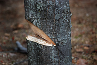

#### praise
verb

1. to express admiration or approval of the achievements or characteristics of a person or thing:
   
   1. He should be praised **for** his honesty.
   2. My parents always praised me when I did well at school.
   3. He was **highly praised** for his research on heart disease.

#### brilliantly
adverb

1. very well, in a way that shows great intelligence or skill or great success:
   
   1. He seems to do everything brillantly - piano playing, skiing, sailing.
   2. The novel brilliantly captures the complex feel of modern life.

#### notch
noun

a V-shaped cut in a hard surface:

1. The stick has two notches, one at each end.

#### top-notch
adjective, informal

excellent:

That restaurant's really top-notch.

#### first-rate
adjective

extremely good:

1. a first-rate restaurant

#### be on the ball
to be quick to understand and react to things:

1. I didn't sleep well last night and I'm not really on the ball today.

#### green fingers
noun, US green thumb

the ability to make plants grow

#### gab
verb, informal

to talk continuously and eagerly, especially about things that are not important:

1. I got so bored listening to him gabbing **on** about nothing.

#### the gift of gab
US,informal (UK the gift of the gab)

the ability to speak easily and confidently in a way that makes people want to listen to you and believe you:

1. She's got the gift of gab - she should work in sales and marketing.

#### out of this world
informal

extremely good:

What a restaurant - the food was out of this world!.

#### criticize
verb

1. to express disapproval of someone or something:

   1. The government is being widely criticized in the media **for** fail**ing** to limit air pollution.
   2. We'll get nowhere if all you can do is criticize.

2. to give an opinion or judgment about a book, film, etc.:
   
   1. We're a group of artists who meet to discuss ideas and criticize each other's work.

#### critical
adjective

1. (not pleased) saying that someone or something is bad or wrong:
   
   1. a critical report.
   2. The report is **highly** critical of safety standards at the factory.

2. (important) of the greatest importance to the way things might happen:
   
   1. The president's support is critical (**to** this project).
   2. a cirtical decision

3. (giving opinions) giving opinions or judgments on books, plays, films, etc.:
   
   1. His last film **won/received** critical **acclaim** (= was praised by film critics).

4. (serious) extremely serious or dangerous:
   
   1. Both drivers are critical/in a critical condition (= so badly hurt that they might die) after the 120 mph crash.

#### acclaimed
adjective

1. attracting public approval and praise:
   
   1. an acclaimed artist/writer/poet

#### run someone/something down

1. (informal) to criticize someone or something, often unfairly:
   
   1. He's always running himself down.

2. to hit and injure a person or animal with a vehicle, especially intentionally:
   
   1. Two masked men on motorbikes tried to run me down.

#### pick holes in something
disapproving

to find mistakes in something someone has done or said, to show that it is not good or not correct.

#### absurd
adjective

stupid and unreasonable, or silly in a humorous way:

1. What an absurd thing to say!
2. Don't be so absurd! Of course I want you to come.
3. It's an absurd situation - neither of them will talk to the other.
4. Do I look absurd in this hat?

#### be the cat's meow/pajamas
UK also be the cat's whiskers

to be better than everyone else

#### be the bee's knees

to be excellent or of an extremely high standard:

1. Have you tried this ice cream? It's the bee's knees, it really is.

#### take the biscuit
informal, UK, (US take the cake)

to be especially annoying, surprising, etc.or to be the worst or best of its kind:

1. And you say she's opening your letters now? Oh, that really takes the biscuit!
2. My life is incredibly boring, but today took the biscuit: absolutely nothing happened.

