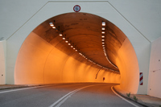

#### chaos
noun

1. a state of total confusion with no order:
   
   1. Snow and ice have caused chaos on the roads.
   2. Ever since our secretary walked out, the office has been in a state of total/utter chaos.

#### disaster
noun

1. (an event that results in) great harm, damage, or death, or serious difficulty:
   
   1. An inquiry was ordered into the recent rail disaster(= a serious train accident).
   2. It would be a disaster **for** me if I lost my job.
   3. This is one of the worst **natural** disasters ever to **befall** the area.

#### dilemma
noun

1. a situation in which a difficult choice has to be made between two different things you could do:
   
   1. The president is clearly **in** a dilemma **about/over** how to tackle the crisis.
   2. She **faces** the dilemma **of** disobey**ing** her father or los**ing** the man she loves.
   3. a **moral/ethical** dilemma.

#### dreadful
adjective

1. causing fear, shock, or suffering:
   
   1. The news report was so dreadful that I just had to switch it off.
   2. the dreadful sufferings of the people during this war.

#### muddle
noun

1. an untidy or confused state:
   
   1. The documents were in a muddle.
   2. Whenever I go to Europe I get in a muddle **about/over** (= become confused about) how much things cost.

#### irritating
adjective

1. making you feel annoyed:
   
   1. an irritating habit.

#### intensely
adverb

1. extremely or strongly:
   
   1. His strongest criticism is reserved for his father, whom he disliked intensely.
   2. This book is intensely personal.

2. in a very serious way that shows strong emotions or opinions:
   
   1. My mother stood us up and looked at us intensely for a minute.
   2. "I give you my word," she said intensely.

#### disrupt
verb

1. to prevent something, especially a system, process, or event, from continuing as usual or as expected:
   
   1. Heavy snow disrupted travel into the city this morning.
   2. The meeting was disrupted by a group of protesters who shouted and threw fruit at the speaker.

#### collapse
verb

1. to fall down suddenly because of pressure or having no strength or support:
   
   1. Thousands of buildings collapsed in the earthquake.
   2. The chair collapsed **under** her **weight**.

2. If someone collapses, they fall down because of being sick or weak:
   
   1. He collapsed and died of a heart attack.

3. to fold something into a smaller shape, usually so it can be stored, or (especially of furniture) to fold in this way:
   
   1. All chairs collapse for easy storage.

4. (of people and business) to suddenly be unable to continue or work correctly:
   
   1. Lots of people lost their jobs when the property market collapsed.
   2. Talks bwtween management and unions have collapsed.

#### deprive
verb

1. to take something, especially something necessary or pleasant, away from someone:
   
   1. He claimed that he had been deprived **of** his freedom/rights.
   2. You can't function properly when you're deprived **of** sleep.

#### grasp
verb

1. to quickly take something in your hand(s) and hold it firmly:
   
   1. Roise suddenly grasped my hand.

2. If you grasp an opportunity, you take it eagerly:
   
   1. We must grasp every oppotunity to strengthen economic ties with other countries.

#### tide
noun

1. the rise and fall of the sea that happens twice every day:
   
   1. high/low tide
   2. The tide is **out/in**.

#### tunnel
noun

1. a long passage under or through the ground, especially one made by people:

   

   1. The train went into the tunnel.
   

#### get your act together
to start to organize yourself so that you do things in an effective way.

1. She's so disorganized - I wish she'd get her act together.

#### bury the hatchet
idiom

to stop an argument an become friends again:

1. Can't you two just bury the hatchet.

